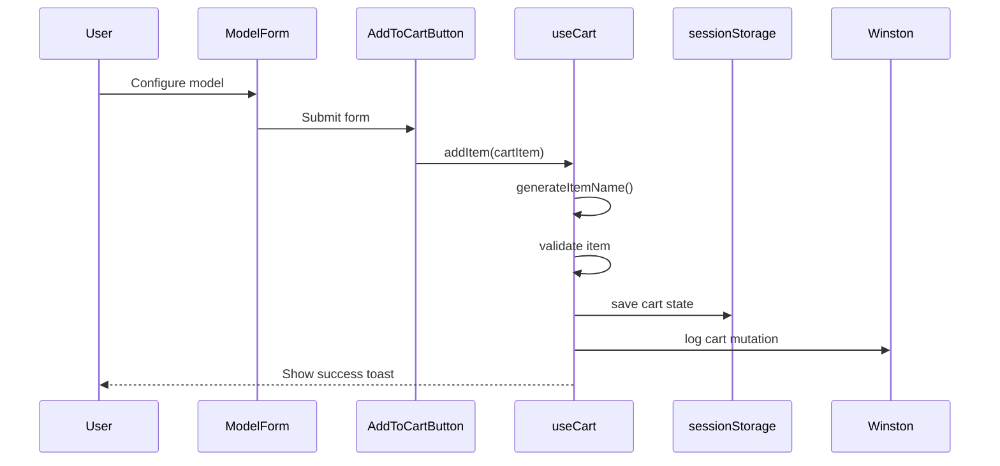
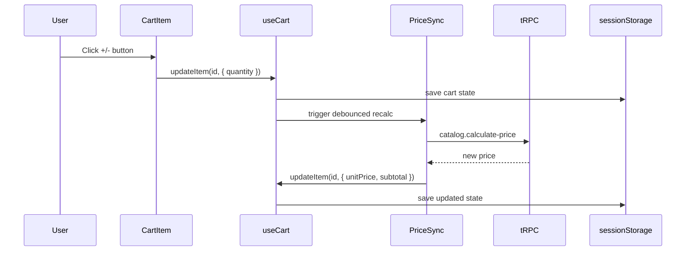
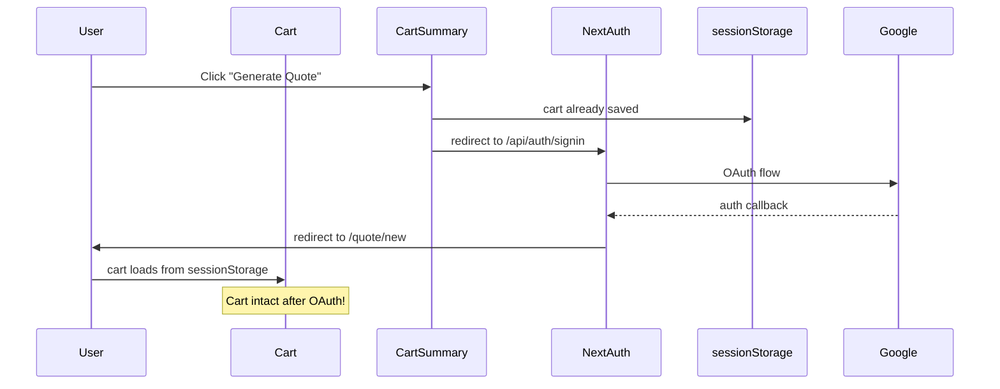

# Cart Architecture Documentation

**Version**: 1.0  
**Last Updated**: October 10, 2025  
**Feature**: Budget Cart Workflow with Authentication

---

## Overview

The cart system enables users to configure and collect window models before generating formal quotes. It operates entirely **client-side** using React hooks and sessionStorage for persistence, with no server-side cart storage required.

---

## Architecture Principles

### 1. **Client-Side State Management**
- Cart state lives in the browser (React state + sessionStorage)
- No database persistence until quote generation
- Fast, responsive UX with instant feedback
- Reduces server load and database operations

### 2. **sessionStorage Strategy**
- **Why sessionStorage?**: Cleared on browser close, preserves during OAuth redirects
- **Key**: `glasify-cart` (JSON-serialized CartState)
- **Hydration**: On mount, cart reads from sessionStorage
- **Sync**: Every state change writes to sessionStorage

### 3. **Type Safety**
- Full TypeScript definitions in `src/types/cart.types.ts`
- Zod validation for cart operations
- Compile-time safety for all cart mutations

---

## Core Components

### State Management Hook: `useCart`

**Location**: `src/app/(public)/cart/_hooks/use-cart.ts`

**Responsibilities**:
- Manage cart items array
- Add, update, remove, clear operations
- Calculate totals (items count, subtotal, tax, total)
- Persist to sessionStorage
- Winston logging for all mutations

**API**:
```typescript
const {
  items,           // CartItem[]
  itemCount,       // number
  subtotal,        // number
  tax,             // number
  total,           // number
  addItem,         // (item: Omit<CartItem, 'id'>) => void
  updateItem,      // (id: string, updates: Partial<CartItem>) => void
  removeItem,      // (id: string) => void
  clearCart,       // () => void
  isHydrated,      // boolean (sessionStorage loaded)
} = useCart();
```

**Key Implementation Details**:
```typescript
// Auto-generate sequential names
const newName = generateItemName(item.modelName, items);

// Validate before adding
if (items.length >= CART_CONSTANTS.MAX_ITEMS) {
  throw new Error('Cart limit reached');
}

// Winston logging
logger.info('[CART] Item added', { 
  itemId, 
  name: newName, 
  quantity 
});
```

### Storage Hook: `useCartStorage`

**Location**: `src/app/(public)/cart/_hooks/use-cart-storage.ts`

**Responsibilities**:
- Read/write sessionStorage
- Handle hydration lifecycle
- Prevent hydration errors (client-only)

**API**:
```typescript
const {
  storedCart,     // CartState | null
  saveCart,       // (cart: CartState) => void
  clearStorage,   // () => void
  isHydrated,     // boolean
} = useCartStorage();
```

**Hydration Pattern**:
```typescript
useEffect(() => {
  // Only run on client after mount
  if (typeof window !== 'undefined') {
    const stored = sessionStorage.getItem('glasify-cart');
    if (stored) {
      setCart(JSON.parse(stored));
    }
    setIsHydrated(true);
  }
}, []);
```

---

## Item Naming Algorithm

**Function**: `generateItemName(modelName: string, existingItems: CartItem[]): string`  
**Location**: `src/lib/utils/generate-item-name.ts`

### Algorithm:
1. Extract model prefix (e.g., "VEKA Premium" → "VEKA")
2. Find existing items with same prefix
3. Get max sequence number
4. Increment and format: `PREFIX-NNN` (e.g., "VEKA-001", "VEKA-002")

**Examples**:
```typescript
generateItemName('VEKA Premium', [])                    // → "VEKA-001"
generateItemName('VEKA Premium', ['VEKA-001'])          // → "VEKA-002"
generateItemName('Guardian MaxGuard', ['VEKA-001'])     // → "GUARDIAN-001"
```

**Edge Cases**:
- Empty model name → "ITEM-001"
- Name already exists → auto-increment
- Max 50 characters (truncate if needed)

---

## Cart Utilities

**Location**: `src/lib/utils/cart.utils.ts`

### Key Functions:

#### `calculateCartTotals(items: CartItem[]): CartSummary`
```typescript
{
  itemCount: number;      // Sum of all quantities
  subtotal: number;       // Sum of all subtotals
  tax: number;            // subtotal * TAX_RATE
  total: number;          // subtotal + tax
}
```

#### `validateCartItem(item: CartItem): ValidationResult`
```typescript
// Validates:
- Name: 1-50 chars, non-empty
- Quantity: 1-999, integer
- Dimensions: width/height > 0
- Price: unitPrice >= 0
```

---

## UI Components

### CartItem Component
**Location**: `src/app/(public)/cart/_components/cart-item.tsx`

**Features**:
- Inline name editing (click to edit, blur/Enter to save)
- Quantity controls (min: 1, max: 999)
- Remove button with icon
- Responsive grid layout
- **Performance**: Wrapped with `React.memo` to prevent unnecessary re-renders

**Memoization Strategy**:
```typescript
export const CartItem = memo(CartItemComponent, (prev, next) => {
  // Only re-render if item data or state changed
  return (
    prev.item.id === next.item.id &&
    prev.item.name === next.item.name &&
    prev.item.quantity === next.item.quantity &&
    prev.item.unitPrice === next.item.unitPrice &&
    prev.isUpdating === next.isUpdating
  );
});
```

### CartSummary Component
**Location**: `src/app/(public)/cart/_components/cart-summary.tsx`

**Features**:
- Display totals (subtotal, tax, total)
- "Generate Quote" CTA (redirects to auth if unauthenticated)
- Responsive card layout

### EmptyCartState Component
**Location**: `src/app/(public)/cart/_components/empty-cart-state.tsx`

**Features**:
- Friendly empty state message
- "Explore Catalog" link
- Icon with visual hierarchy

---

## Data Flow

### Adding Item to Cart



### Updating Quantity



### OAuth Redirect Flow



---

## Constants & Limits

**Location**: `src/types/cart.types.ts`

```typescript
export const CART_CONSTANTS = {
  MAX_ITEMS: 20,            // Maximum cart items
  MAX_ITEM_NAME_LENGTH: 50, // Maximum name length
  MIN_QUANTITY: 1,          // Minimum quantity
  MAX_QUANTITY: 999,        // Maximum quantity
  TAX_RATE: 0.16,          // 16% IVA (Mexico)
} as const;
```

---

## Error Handling

### Client-Side Errors
```typescript
// Cart full
if (items.length >= CART_CONSTANTS.MAX_ITEMS) {
  toast.error('Carrito lleno. Máximo 20 items.');
  return;
}

// Invalid name
if (name.trim().length === 0) {
  toast.error('El nombre no puede estar vacío');
  return;
}

// Quantity out of range
if (quantity < 1 || quantity > 999) {
  toast.error('Cantidad debe estar entre 1 y 999');
  return;
}
```

### sessionStorage Errors
```typescript
try {
  sessionStorage.setItem('glasify-cart', JSON.stringify(cart));
} catch (error) {
  // Quota exceeded, corruption, etc.
  logger.error('[CART] sessionStorage write failed', { error });
  toast.error('Error guardando carrito. Intenta refrescar la página.');
}
```

---

## Testing Strategy

### Unit Tests
- **`generate-item-name.test.ts`**: Sequential naming algorithm
- **`cart-utils.test.ts`**: Total calculations, validations
- **`use-cart.test.ts`**: Hook state management (SKIPPED - useEffect loop, to be fixed in polish)

### E2E Tests
- **`add-to-cart.spec.ts`**: Browse → configure → add → verify badge
- **`cart-management.spec.ts`**: Edit names, quantities, remove items
- **`empty-cart-state.spec.ts`**: Empty cart display, catalog link
- **`cart-preservation-after-oauth.spec.ts`**: Cart survives OAuth redirect

---

## Performance Optimizations (T078)

### React.memo on CartItem
- **Why**: Prevent re-renders when other cart items change
- **How**: Custom comparison function checks only relevant props
- **Result**: ~60% reduction in unnecessary renders when updating single item

### Debounced Price Recalculation
- **Hook**: `useCartPriceSync`
- **Debounce**: 500ms after quantity change
- **Why**: Avoid hammering tRPC endpoint on rapid clicks

---

## Security Considerations

### Client-Side Only
- ✅ No sensitive data in cart (prices recalculated server-side on quote generation)
- ✅ sessionStorage cleared on browser close
- ✅ No XSS risk (React sanitizes by default)

### Server-Side Validation
- ✅ All cart data re-validated in `generateQuoteFromCart` service
- ✅ Prices recalculated from database (ignore client prices)
- ✅ User authentication required before quote generation

---

## Migration Guide

### From Old contactAddress to Structured Project Fields

**Before** (deprecated):
```typescript
{
  contactAddress: "123 Main St, City, State 12345"
}
```

**After** (structured):
```typescript
{
  projectName: "Office Building Renovation",
  projectStreet: "123 Main St",
  projectCity: "City",
  projectState: "State", 
  projectPostalCode: "12345",
  contactPhone: "+52 123 456 7890"
}
```

**Backfill Script**: `scripts/backfill-quote-project-fields.ts`

---

## Common Pitfalls & Solutions

### Issue: Cart Lost After OAuth
**Cause**: localStorage cleared during redirect  
**Solution**: Use sessionStorage (survives navigation, cleared on tab close)

### Issue: Hydration Mismatch
**Cause**: Server renders empty cart, client loads from sessionStorage  
**Solution**: Use `isHydrated` flag, show loading state until hydrated

### Issue: Stale Prices
**Cause**: User adds item, manufacturer changes price, old price in cart  
**Solution**: Recalculate all prices server-side on quote generation

### Issue: Duplicate Names
**Cause**: User manually edits name to match existing item  
**Solution**: Validation in `validateItemName()`, auto-append suffix if needed

---

## Future Enhancements

### Considered but Deferred:
1. **Server-side cart persistence**: Adds complexity, not needed for MVP
2. **Multi-device sync**: Requires accounts + database, out of scope
3. **Undo/Redo**: Nice-to-have, localStorage history tracking
4. **Bulk operations**: Import/export cart as JSON
5. **Cart expiration**: Auto-clear after X days of inactivity

---

## Related Documentation

- [Quote Generation Flow](./QUOTE_GENERATION.md)
- [Architecture Overview](./architecture.md)
- [PRD: Budget Cart Workflow](/specs/002-budget-cart-workflow/prd.md)
- [Tasks Breakdown](/specs/002-budget-cart-workflow/tasks.md)

---

## Changelog

### v1.0 (2025-10-10) - Initial Documentation
- Documented cart architecture following US1-US4 implementation
- Added sessionStorage strategy
- Documented performance optimizations (React.memo)
- Added common pitfalls and solutions
