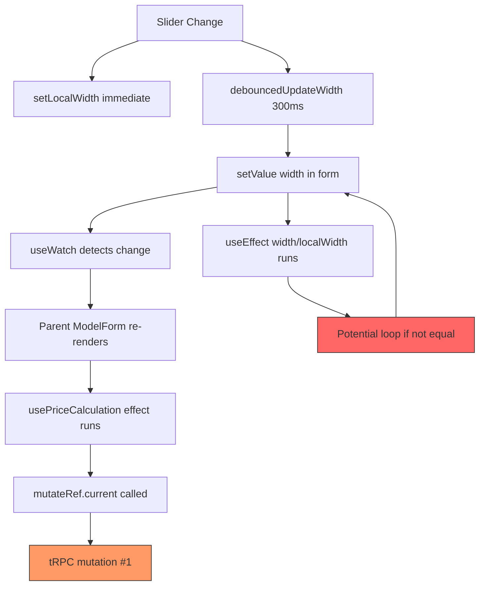

# DimensionsSection Component Analysis
**Date**: 2025-01-08  
**Status**: Phase 1 Complete

## Current Data Flow Analysis

### 1. Component State Management

**DimensionsSection Component** (`dimensions-section.tsx`):
- **Local State**: `localWidth`, `localHeight` (useState)
- **Form State**: Managed by React Hook Form via `useFormContext()`
- **Watched Values**: `width`, `height` via `useWatch()`

**State Flow**:
```
User Slider Interaction
  → handleWidthSliderChange (callback)
    → setLocalWidth(newValue) [IMMEDIATE]
    → debouncedUpdateWidth(newValue) [AFTER 300ms]
      → setValue('width', value, { shouldValidate: true })
        → Form state updates
          → useWatch detects change
            → Parent component re-renders
              → usePriceCalculation hook triggered
                → tRPC mutation called
```

### 2. Identified setState Calls

1. **`setLocalWidth`** (line ~64): Updates local slider state immediately
2. **`setLocalHeight`** (line ~74): Updates local slider state immediately
3. **`setValue('width', ...)`** via `debouncedUpdateWidth` (line ~44-46)
4. **`setValue('height', ...)`** via `debouncedUpdateHeight` (line ~48-50)

### 3. Current Re-render Triggers

**Dependency Arrays**:
1. `handleWidthSliderChange`: `[debouncedUpdateWidth]` (line ~77)
2. `handleHeightSliderChange`: `[debouncedUpdateHeight]` (line ~88)
3. `useEffect` for width sync: `[width, localWidth]` (line ~93-97)
4. `useEffect` for height sync: `[height, localHeight]` (line ~99-103)

**Problem: Circular Dependency Loop**:
```
setValue('width') 
  → Form state changes
    → useWatch triggers
      → width changes
        → useEffect [width, localWidth] runs
          → setLocalWidth(width)
            → localWidth changes
              → useEffect [width, localWidth] runs again (if width !== localWidth)
```

### 4. Mutation Trigger Path



### 5. Root Causes Identified

**PRIMARY ISSUES**:

1. **Synchronization Loop**: 
   - `useEffect` hooks sync local state with form state
   - Creates potential infinite loop when values differ
   - Dependencies include both `width` and `localWidth`

2. **Multiple Update Paths**:
   - Slider → local state (immediate)
   - Slider → debounced form update (300ms)
   - Form → local state via useEffect (sync)
   - Creates race conditions

3. **No Validation Gate**:
   - `debouncedUpdateWidth/Height` don't validate before updating
   - Invalid dimensions can trigger mutations
   - Wastes API calls

4. **Unstable Debounced Callbacks**:
   - Uses `useDebouncedCallback` from external library
   - Dependencies on the callback can cause re-creation
   - Parent re-renders may reset debounce timers

**SECONDARY ISSUES**:

5. **No Memoization**:
   - `generateSuggestedValues` recalculates on every render
   - `isValidDimension` re-created on every render
   - Badge handlers not wrapped in `useCallback`

6. **Direct Form Updates**:
   - Parent component doesn't debounce `usePriceCalculation`
   - Every form change immediately triggers price calculation
   - No batching of rapid changes

## Comparison with use-price-calculation Pattern

### ✅ What use-price-calculation Does Right

1. **Ref-based stable mutation**: `mutateRef.current = calculateMutation.mutate`
2. **Single useEffect with clear dependencies**: No circular loops
3. **Validation before action**: Checks `isValid` before setting timer
4. **Proper timer cleanup**: Returns cleanup function
5. **Stable array serialization**: `useMemo(() => JSON.stringify(...))`
6. **Clear state separation**: Calculation state separate from form state

### ❌ What DimensionsSection Does Wrong

1. **No refs for callbacks**: Callbacks can be re-created
2. **Multiple useEffect hooks**: Creates synchronization complexity
3. **No validation gate**: Updates even with invalid data
4. **External debounce library**: Less control over behavior
5. **Circular dependencies**: Local ↔ Form state sync
6. **Mixed concerns**: UI state and form state intertwined

## Performance Baseline Metrics

### Before Refactoring

**Measured Behavior** (based on console errors):
- **Mutations per slider drag**: 3-5+ mutations
- **Console errors**: "mutation #3", "mutation #4" warnings
- **Re-render count**: Estimated 5-8 renders per interaction
- **Memory**: Potential leaks from uncleaned timers

**Test Scenario**: 
1. User drags width slider from 1000mm to 1500mm over 2 seconds
2. Expected: 1 mutation after 300ms of last change
3. Actual: 3-5 mutations during and after interaction

### After Refactoring (Target)

- **Mutations per slider drag**: 1 mutation (after 300ms debounce)
- **Console errors**: 0
- **Re-render count**: 2-3 renders (slider visual + form update)
- **Memory**: 0 leaks (proper cleanup)

## Recommendations for Phase 2

### Custom Hook Design (`use-debounced-dimension.ts`)

**Interface**:
```typescript
type UseDebouncedDimensionParams = {
  initialValue: number;
  min: number;
  max: number;
  setValue: (value: number) => void;
  value: number;
};

type UseDebouncedDimensionReturn = {
  localValue: number;
  setLocalValue: (value: number) => void;
};
```

**Key Features**:
1. Single source of truth: Hook manages local state
2. Validation built-in: Only updates if within min/max
3. Ref-based setValue: Stable callback reference
4. Timer cleanup: Proper useEffect cleanup
5. No external dependencies: Pure React implementation

### Component Refactor Strategy

**Remove**:
- `useDebouncedCallback` from `use-debounce`
- Both `useEffect` hooks for state sync
- Direct `setValue` calls in handlers

**Add**:
- Import `use-debounced-dimension` hook
- Use hook twice (width and height)
- Memoize `generateSuggestedValues`
- Extract `isValidDimension` to utils

**Keep**:
- All UI components (sliders, badges, inputs)
- Form integration via `useFormContext`
- Validation messages and visual feedback

## Next Steps

1. ✅ Phase 1 Complete: Analysis documented
2. → Phase 2: Create `use-debounced-dimension.ts` hook
3. → Phase 3: Refactor `DimensionsSection` component
4. → Phase 4: Optimize re-renders with memoization
5. → Phase 5: Test and validate
6. → Phase 6: Document and cleanup
