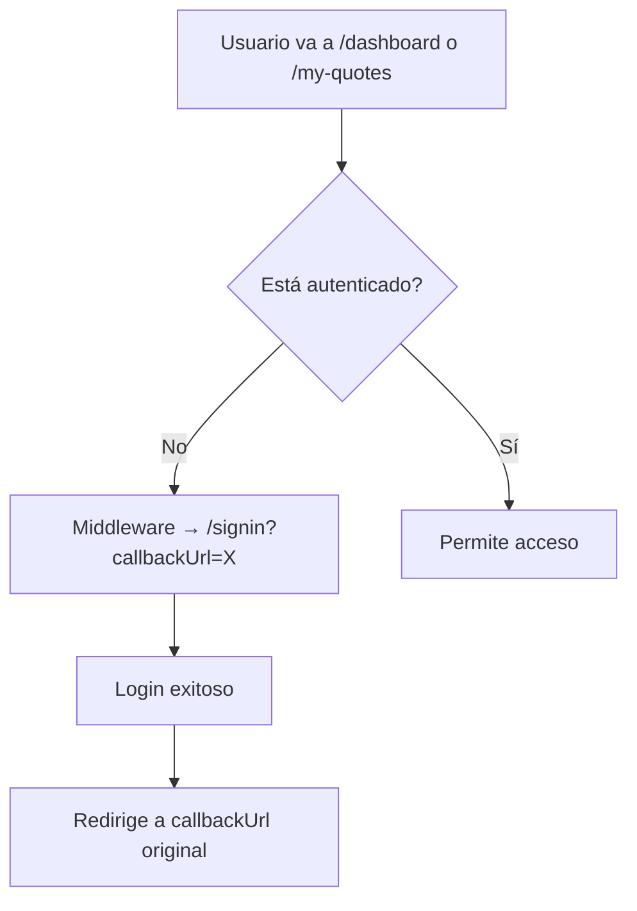

# Role-Based Authentication & Redirection

## Descripción General

Se implementó un sistema de autenticación basado en roles que redirige a los usuarios según su rol después del inicio de sesión:

- **Admin** (`ADMIN_EMAIL` configurado) → `/dashboard`
- **Usuarios regulares** → `/my-quotes`

## Cambios Implementados

### 1. Variables de Entorno

**Archivo**: `.env` (y `.env.example`)

```bash
# Admin User (Optional)
# Email address of the admin user. This user will have access to the dashboard.
# If not set, all users will be redirected to /my-quotes after sign in.
ADMIN_EMAIL="admin@example.com"
```

**Validación**: `src/env.js`
- Tipo: `z.string().email().optional()`
- Campo opcional, pero si se configura debe ser un email válido

---

### 2. NextAuth Configuration

**Archivo**: `src/server/auth/config.ts`

#### Cambios Principales

**a) Type Augmentation - Session con Role**

```typescript
declare module 'next-auth' {
  interface Session extends DefaultSession {
    user: {
      id: string;
      role: 'admin' | 'user';  // ← Nuevo
    } & DefaultSession['user'];
  }

  interface User {
    role?: 'admin' | 'user';  // ← Nuevo
  }
}
```

**b) Helper Function - isAdmin**

```typescript
const isAdmin = (email: string | null | undefined): boolean => {
  if (!email || !env.ADMIN_EMAIL) return false;
  return email.toLowerCase() === env.ADMIN_EMAIL.toLowerCase();
};
```

- ✅ Case-insensitive comparison
- ✅ Safe null/undefined handling
- ✅ Returns `false` if `ADMIN_EMAIL` not configured

**c) Session Callback - Assign Role**

```typescript
callbacks: {
  session: ({ session, user }) => ({
    ...session,
    user: {
      ...session.user,
      id: user.id,
      role: isAdmin(user.email) ? 'admin' : 'user',  // ← Asigna role
    },
  }),
}
```

---

### 3. Auth Callback Page

**Archivo**: `src/app/(auth)/auth/callback/page.tsx`

**Propósito**: Redirigir usuarios según su rol después del login exitoso

```typescript
export default async function AuthCallbackPage() {
  const session = await auth();

  if (!session?.user) {
    redirect('/signin');  // No autenticado
  }

  if (session.user.role === 'admin') {
    redirect('/dashboard');  // Admin → Dashboard
  }

  redirect('/my-quotes');  // User → Mis Cotizaciones
}
```

**Ventajas**:
- ✅ Server Component (SSR, SEO-friendly)
- ✅ Centraliza lógica de redirección
- ✅ Fácil de testear y mantener

---

### 4. SignIn Form Update

**Archivo**: `src/app/(auth)/_components/signin-form.tsx`

**Cambio**: `callbackUrl` ahora apunta a `/auth/callback`

```typescript
// Antes
await signIn('google', { callbackUrl: '/dashboard' });

// Ahora
await signIn('google', { callbackUrl: '/auth/callback' });
```

**Beneficio**: La redirección se maneja de forma dinámica según el rol

---

### 5. Middleware Update

**Archivo**: `src/middleware.ts`

**Cambios**:

```typescript
// Nueva variable
const isAuthCallback = pathname === '/auth/callback';

// Actualización de lógica
if (isAuthRoute && isLoggedIn && !isAuthCallback) {
  return NextResponse.redirect(new URL('/auth/callback', request.url));
}
```

**Comportamiento**:
- Si usuario autenticado intenta acceder a `/signin` → redirige a `/auth/callback`
- `/auth/callback` determina si es admin o user y redirige apropiadamente

---

### 6. Auth Helper Utilities (Opcional)

**Archivo**: `src/lib/auth-helpers.ts`

Función helper para determinar redirección según rol:

```typescript
export const getRedirectAfterSignIn = (session: Session | null): string => {
  if (!session?.user) return '/catalog';
  if (session.user.role === 'admin') return '/dashboard';
  return '/my-quotes';
};
```

**Uso**: Puede usarse en Server Components o Server Actions

---

## Flujo de Autenticación

### Login con Google

```mermaid
graph TD
    A[Usuario hace clic en "Google"] --> B[signIn con callbackUrl=/auth/callback]
    B --> C[Google OAuth]
    C --> D{Login exitoso?}
    D -->|No| E[Vuelve a /signin]
    D -->|Sí| F[NextAuth crea sesión]
    F --> G[Callback asigna role en sesión]
    G --> H[Redirige a /auth/callback]
    H --> I{Usuario autenticado?}
    I -->|No| J[Redirige a /signin]
    I -->|Sí| K{Es admin?}
    K -->|Sí| L[Redirige a /dashboard]
    K -->|No| M[Redirige a /my-quotes]
```

### Acceso Directo a Rutas Protegidas



---

## Configuración

### 1. Configurar Email de Admin

Edita tu archivo `.env`:

```bash
ADMIN_EMAIL="tu-email@gmail.com"
```

**Importante**:
- ✅ Usa el mismo email que usas para Google OAuth
- ✅ Case-insensitive (no importa mayúsculas/minúsculas)
- ✅ Opcional: Si no se configura, todos los users van a `/my-quotes`

### 2. Reiniciar Servidor

```bash
pnpm dev
```

### 3. Probar Login

1. Login con Google usando el email configurado en `ADMIN_EMAIL` → debería ir a `/dashboard`
2. Login con otro email → debería ir a `/my-quotes`

---

## Seguridad

### Protección de Rutas

**Dashboard** (Solo Admin):
- Middleware verifica autenticación
- En el futuro, agregar verificación de role en Server Component:

```typescript
// src/app/(dashboard)/layout.tsx
export default async function DashboardLayout({ children }) {
  const session = await auth();
  
  if (!session?.user || session.user.role !== 'admin') {
    redirect('/my-quotes');
  }
  
  return <>{children}</>;
}
```

**Mis Cotizaciones** (Usuarios autenticados):
- Middleware verifica autenticación
- Todos los usuarios autenticados tienen acceso

---

## Testing

### Unit Tests

**Archivo sugerido**: `tests/unit/auth-helpers.test.ts`

```typescript
import { describe, expect, it } from 'vitest';
import { getRedirectAfterSignIn } from '@/lib/auth-helpers';

describe('getRedirectAfterSignIn', () => {
  it('should redirect admin to /dashboard', () => {
    const session = {
      user: { id: '1', name: 'Admin', email: 'admin@test.com', role: 'admin' as const },
      expires: '2025-12-31',
    };
    expect(getRedirectAfterSignIn(session)).toBe('/dashboard');
  });

  it('should redirect regular user to /my-quotes', () => {
    const session = {
      user: { id: '2', name: 'User', email: 'user@test.com', role: 'user' as const },
      expires: '2025-12-31',
    };
    expect(getRedirectAfterSignIn(session)).toBe('/my-quotes');
  });

  it('should redirect to /catalog if no session', () => {
    expect(getRedirectAfterSignIn(null)).toBe('/catalog');
  });
});
```

### E2E Tests

**Archivo sugerido**: `e2e/auth/role-based-redirect.spec.ts`

```typescript
import { expect, test } from '@playwright/test';

test.describe('Role-based redirect after login', () => {
  test('admin user redirects to dashboard', async ({ page }) => {
    // TODO: Mock Google OAuth with admin email
    await page.goto('/signin');
    // ... login flow
    await expect(page).toHaveURL('/dashboard');
  });

  test('regular user redirects to my-quotes', async ({ page }) => {
    // TODO: Mock Google OAuth with regular email
    await page.goto('/signin');
    // ... login flow
    await expect(page).toHaveURL('/my-quotes');
  });
});
```

---

## Próximos Pasos (Opcional)

### 1. Migración a Database Roles

Si necesitas múltiples admins, migra a un campo `role` en la DB:

```prisma
model User {
  id            String   @id @default(cuid())
  name          String?
  email         String?  @unique
  emailVerified DateTime?
  image         String?
  role          String   @default("user")  // 'admin' | 'user'
  // ...
}
```

**Migración**:

```sql
-- Add role column
ALTER TABLE "User" ADD COLUMN "role" TEXT NOT NULL DEFAULT 'user';

-- Set admin role for specific email
UPDATE "User" SET "role" = 'admin' WHERE "email" = 'admin@example.com';
```

### 2. Middleware Role Verification

Proteger `/dashboard` a nivel de middleware (requiere NextAuth v5 middleware):

```typescript
// src/middleware.ts
import { auth } from '@/server/auth';

export default auth((req) => {
  const { pathname } = req.nextUrl;
  const isAdmin = req.auth?.user?.role === 'admin';

  if (pathname.startsWith('/dashboard') && !isAdmin) {
    return NextResponse.redirect(new URL('/my-quotes', req.url));
  }
});
```

### 3. Role-based UI Components

Mostrar/ocultar elementos según rol:

```typescript
// src/components/admin-only.tsx
import { auth } from '@/server/auth';

export async function AdminOnly({ children }: { children: React.ReactNode }) {
  const session = await auth();
  
  if (session?.user?.role !== 'admin') return null;
  
  return <>{children}</>;
}
```

**Uso**:

```tsx
<AdminOnly>
  <Link href="/dashboard">Panel de Administración</Link>
</AdminOnly>
```

---

## Referencias

- [NextAuth.js v5 Docs](https://authjs.dev/)
- [NextAuth.js Callbacks](https://authjs.dev/reference/core#callbacks)
- [Next.js Middleware](https://nextjs.org/docs/app/building-your-application/routing/middleware)
- [@t3-oss/env-nextjs](https://env.t3.gg/)

---

## Troubleshooting

### Usuario Admin No Redirige a Dashboard

**Verificar**:
1. ✅ `ADMIN_EMAIL` configurado en `.env`
2. ✅ Email coincide con el de Google OAuth (case-insensitive)
3. ✅ Servidor reiniciado después de cambiar `.env`
4. ✅ No hay caché de sesión (logout y login nuevamente)

**Debug**:

```typescript
// src/app/(auth)/auth/callback/page.tsx
export default async function AuthCallbackPage() {
  const session = await auth();
  
  console.log('Session:', session);
  console.log('Role:', session?.user?.role);
  
  // ...
}
```

### Todos los Usuarios van a /my-quotes

**Causa**: `ADMIN_EMAIL` no configurado o no coincide

**Solución**:
1. Verifica `.env`: `ADMIN_EMAIL="admin@example.com"`
2. Coincide con email de Google OAuth
3. Reinicia servidor: `pnpm dev`

---

## Changelog

- ✅ Agregado `ADMIN_EMAIL` a variables de entorno
- ✅ Actualizado `src/env.js` con validación Zod
- ✅ Agregado campo `role` a Session type (NextAuth)
- ✅ Implementada función `isAdmin()` en auth config
- ✅ Creada página `/auth/callback` para redirección basada en rol
- ✅ Actualizado `signin-form.tsx` para usar callback dinámico
- ✅ Actualizado middleware para redirigir a callback
- ✅ Creado helper `getRedirectAfterSignIn()` en `lib/auth-helpers.ts`
- ✅ Actualizado `.env.example` con documentación
