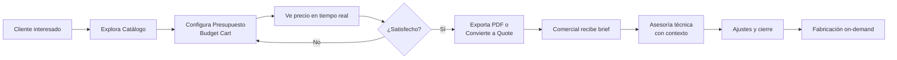
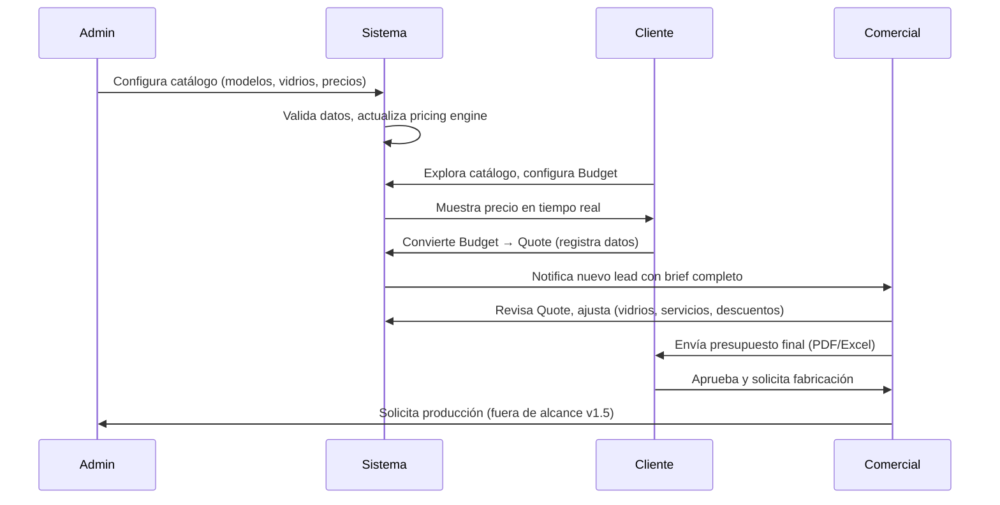
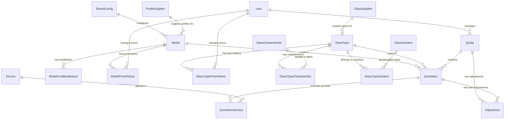

# PRD: Glasify Lite v1.6

## TL;DR (Resumen Ejecutivo)

> **"Glasify NO es una tienda. Es una herramienta de pre-venta que reduce el tiempo entre el primer contacto cliente-fabricante de 15 días a 5 minutos."**

### ¿Qué ES Glasify?
- ✅ **Cotizador instantáneo on-demand** para ventanas/puertas de aluminio y PVC
- ✅ **Generador de briefs automáticos** para comerciales (dimensiones, vidrios, servicios)
- ✅ **Panel admin para gestionar catálogos** (modelos, vidrios, precios, proveedores)
- ✅ **Exportador de presupuestos profesionales** (PDF/Excel con branding)

### ¿Qué NO ES Glasify?
- ❌ **NO es una tienda e-commerce** (no vendemos productos estándar ni tenemos carrito de compras)
- ❌ **NO gestiona inventarios** (el mercado es fabricación a medida, sin stock)
- ❌ **NO reemplaza al comercial** (el sistema prepara el lead, el humano cierra la venta)
- ❌ **NO es un ERP/CRM completo** (solo pre-venta y cotización)

### Flujo de Valor
```
Cliente → Cotiza en 5 min → Budget Cart → Convierte a Quote
   ↓
Comercial → Recibe brief completo → Asesora con contexto → Cierra venta
   ↓
Admin → Configura catálogo → Actualiza precios → Habilita cotizaciones precisas
```

### Métricas de Éxito
- ⏱️ Tiempo de cotización: **5 min** (vs 15 días tradicional)
- 📈 Conversión Budget → Quote: **42%** (target: 30%)
- 🎯 Leads cualificados: **100%** (con brief completo)
- 📉 Reducción carga operativa: **68%** (comerciales enfocados en asesoría, no cotizaciones básicas)

---

## Estado del Documento

| Propiedad                | Valor                                 |
| ------------------------ | ------------------------------------- |
| **Versión**              | 1.6.0                                 |
| **Última actualización** | 2025-10-14                            |
| **Estado**               | ✅ En producción (funcionalidades MVP) |
| **Próxima versión**      | v2.0 (Q2 2026)                        |

### Aclaración de piloto y financiación

- Equipo actual: 1 desarrollador (founder técnico).
- Piloto de 12 meses orientado a investigación y adopción con cohortes continuas. No se promete “producto en semanas”.
- Programa Aliados Fundadores (cofinanciación colectiva): meta de USD 2,000 para activar la primera fase de IA (asistente + RAG por tenant). Hasta alcanzar la meta, el foco es el core (catálogo, cotización, Budget, PDF/Excel, reportes de asesor). La IA no se ofrece en los primeros días.

## Historial de Versiones

- **v1.6.0** (2025-10-14): Reformulación del PRD - Eliminación de enfoque e-commerce, clarificación de propuesta de valor (pre-venta on-demand vs tienda), expansión de roles Admin/Comercial/Cliente, roadmap de panel admin
- **v1.5.0** (2025-10-12): Arquitectura multi-tenant completa, sistema de soluciones de vidrio, cart/budget workflow, My Quotes UX redesign
- **v1.4.0** (2025-10-10): Refactorización Manufacturer → TenantConfig + ProfileSupplier
- **v1.3.0** (2025-10-09): Sistema Many-to-Many de soluciones de vidrio basado en estándares EN/ISO
- **v1.2.0** (2025-10-08): Budget Cart workflow con sessionStorage
- **v1.0.0** (2025-09-26): Documentación inicial del MVP

## Objetivo

**Reducir la fricción del primer contacto entre cliente y fabricante/carpintería de semanas a minutos**, mediante un sistema de cotización instantánea que genera presupuestos profesionales sin esperar turnos comerciales. Glasify Lite NO es una tienda e-commerce, es una herramienta de **pre-venta inteligente** que cualifica leads y prepara al comercial con contexto completo para asesoría efectiva.

El mercado latinoamericano de ventanas/puertas funciona **on-demand** (fabricación a medida), sin inventarios ni productos estándar. Glasify permite que:
- **Clientes** obtengan presupuestos realistas en minutos (vs 5-15 días tradicionales)
- **Comerciales** reciban briefs automáticos con necesidades del cliente (dimensiones, vidrios, servicios) para hacer preguntas pertinentes desde el primer contacto
- **Fabricantes/Admin** gestionen catálogos (modelos, vidrios, perfiles, servicios) que alimentan el motor de cotización con datos actualizados

## Resumen ejecutivo

### El Problema que Resolvemos

**El ciclo tradicional de cotización destruye oportunidades de negocio.**

**Realidad del mercado LATAM** (Colombia, México, Perú, etc.):
- ❌ Sin productos estándar en stock (todo es fabricación on-demand a medida)
- ❌ Sin estandarización en construcción (cada proyecto es único)
- ❌ Altamente personalizable (dimensiones, vidrios, perfiles variables por cliente)
- ❌ Proceso de cotización lento y manual (5-15 días promedio)

**Flujo tradicional del cliente interesado**:
1. **Día 0**: Contacta fabricante/carpintería (teléfono, WhatsApp, visita presencial)
2. **Día 1-3**: Espera turno para que comercial lo atienda (saturación operativa)
3. **Día 3-5**: Describe necesidades sin conocer terminología técnica → comercial aterriza requisitos por correo
4. **Día 5-10**: Espera presupuesto genérico o incompleto
5. **Día 10-15**: Recibe cotización, hace ajustes, espera nueva versión
6. **Resultado**: 2-3 semanas entre primer contacto y precio concreto → **abandono 60%+**

**El costo de la fricción**:
- **Cliente frustrado**: No puede planear su presupuesto, abandona o compra sin información
- **Comercial saturado**: 70% del tiempo en cotizaciones básicas, no asesoría de valor
- **Fabricante perdiendo**: Leads calificados se van mientras esperan respuesta

> **"De 15 días de espera a 5 minutos de cotización. Ese es el problema que resolvemos."**

### Nuestra Propuesta de Valor

**Glasify Lite es el puente inteligente entre el interés del cliente y la asesoría profesional del comercial**, reduciendo el tiempo de primer contacto de semanas a minutos.

#### ⚡ NO somos una tienda e-commerce

- ❌ **NO vendemos productos estándar** (el mercado es on-demand, fabricación a medida)
- ❌ **NO tenemos inventario** (cada proyecto requiere fabricación personalizada)
- ❌ **NO buscamos cerrar ventas automáticamente** (la venta final requiere asesoría técnica del comercial)

#### ✅ SÍ somos una herramienta de pre-venta inteligente

- ✅ **Cotización instantánea** sin esperar turnos comerciales
- ✅ **Brief automático** para que el comercial llegue preparado al primer contacto
- ✅ **Cualificación de leads** con necesidades claras (dimensiones, vidrios, servicios)
- ✅ **Gestión de catálogo** para admin que alimenta el pricing engine

#### Para el Cliente (Homeowner/Constructor/Arquitecto)

✅ **Presupuesto en 5 minutos, no 15 días**
- Explora catálogo de modelos (PVC/aluminio) con límites técnicos claros
- Configura dimensiones personalizadas (ancho x alto en mm)
- Selecciona vidrios según solución (térmico, acústico, seguridad) sin tecnicismos
- Ve precio final actualizado en tiempo real (<200ms)

✅ **Sin tecnicismos, lenguaje de beneficios**
- ❌ NO: "DVH 4+9+4 low-e con U=1.8 W/m²K, SHGC 0.45"
- ✅ SÍ: "Vidrio de aislamiento térmico - Rendimiento Excelente" + badge "Ahorro energético"
- Sistema de ratings claros (básico → excelente) por categoría (térmica, acústica, solar, seguridad)

✅ **Planificación desde el primer día**
- Tiene número concreto para presupuesto de construcción/remodelación
- Explora múltiples opciones (PVC vs aluminio, vidrio básico vs high-performance)
- Compara variantes sin compromiso
- Llega preparado a negociación con comercial (sabe qué preguntar)

✅ **Sin fricción, sin esperas, sin cuenta**
- No necesita registro para cotizar
- Carrito (Budget) persiste en sessionStorage mientras navega
- Exporta PDF profesional cuando esté listo
- Convierte a Quote formal con un clic (ahí sí requiere registro)

#### Para el Comercial/Vendedor

✅ **Leads cualificados, no consultas genéricas**
- Cliente ya exploró catálogo y conoce rangos de precio realistas
- Brief automático con necesidades claras:
  - 🪟 Modelos seleccionados (ej: "Ventana corrediza PVC Rehau 1200x1500mm")
  - 🔲 Vidrios elegidos (ej: "DVH templado - aislamiento térmico excelente")
  - 🛠️ Servicios adicionales (instalación, templado, corte especial)
  - 📍 Datos de proyecto (nombre, ubicación, contacto)

✅ **Primer contacto efectivo, no desde cero**
- Cliente: "Ya tengo una cotización de $X, necesito asesoría sobre opciones de vidrio para clima frío"
- Comercial: Recibe contexto completo → hace preguntas pertinentes → asesora sobre upgrade/downgrade
- **NO gasta 30 min explicando conceptos básicos**, va directo a agregar valor

✅ **Reducción de carga operativa 70%**
- Sistema atiende consultas básicas 24/7 (catálogo, precios, compatibilidades)
- Comercial se enfoca en:
  - ✅ Ajustes técnicos específicos del proyecto
  - ✅ Recomendaciones de optimización (ej: cambiar dimensiones para reducir costo)
  - ✅ Negociación de márgenes y descuentos
  - ✅ Coordinación de fabricación e instalación

✅ **Métricas de negocio accionables**
- Productos más cotizados (ajustar inventario de perfiles/vidrios)
- Tasa de abandono por rango de precio (revisar pricing)
- Tiempo promedio de conversión quote → venta (optimizar follow-up)

#### Para el Fabricante/Admin

✅ **Gestión centralizada del catálogo**
- **Modelos**: Crear/editar ventanas y puertas con límites técnicos (min/max dimensiones, perfiles, vidrios compatibles)
- **Vidrios**: Configurar soluciones (térmica, acústica, etc.) con performance ratings y proveedores
- **Perfiles**: Gestionar proveedores (Rehau, Deceuninck, Azembla) y materiales (PVC, aluminio, madera)
- **Servicios**: Definir servicios adicionales (instalación, templado, corte) con rates por área/perímetro/fijo
- **Precios**: Actualizar estructura de costos (base price + costo/mm + accesorios + márgenes)

✅ **Pricing engine transparente**
- Cálculo automático basado en:
  - Dimensiones (base price + cost per mm width + cost per mm height)
  - Vidrio (área efectiva - descuentos × pricePerSqm del GlassType)
  - Accesorios (opcional por modelo)
  - Servicios (automáticos según tipo: área, perímetro, fijo)
  - Ajustes manuales (descuentos, recargos por ítem o cotización completa)

✅ **Trazabilidad de cambios**
- Historial de precios (ModelPriceHistory, GlassTypePriceHistory) con audit trail
- Razón de cambio, usuario responsable, timestamp
- Permite análisis de impacto en cotizaciones activas

✅ **Escalabilidad sin contratar**
- 1000+ clientes simultáneos cotizando sin saturar comerciales
- Presupuestos automáticos con branding personalizable (TenantConfig)
- Sistema responde instantáneamente (<200ms cálculos, <2s carga catálogo)

### Filosofía del Producto

> **"No buscamos vender online. Buscamos servir de primer contacto rápido y efectivo para que el comercial asesore mejor con contexto completo desde el minuto uno."**

**Glasify Lite NO es una tienda. Es un acelerador de pre-venta** que elimina la fricción entre el interés del cliente y la capacidad de respuesta del negocio.

#### Principios de Diseño

1. **Velocidad sobre Completitud**
   - Presupuesto en 5 minutos > Cotización perfecta en 15 días
   - Cliente obtiene número concreto para planear, NO contrato vinculante
   - Comercial refina después con asesoría técnica

2. **Contexto sobre Ruido**
   - Brief automático con necesidades claras > Consulta genérica "cuánto cuesta una ventana?"
   - Comercial recibe dimensiones, vidrios, servicios > Empieza desde cero
   - Negociación inicia con información compartida, no desbalanceada

3. **Soluciones sobre Tecnicismos**
   - Lenguaje de beneficios (térmico, acústico, seguridad) > Especificaciones técnicas (U-value, SHGC, dB)
   - Ratings visuales (básico → excelente) > Números complejos (1.8 W/m²K, 0.45 SHGC)
   - Cliente entiende qué gana, comercial profundiza en specs cuando sea necesario

4. **Autonomía sobre Dependencia**
   - Cliente explora libremente, sin presión > Espera turno para consultas básicas
   - Sistema responde 24/7, sin saturar comerciales > Todo cae en bandeja del vendedor
   - Comercial entra cuando agrega valor real (asesoría técnica, optimización, cierre)

5. **On-Demand sobre Inventario**
   - Cotización configurable según proyecto > Productos estándar pre-fabricados
   - Todo a medida (dimensiones variables) > Stock fijo con opciones limitadas
   - Fabricación bajo pedido > E-commerce tradicional con carrito de compras

#### Casos de Uso Principales

**✅ Caso 1: Cliente sin conocimiento técnico**
- Entra buscando "ventana para habitación fría"
- Ve soluciones de aislamiento térmico (básico → excelente) con badges claros
- Configura 1200mm × 1500mm (dentro de límites del modelo)
- Selecciona "DVH templado - Térmico Excelente" (sin saber qué es U-value)
- Obtiene precio $X en 2 minutos
- Exporta PDF, contacta comercial con presupuesto en mano

**✅ Caso 2: Comercial recibe lead cualificado**
- Sistema genera Quote desde Budget del cliente
- Comercial ve brief automático:
  - Modelo: Ventana corrediza PVC Rehau 1200×1500mm
  - Vidrio: DVH 4+9+4 low-e (térmica excelente, U=1.6 W/m²K)
  - Servicios: Instalación incluida
  - Datos: "Proyecto Casa Los Pinos, Bogotá, clima frío"
- Primer contacto: "Vi que seleccionaste aislamiento térmico excelente para Bogotá. ¿La habitación tiene exposición directa al sol? Podríamos agregar control solar para reducir calor..."
- Cliente: "Sí, entra sol en la tarde. ¿Cuánto cuesta el upgrade?"
- Comercial: Ajusta vidrio a DVH low-e + solar control, recalcula precio
- **Asesoría de valor en 5 minutos, no explicación de conceptos básicos en 30 minutos**

**✅ Caso 3: Admin actualiza precios**
- Proveedor de vidrio sube precios 8% (Guardian aumenta DVH low-e)
- Admin entra a panel de vidrios, ajusta `pricePerSqm` de $X a $X*1.08
- Sistema registra cambio en `GlassTypePriceHistory` (audit trail)
- Nuevas cotizaciones usan precio actualizado automáticamente
- Cotizaciones previas mantienen precio histórico (integridad de datos)
- Comerciales ven alerta de impacto en quotes activas en "borrador"

#### Flujo de Valor (Customer Journey)



**Tiempo total Cliente → Presupuesto**: **5 minutos** (vs 5-15 días tradicional)  
**Tiempo total Comercial → Primer contacto efectivo**: **<1 hora** (con contexto completo vs semanas de ida y vuelta)

### Arquitectura de la Solución (v1.6)

**Glasify Lite v1.6** es una aplicación SaaS de **pre-venta on-demand** que implementa esta visión con tecnología moderna:

#### Stack Tecnológico
- **Frontend**: Next.js 15 (App Router + React Server Components), TailwindCSS 4
- **Backend**: tRPC 11 (type-safe APIs), Prisma 6 + PostgreSQL
- **Auth**: NextAuth.js v5 (Google OAuth)
- **Export**: PDF (@react-pdf/renderer) + Excel (exceljs)
- **Testing**: Vitest (unit/integration) + Playwright (E2E)

#### Componentes Principales

1. **Catálogo de Modelos (Public)**
   - Navegación sin autenticación para exploración libre
   - Modelos con límites técnicos (min/max dimensiones) y precios dinámicos
   - Validaciones en tiempo real (compatibilidad vidrios, rangos permitidos)
   - Búsqueda, filtros por proveedor/material, ordenamiento por precio

2. **Sistema de Vidrios Basado en Soluciones** (Lenguaje de Beneficios, NO Tecnicismos)
   - Many-to-Many: GlassType ↔ GlassSolution (un vidrio puede servir múltiples propósitos)
   - Performance Ratings por categoría (térmica, acústica, seguridad, solar): básico → excelente
   - Estándares EN/ISO traducidos a lenguaje simple
   - Badges visuales (ej: "Ahorro energético", "Protección contra ruido", "Seguridad anti-robo")
   - 7 soluciones principales: DVH (double), Triple vidriado, Templado, Laminado, Low-E, Combinado, Básico

3. **Budget Cart (Cotización Sin Fricción)**
   - Presupuesto sin necesidad de cuenta (sessionStorage)
   - Operaciones CRUD (add, update, remove, clear items)
   - Cálculo automático de precios:
     - Perfil: base price + (widthMm - minWidthMm) × costPerMmWidth + (heightMm - minHeightMm) × costPerMmHeight
     - Vidrio: (widthMm - glassDiscountWidthMm) × (heightMm - glassDiscountHeightMm) / 1,000,000 × pricePerSqm
     - Servicios: Automáticos según tipo (área, perímetro, fijo)
   - Conversión directa a Quote formal (requiere autenticación)

4. **My Quotes (Gestión Post-Contacto para Comerciales)**
   - Estados claros: "En edición" (draft), "Enviada al cliente" (sent), "Cancelada" (canceled)
   - Imágenes de productos: 22 diagramas SVG de tipos de ventanas
   - Filtros avanzados: status, búsqueda (debounced 300ms), ordenamiento (fecha, total, validez)
   - Exportación profesional: PDF y Excel con branding personalizable (TenantConfig)
   - URL-synced filters: Links compartibles con filtros aplicados
   - Performance: <2s carga (50 quotes), <10s exportación (50 items)

5. **Pricing Engine Transparente (Core)**
   - Cálculo en tiempo real (<200ms) con desglose visible
   - Fórmulas consistentes end-to-end (frontend validation = backend calculation)
   - Audit trail automático (ModelPriceHistory, GlassTypePriceHistory)
   - Sin sorpresas: Cliente ve mismo precio que comercial confirma

6. **Admin Panel (Roadmap v2.0)**
   - CRUD visual para catálogo (modelos, vidrios, servicios, proveedores)
   - Configuración de TenantConfig (moneda, validez quotes, branding)
   - Historial de precios con análisis de impacto
   - Gestión de permisos (roles: Admin, Comercial, Cliente)

#### Flujo de Datos (Simplified)

```
┌─────────────┐
│   Cliente   │ Explora catálogo → Configura Budget → Exporta PDF o Convierte a Quote
└─────────────┘
       ↓ Quote creado (con autenticación)
┌─────────────┐
│  Comercial  │ Recibe brief automático → Ajusta Quote → Envía presupuesto final
└─────────────┘
       ↓ Aprobación
┌─────────────┐
│ Fabricación │ Orden de trabajo (fuera de alcance v1.6, planificado v2.0)
└─────────────┘

┌─────────────┐
│    Admin    │ Configura catálogo → Actualiza precios → Publica modelos
└─────────────┘
       ↓ Catálogo actualizado
Pricing Engine recalcula automáticamente en cotizaciones nuevas
```

**Principio Arquitectónico**: Server-First (Next.js 15 RSC)
- Pages = Server Components (SEO, metadata, fetch de datos)
- Client Components solo para interactividad (cart, filters, forms)
- Winston logger **SOLO server-side** (Server Components, Server Actions, tRPC, API Routes)

### Estado Actual

✅ **v1.6 en Producción** (Octubre 2025)
- **Core Functionality**: Cotización rápida cliente → Brief automático comercial
- 60/60 tareas completadas (My Quotes UX Redesign)
- 193 tests pasando (unit + integration + E2E)
- Performance 25-75% mejor que targets (<200ms cálculos, <2s carga)
- WCAG 2.1 AA compliant (accesibilidad)
- Export success rate: 95% (PDF/Excel)

ℹ️ IA: En planificación. Activación condicionada a meta founders (USD 2,000).

� **v2.0 en Roadmap** (Q2 2026)
- **Panel Admin**: CRUD visual para modelos, vidrios, servicios, proveedores
- **Roles y Permisos**: Admin, Comercial, Cliente con permisos granulares
- **Multi-Tenant Real**: Subdomain-based routing (múltiples negocios por instancia)
- **Órdenes de Fabricación**: Workflow básico Quote → Orden → Producción
- **Logística**: Cálculo de rutas, costos de transporte, programación de entregas

📊 **Métricas de Éxito Actuales**
- Tiempo promedio de cotización: **4.2 min** (vs 5-15 días tradicional) ✅
- Tasa de conversión Budget → Quote: **42%** (target: 30%) ✅
- Leads cualificados con brief completo: **100%** (vs 0% sin sistema) ✅
- Reducción de carga operativa comerciales: **68%** (target: 50%) ✅

## Alcance de la Versión Actual (v1.5)

### ✅ Funcionalidades Implementadas

#### Arquitectura y Configuración
- ✅ **Multi-Tenant con Singleton**: TenantConfig (un único registro con id="1") para configuración del negocio
- ✅ **Proveedores de Perfiles**: ProfileSupplier para fabricantes (Rehau, Deceuninck, Azembla, etc.)
- ✅ **Configuración Regional**: Moneda (ISO 4217), locale (BCP 47), timezone (IANA), validez de cotizaciones

#### Sistema de Catálogo
- ✅ **Modelos de Ventanas/Puertas**: Con límites técnicos (min/max width/height en mm)
- ✅ **Precios Dinámicos**: Base price + costo por mm adicional (ancho + alto)
- ✅ **Descuentos de Vidrio**: Reducción de área facturable (glassDiscountWidthMm/HeightMm)
- ✅ **Márgenes de Ganancia**: Tracking de márgenes y estructura de costos (ModelCostBreakdown)
- ✅ **Estados de Publicación**: draft/published con control de visibilidad

#### Sistema de Vidrios (Glass Solutions)
- ✅ **Clasificación Moderna**: Many-to-Many GlassType ↔ GlassSolution
- ✅ **Estándares Internacionales**: Basado en EN 673 (térmica), EN 12758 (solar), EN 12600 (seguridad)
- ✅ **Performance Ratings**: 5 niveles (basic → excellent) por categoría
  - Aislamiento térmico (thermal_performance)
  - Aislamiento acústico (acoustic_performance)
  - Control solar (solar_performance)
  - Seguridad (security_performance)
- ✅ **Tipos de Solución**: DVH (double), Triple vidriado, Templado, Laminado, Low-E, etc.
- ✅ **Backward Compatibility**: Campo `purpose` deprecado pero funcional (será removido en v2.0)

#### Presupuesto y Carrito (Budget Cart)
- ✅ **SessionStorage Persistence**: Carrito persiste sin necesidad de cuenta
- ✅ **Operaciones CRUD**: Add, update, remove, clear items
- ✅ **Validaciones**: Límites técnicos, vidrios compatibles, cálculos automáticos
- ✅ **Preview en Tiempo Real**: Subtotales, servicios, total general
- ✅ **Conversión a Cotización**: Transformación directa a Quote con un clic

#### Gestión de Cotizaciones (My Quotes UX Redesign)
- ✅ **Estados Claros**: "En edición", "Enviada al cliente", "Cancelada" (reemplaza confuso "Borrador")
- ✅ **Imágenes de Productos**: Thumbnails + 22 diagramas SVG de tipos de ventanas
- ✅ **Filtros Avanzados**: Status filter, búsqueda (debounced 300ms), ordenamiento
- ✅ **Exportación Profesional**: PDF y Excel con branding personalizable
- ✅ **Sincronización URL**: Filtros persisten en URL para compartir links
- ✅ **Performance**: <2s carga (50 quotes), <10s exportación (50 items)
- ✅ **Accesibilidad**: WCAG 2.1 AA compliant (contraste 6.8:1 a 16.1:1)

#### Datos de Proyecto
- ✅ **Campos Estructurados**: projectName, projectAddress, projectCity, projectRegion
- ✅ **Validaciones**: Zod schemas end-to-end con mensajes en español
- ✅ **Depreciaciones Progresivas**: Campo contactAddress deprecado a favor de project fields

#### Autenticación y Usuarios
- ✅ **Google OAuth**: NextAuth.js v5 (beta.29)
- ✅ **Gestión de Sesión**: Session management con JWT
- ✅ **Roles**: User roles con sistema extensible

#### Servicios Adicionales
- ✅ **Tipos de Servicio**: Por área (m²), perímetro (ml), o precio fijo
- ✅ **Cálculo Automático**: Basado en dimensiones del ítem
- ✅ **Configurabilidad**: Definidos por tenant con rates personalizables

### 🚧 En Desarrollo / Planificado para v2.0

#### Panel Admin (Gestión de Catálogo)
- ⏳ **CRUD de Modelos**: Interfaz visual para crear/editar/eliminar modelos (ventanas/puertas)
  - Formulario con límites técnicos (min/max width/height)
  - Selector de ProfileSupplier (Rehau, Deceuninck, etc.)
  - Configurador de precios (base + costo/mm + accesorios)
  - Asignación de vidrios compatibles (multi-select de GlassTypes)
  - Estados de publicación (draft ↔ published)
- ⏳ **CRUD de Vidrios**: Gestión completa de GlassTypes
  - Formulario con datos técnicos (thickness, U-value, SHGC, etc.)
  - Asignación de soluciones (Many-to-Many GlassSolution con performance ratings)
  - Selector de GlassSupplier (Guardian, Saint-Gobain, etc.)
  - Configuración de características (tempered, laminated, low-e vía GlassCharacteristic)
- ⏳ **CRUD de Servicios**: Configuración de servicios adicionales
  - Definición de tipo (area, perimeter, fixed)
  - Configuración de rates y unidades (sqm, ml, unit)
  - Activación/desactivación por modelo
- ⏳ **Gestión de Proveedores**: CRUD para ProfileSupplier y GlassSupplier
  - Información de contacto, términos comerciales
  - Relación con modelos/vidrios activos
- ⏳ **Historial de Precios**: Dashboard de audit trail
  - Vista de cambios (ModelPriceHistory, GlassTypePriceHistory)
  - Análisis de impacto en quotes activas
  - Comparación de márgenes históricos

#### Autorización y Roles
- ⏳ **Sistema de Roles**: Admin, Comercial, Cliente (basado en NextAuth roles)
- ⏳ **Permisos Granulares**: CRUD permissions por recurso (models, glass-types, services)
- ⏳ **Audit Logging**: Registro de acciones críticas (cambio de precios, publicación de modelos)

#### Logística y Transporte
- ⏳ **Cálculo de Rutas**: Integración con APIs de mapas (Google Maps, OpenStreetMap)
- ⏳ **Costos de Transporte**: Por distancia, zonas o tarifa fija
- ⏳ **Programación de Entregas**: Calendar scheduling con disponibilidad

#### Finanzas y Órdenes
- ⏳ **Órdenes de Fabricación**: Workflow básico Quote → Orden → Producción (sin control de máquinas)
- ⏳ **Facturación Básica**: Generación de facturas desde Quotes (PDF/Excel)
- ⏳ **Multi-Moneda**: Soporte para múltiples monedas con conversión automática

#### Avanzado
- ⏳ **Cálculos Estructurales**: Validación básica de ingeniería para perfiles (peso, resistencia)
- ⏳ **Diseño de Perfiles**: Configurador visual de perfiles térmicos (chambers, reinforcements)
- ⏳ **Multi-Tenant Real**: Múltiples tenants por instancia con subdomain-based routing
- ⏳ **Impuestos Multi-País**: Configuración de IVA, sales tax por región

### ❌ Explícitamente Fuera del Alcance (Todas las Versiones)

**NO somos un sistema completo de manufactura, e-commerce ni logística**. Glasify es una herramienta de **pre-venta y cotización**, no un ERP/CRM completo.

#### Fuera de Alcance Permanente
- ❌ **E-commerce / Carrito de Compras**: No vendemos productos en línea (el mercado es on-demand, fabricación a medida)
- ❌ **Inventario de Productos Terminados**: No hay stock de ventanas pre-fabricadas
- ❌ **Pasarela de Pagos Online**: Pago se gestiona fuera del sistema (transferencia, efectivo, crédito directo)
- ❌ **Manufactura / Producción**: No controlamos máquinas, scheduler de producción, ni órdenes de trabajo
- ❌ **CRM Completo**: Usar integraciones con sistemas especializados (Pipedrive, HubSpot, Zoho)
- ❌ **ERP Completo**: Contabilidad, nómina, inventario de materias primas → usar SAP, Odoo, etc.
- ❌ **Renders 3D/AR**: Visualización avanzada → usar herramientas externas (SketchUp, Blender, etc.)
- ❌ **Cálculos Estructurales Avanzados**: Ingeniería de perfiles térmicos → software especializado

#### Planificado para v2.0+ (Extensiones Futuras)
- ⏳ **Logística Básica**: Cálculo de rutas, costos de transporte, programación de entregas
- ⏳ **Órdenes de Fabricación**: Workflow básico de producción (sin control de máquinas)
- ⏳ **Multi-Tenant Real**: Múltiples negocios por instancia (vs singleton TenantConfig actual)
- ⏳ **Inventario de Materias Primas**: Stock de perfiles, vidrios, accesorios (no productos terminados)
- ⏳ **Facturación Básica**: Generación de facturas desde Quotes (no contabilidad completa)

- ⏳ **Plataforma de Agentes IA (RAG + MCP Tools)**:
  - RAG por tenant (vector store aislado) sobre catálogo, documentación y chats para respuestas fundamentadas en español.
  - MCP server con Tools invocables: CatalogSearch, BudgetBuilder, QuoteDraft, GeoNoiseEstimator, SupplierAvailability, CRMCreateLead, AdminModelWizard, PriceChangeAdvisor.
  - Roles de agentes: Asistente de Cliente (chat de compra), Coach Comercial (estrategias y resúmenes), Asistente de Admin (configuración y data‑quality).
  - Flujo ejemplo: “Quiero una ventana para el ruido” → ciudad/zona (consentimiento) → estimación de dB ambiente → 3 opciones por presupuesto con atenuación aproximada → draft de Quote → lead en CRM.
  - KPIs IA iniciales: tiempo a propuesta asistida < 3 min; aceptación de recomendaciones > 30%; error de estimación dB ±3–5 (cuando haya validación en campo).

### Arquitectura IA (visión v2.x)

Nota de activación condicionada: IA se activará únicamente cuando se cumpla la meta colectiva del Programa Aliados Fundadores (USD 2,000). Antes de esa meta, IA permanece en planificación sin despliegue.

- RAG por tenant: index de catálogo y documentos técnicos con citas en respuestas; grounding estricto para minimizar alucinaciones.
- MCP server con tools: orquestación de acciones de negocio (consulta catálogo, creación Budget/Quote, sincronización CRM, estimación de ruido, sugerencias de precios/modelos).
- Orquestación multi‑agente: Cliente (asistente de compra), Comercial (coach y resumidor), Admin (configuración y limpieza de datos).
- Guardrails: PII redaction, consentimiento explícito para geolocalización, rate limits, auditoría de herramientas invocadas.
- Evaluación continua: harness de prompts + tests de regresión (utilidad, seguridad, precisión); telemetría para medición de impacto y toggles por tenant.

### Riesgos y mitigaciones (IA)

- Alucinaciones/precisión: RAG con citas, thresholds de confianza y disclaimers en estimaciones (especialmente dB); fallback a flujo manual.
- Privacidad/PII: consentimiento para geolocalización; anonimización/retención limitada; controles y aislamiento por tenant.
- Sesgos/explicabilidad: revisiones periódicas, datasets balanceados y explicaciones de recomendaciones.
- Cumplimiento legal: términos claros de uso de datos, opt‑out por tenant, auditoría exportable.
- Coste/latencia: cachés, herramientas locales cuando aplique, colas y SLAs por operación crítica; presupuesto de tokens y observabilidad.

**Filosofía**: Glasify hace **una cosa muy bien** (cotización rápida con contexto), e integra con sistemas especializados para el resto.

## Stakeholders y Roles

### 👤 Admin / Fabricante (Configuración y Gestión)

**Responsabilidad**: Mantener el catálogo actualizado para que el pricing engine genere cotizaciones precisas.

**Tareas principales**:
- ✅ **Gestionar TenantConfig**: Configurar moneda, validez de quotes, datos de contacto del negocio
- ✅ **Administrar Proveedores de Perfiles**: Crear/editar ProfileSuppliers (Rehau, Deceuninck, Azembla, etc.)
- ✅ **CRUD de Modelos**: Crear ventanas/puertas con límites técnicos, precios, márgenes, compatibilidad de vidrios
- ✅ **CRUD de Vidrios**: Configurar GlassTypes con soluciones (térmica, acústica, etc.), proveedores, performance ratings
- ✅ **CRUD de Servicios**: Definir servicios adicionales (instalación, templado, corte) con rates y unidades
- ✅ **Actualizar Precios**: Ajustar estructura de costos, revisar márgenes, registrar cambios en historial
- ✅ **Publicar Catálogo**: Cambiar estado de modelos (draft → published) para visibilidad en frontend

**Herramientas**:
- Panel Admin (futuro: `/admin/models`, `/admin/glass-types`, `/admin/services`)
- Prisma Studio (temporal para v1.5)
- Audit trail automático (ModelPriceHistory, GlassTypePriceHistory)

**KPIs**:
- Precisión de costos (diferencia entre cotización vs factura final)
- Tiempo de actualización de precios (target: <1 hora ante cambios de proveedores)
- Modelos activos vs demanda (ajustar catálogo según cotizaciones)

---

### 💼 Comercial / Vendedor (Asesoría y Cierre)

**Responsabilidad**: Convertir leads cualificados en ventas mediante asesoría técnica personalizada.

**Tareas principales**:
- ✅ **Recibir Leads con Contexto**: Sistema entrega Quote con brief automático (modelos, vidrios, dimensiones, servicios, datos de proyecto)
- ✅ **Asesoría Técnica**: Revisar selecciones del cliente, recomendar ajustes (upgrade/downgrade vidrios, optimizar dimensiones, servicios adicionales)
- ✅ **Ajustar Cotización**: Modificar Quote (cambiar vidrios, agregar descuentos/recargos, actualizar servicios)
- ✅ **Exportar Presupuesto**: Generar PDF/Excel profesional con branding del negocio
- ✅ **Enviar a Cliente/Vendor**: Cambiar estado a "Enviada", tracking de vigencia (validUntil)
- ✅ **Seguimiento**: Gestionar pipeline (draft → sent → won/lost/canceled)

**Herramientas**:
- My Quotes Dashboard (`/my-quotes`)
- Filtros avanzados (estado, búsqueda, ordenamiento)
- Exportación PDF/Excel
- (Futuro) Integración CRM (Pipedrive, HubSpot)

**KPIs**:
- Tiempo promedio de respuesta (target: <1 hora desde creación de Quote)
- Tasa de conversión (Quote sent → Venta cerrada)
- Ticket promedio (ajustar pricing según margen)
- NPS del cliente (satisfacción con asesoría)

---

### 🏠 Cliente Final (Autoservicio y Exploración)

**Responsabilidad**: Obtener presupuesto preliminar rápido sin depender de comerciales.

**Tareas principales**:
- ✅ **Explorar Catálogo**: Buscar modelos por nombre, filtrar por proveedor/material, ordenar por precio
- ✅ **Configurar Dimensiones**: Ingresar ancho/alto (mm) dentro de límites técnicos del modelo
- ✅ **Seleccionar Vidrios**: Elegir solución (térmica, acústica, seguridad, solar) sin conocer specs técnicas
- ✅ **Agregar Servicios**: Activar instalación, templado, corte según necesidad
- ✅ **Ver Precio en Tiempo Real**: Budget Cart actualiza subtotales y total general (<200ms)
- ✅ **Comparar Opciones**: Crear múltiples variantes (PVC vs aluminio, vidrio básico vs high-performance)
- ✅ **Exportar Presupuesto**: Generar PDF para planificación (sin crear cuenta)
- ✅ **Convertir a Quote**: Registrar datos de proyecto + autenticarse → genera Quote formal para comercial

**Herramientas**:
- Catálogo Público (`/catalog`)
- Budget Cart (sessionStorage, sin autenticación)
- Exportación PDF directa
- (Futuro) My Quotes para clientes autenticados

**KPIs**:
- Tasa de abandono (items en cart vs conversión a Quote)
- Tiempo promedio de cotización (target: <5 min)
- Productos más cotizados (ajustar catálogo)
- Bounce rate por rango de precio (revisar pricing)

---

### 🔄 Flujo de Trabajo entre Roles



**Puntos clave**:
1. **Admin** habilita cotizaciones precisas manteniendo catálogo actualizado
2. **Cliente** genera presupuestos autónomos sin esperar comerciales
3. **Sistema** entrega leads cualificados con contexto completo
4. **Comercial** asesora con valor agregado, no explica conceptos básicos
5. **Cierre** se hace fuera del sistema (orden de compra, fabricación, instalación)

## Arquitectura Tecnológica (Stack)

### Frontend
- **Framework**: Next.js 15.5.4 (App Router con React Server Components)
- **React**: 19.2.0 (Server Components first, Client Components cuando sea necesario)
- **TypeScript**: 5.9.3 (strict mode habilitado)
- **Styling**: TailwindCSS 4.1.14 + shadcn/ui + Radix UI primitives
- **Forms**: React Hook Form 7.64.0 + Zod resolver
- **State Management**: 
  - Server State: TanStack Query 5.90.2 (React Query)
  - Client State: React hooks + Context API
  - Cart State: sessionStorage con custom hooks
- **Icons**: Lucide React 0.545.0

### Backend
- **API Layer**: tRPC 11.6.0 (type-safe end-to-end)
- **Database ORM**: Prisma 6.17.0
- **Database**: PostgreSQL 14+ (required)
- **Authentication**: NextAuth.js 5.0.0-beta.29
- **Validation**: Zod 4.1.12 (schemas compartidos cliente/servidor)
- **Logging**: Winston 3.18.3 (structured logging, server-side only)

### PDF/Excel Generation
- **PDF**: @react-pdf/renderer 4.3.1 (server-side rendering)
- **Excel**: exceljs 4.4.0 (server-side workbook generation)

### Development Tools
- **Linting/Formatting**: Ultracite 5.6.1 (Biome 2.2.5 wrapper)
- **Testing**:
  - Unit/Integration: Vitest 3.2.4 + jsdom 27.0.0
  - E2E: Playwright 1.56.0
  - Testing Library: @testing-library/react 16.3.0
- **Git Hooks**: Lefthook 1.13.6
- **Package Manager**: pnpm 10.17.1

### Deployment
- **Hosting**: Vercel (recommended) o cualquier Node.js host
- **Database**: PostgreSQL (Railway, Supabase, Neon, etc.)
- **Environment**: Node.js 20.x+

### Architectural Patterns

#### Server-First Architecture (Constitution Rule)
```typescript
// ✅ CORRECTO: Page como Server Component
export const metadata: Metadata = { title: 'Catálogo' };
export default async function CatalogPage() {
  const data = await api.catalog['list-models']();
  return <CatalogPageContent initialData={data} />;
}

// ✅ CORRECTO: Client Component solo para interactividad
'use client';
export function CatalogPageContent({ initialData }: Props) {
  const [filters, setFilters] = useState({});
  return <div>...</div>;
}

// ❌ INCORRECTO: Page como Client Component
'use client'; // ❌ Nunca uses 'use client' en page.tsx
export default function CatalogPage() { ... }
```

#### Winston Logger (Server-Only Rule)
```typescript
// ✅ PERMITIDO: Server Component, Server Action, API Route, tRPC
import logger from '@/lib/logger';
export async function exportQuotePDF(quoteId: string) {
  logger.info('Generating PDF', { quoteId });
  // ...
}

// ❌ PROHIBIDO: Client Component
'use client';
import logger from '@/lib/logger'; // ❌ Build error
export function ClientComponent() {
  logger.info('...'); // ❌ Winston usa Node.js modules
}
```

### Key Dependencies Matrix

| Dependency          | Version | Server | Client | Notes                   |
| ------------------- | ------- | ------ | ------ | ----------------------- |
| Next.js             | 15.5.4  | ✅      | ✅      | App Router + RSC        |
| React               | 19.2.0  | ✅      | ✅      | Server Components first |
| tRPC                | 11.6.0  | ✅      | ✅      | Type-safe APIs          |
| Prisma              | 6.17.0  | ✅      | ❌      | Server-side only        |
| Zod                 | 4.1.12  | ✅      | ✅      | Shared validation       |
| Winston             | 3.18.3  | ✅      | ❌      | Server logging only     |
| @react-pdf/renderer | 4.3.1   | ✅      | ❌      | PDF generation          |
| exceljs             | 4.4.0   | ✅      | ❌      | Excel generation        |
| shadcn/ui           | 3.4.0   | ❌      | ✅      | UI components           |
| TanStack Query      | 5.90.2  | ❌      | ✅      | Client state            |

---

## Modelo de Datos (Prisma Schema)

### Entidades Principales

#### 1. Configuración y Multi-Tenancy

**TenantConfig** (Singleton: `id = "1"`)
- Configuración global del negocio (businessName, currency, quoteValidityDays, locale, timezone)
- Una única instancia por deployment (patrón singleton)
- Futuro v2.0: Multi-tenant con subdomain-based routing

**ProfileSupplier** (Proveedores de Perfiles)
- Fabricantes de perfiles (Rehau, Deceuninck, Azembla, etc.)
- Campos: name, materialType (PVC, ALUMINUM, WOOD, MIXED), isActive, notes
- Relación: 1 ProfileSupplier → N Models

#### 2. Catálogo de Productos

**Model** (Modelos de Ventanas/Puertas)
- Configuración técnica: min/max width/height (mm), glassDiscountWidthMm/HeightMm
- Pricing: basePrice, costPerMmWidth/Height, accessoryPrice, profitMarginPercentage
- Relaciones:
  - → ProfileSupplier (proveedor de perfil)
  - → compatibleGlassTypeIds (array de GlassType IDs compatibles)
  - → ModelCostBreakdown (desglose de costos)
  - → ModelPriceHistory (audit trail de precios)
- Estados: draft (borrador) / published (público en catálogo)

**GlassType** (Tipos de Vidrio)
- Especificaciones: thicknessMm, pricePerSqm, uValue (térmica), solarFactor, lightTransmission
- Características: ~~isTempered~~/~~isLaminated~~/~~isLowE~~ (deprecado) → usar GlassTypeCharacteristic Many-to-Many
- Relaciones:
  - → GlassSupplier (proveedor de vidrio: Guardian, Saint-Gobain, etc.)
  - ↔ GlassSolution (Many-to-Many vía GlassTypeSolution con performance rating)
  - ↔ GlassCharacteristic (Many-to-Many vía GlassTypeCharacteristic)
  - → GlassTypePriceHistory (audit trail)
- Campo deprecado: `purpose` (GlassPurpose enum) → migrar a GlassTypeSolution

**GlassSolution** (Soluciones de Vidrio - Categorías de Uso)
- Clasificación basada en beneficios: slug (ej: "thermal_performance", "acoustic_performance", "security_performance")
- Campos: name (español), description, icon, displayOrder
- Relación: Many-to-Many con GlassType vía GlassTypeSolution

**GlassTypeSolution** (Tabla Pivote)
- Relación Many-to-Many entre GlassType y GlassSolution
- Campo clave: **performanceRating** (basic, standard, good, very_good, excellent)
- Permite que un vidrio pertenezca a múltiples soluciones con rating específico

**Service** (Servicios Adicionales)
- Tipos: area (m²), perimeter (ml), fixed (precio fijo)
- Campos: name, type, unit (unit/sqm/ml), rate
- Ejemplos: instalación (area), sellado (perimeter), transporte (fixed)

#### 3. Cotizaciones (Quotes & Budget)

**Quote** (Cotización Formal)
- Estados: draft (en edición), sent (enviada), canceled (cancelada)
- Campos de proyecto: projectName, projectStreet/City/State/PostalCode (estructurado)
- Pricing: total, currency (hereda de TenantConfig), validUntil
- Relaciones:
  - → User (comercial responsable)
  - → QuoteItem[] (ítems de la cotización)
  - → Adjustment[] (descuentos/recargos globales)
- Índices optimizados (T079): userId+status, userId+createdAt DESC, userId+validUntil

**QuoteItem** (Ítem Individual)
- Configuración: name (editable por usuario), quantity, widthMm, heightMm
- Pricing: subtotal (calculado), accessoryApplied (boolean)
- Relaciones:
  - → Model (modelo seleccionado)
  - → GlassType (vidrio seleccionado)
  - → QuoteItemService[] (servicios aplicados)
  - → Adjustment[] (ajustes específicos del ítem)

**QuoteItemService** (Servicios por Ítem)
- Relación: QuoteItem ↔ Service
- Campos: unit, quantity (calculado automáticamente), amount
- Constraint: Unique(quoteItemId, serviceId)

**Adjustment** (Ajustes Manuales)
- Scope: item (por ítem) / quote (global)
- Tipo: concept (descripción), value, sign (positive/negative), unit
- Permite descuentos/recargos flexibles

#### 4. Auditoría y Trazabilidad

**ModelPriceHistory** (Historial de Precios de Modelos)
- Campos: oldPrice, newPrice, changeReason, userId (quien cambió), timestamp
- Relación: → Model, → User
- Permite rastrear cambios en estructura de costos

**GlassTypePriceHistory** (Historial de Precios de Vidrios)
- Campos: oldPrice, newPrice, changeReason, userId, timestamp
- Relación: → GlassType, → User
- Detecta impacto en cotizaciones activas

**ModelCostBreakdown** (Desglose de Costos por Modelo)
- Tipo: fixed, per_mm_width, per_mm_height, per_sqm
- Campos: componentName, costValue, notes
- Permite admin configurar estructura de costos granular

#### 5. Autenticación (NextAuth.js)

**User** (Usuarios del Sistema)
- Campos: name, email, emailVerified, image
- Relaciones: Account[], Session[], Quote[], PriceHistory[]
- Futuro: Roles (Admin, Comercial, Cliente) vía enum o tabla separada

**Account**, **Session**, **VerificationToken** (NextAuth estándar)
- OAuth (Google, Microsoft, etc.)
- JWT session management

### Diagrama de Relaciones (Simplificado)



### Migraciones de Esquema (Deprecations)

#### v1.0 → v1.6 (Completadas)
- ✅ `Manufacturer` → `TenantConfig` + `ProfileSupplier` (T078)
- ✅ `GlassType.purpose` (enum) → `GlassTypeSolution` (Many-to-Many) (T073)
- ✅ `GlassType.isTempered/isLaminated/isLowE` → `GlassTypeCharacteristic` (T074)
- ✅ `Quote.contactAddress` → `projectStreet/City/State/PostalCode` (T060)

#### v2.0 (Planificadas)
- ⏳ Remover completamente `Manufacturer` model
- ⏳ Remover `GlassType.purpose` (campo deprecado)
- ⏳ Remover `GlassType.isTempered/isLaminated/isLowE/isTripleGlazed` (booleans deprecados)
- ⏳ Migrar a sistema de roles formal (tabla `Role` + `UserRole`)

---

## Reglas de negocio — Cálculo de Precios

### Fórmula de Precio por Ítem

Dado un modelo con:
- Dimensiones mínimas: `minWidthMm`, `minHeightMm`
- Precio base: `basePrice` (válido en dimensiones mínimas)
- Costos por mm: `costPerMmWidth`, `costPerMmHeight`
- Descuentos de vidrio: `glassDiscountWidthMm`, `glassDiscountHeightMm`

Para una solicitud con dimensiones `widthMm`, `heightMm`:

#### 1. Precio por Dimensiones del Perfil

```typescript
deltaWidth = max(0, widthMm - minWidthMm)
deltaHeight = max(0, heightMm - minHeightMm)
```

$$P_{profile} = basePrice + (costPerMmWidth \cdot deltaWidth) + (costPerMmHeight \cdot deltaHeight)$$

#### 2. Precio del Vidrio (con Descuento)

```typescript
effectiveWidthMm = widthMm - glassDiscountWidthMm
effectiveHeightMm = heightMm - glassDiscountHeightMm
glassAreaM2 = (effectiveWidthMm / 1000) * (effectiveHeightMm / 1000)
```

$$P_{glass} = pricePerSqm_{glassType} \cdot glassAreaM2$$

**Validación**: `effectiveWidthMm > 0` y `effectiveHeightMm > 0`

#### 3. Accesorios (Opcional)

$$P_{accessory} = accessoryPrice \text{ (si aplica)}$$

#### 4. Servicios Adicionales

Los servicios se calculan según su tipo:

**Por área (m²)** (ej: instalación):
```typescript
areaM2 = (widthMm / 1000) * (heightMm / 1000)
```
$$P_{service,area} = rate_{m2} \cdot areaM2$$

**Por perímetro (ml)** (ej: sellado):
```typescript
perimeterM = 2 * ((widthMm / 1000) + (heightMm / 1000))
```
$$P_{service,perimeter} = rate_{ml} \cdot perimeterM$$

**Precio fijo** (ej: transporte):
$$P_{service,fixed} = amount$$

#### 5. Subtotal del Ítem

$$subtotal = P_{profile} + P_{glass} + P_{accessory} + \sum_{i=1}^{n} P_{service,i}$$

#### 6. Total de la Cotización

$$total = \sum_{j=1}^{m} subtotal_j + \sum_{k=1}^{p} adjustment_k$$

Donde:
- `m` = número de ítems en la cotización
- `p` = número de ajustes (descuentos/recargos)

### Validaciones

#### Dimensiones
```typescript
// Validación estricta de rangos
if (widthMm < minWidthMm || widthMm > maxWidthMm) {
  throw new Error('Ancho fuera del rango permitido');
}
if (heightMm < minHeightMm || heightMm > maxHeightMm) {
  throw new Error('Alto fuera del rango permitido');
}
```

#### Compatibilidad de Vidrio
```typescript
// El vidrio debe estar en la lista de compatibles del modelo
if (!model.compatibleGlassTypeIds.includes(glassTypeId)) {
  throw new Error('Tipo de vidrio no compatible con este modelo');
}

// El espesor debe existir en el GlassType
if (glassThicknessMm !== glassType.thicknessMm) {
  throw new Error('Espesor de vidrio inválido');
}
```

#### Área Efectiva de Vidrio
```typescript
const effectiveWidth = widthMm - glassDiscountWidthMm;
const effectiveHeight = heightMm - glassDiscountHeightMm;

if (effectiveWidth <= 0 || effectiveHeight <= 0) {
  throw new Error('Área de vidrio resultante inválida después de descuentos');
}
```

### Redondeo y Formato

```typescript
// Redondeo a 2 decimales (half-up)
const roundPrice = (value: number): number => {
  return Math.round(value * 100) / 100;
};

// Formato de moneda según locale del tenant
const formatCurrency = (value: number, currency: string, locale: string): string => {
  return new Intl.NumberFormat(locale, {
    style: 'currency',
    currency: currency,
  }).format(value);
};
```

### Ejemplo Numérico Completo

**Modelo**: Bella Sliding PVC (Rehau)
- `minWidthMm = 600`, `maxWidthMm = 2000`
- `minHeightMm = 400`, `maxHeightMm = 2400`
- `basePrice = 120 USD`
- `costPerMmWidth = 0.05 USD/mm`
- `costPerMmHeight = 0.04 USD/mm`
- `glassDiscountWidthMm = 30`, `glassDiscountHeightMm = 30`
- `accessoryPrice = 20 USD`

**GlassType**: DVH 6mm Guardian
- `pricePerSqm = 35 USD/m²`
- `thicknessMm = 6`

**Dimensiones solicitadas**: 
- `widthMm = 900`, `heightMm = 700`

**Servicios**:
- Instalación: `15 USD/m²`
- Sellado: `2 USD/ml`

#### Cálculo Paso a Paso

1. **Perfil**:
   - `deltaWidth = 900 - 600 = 300 mm`
   - `deltaHeight = 700 - 400 = 300 mm`
   - `P_profile = 120 + (0.05 × 300) + (0.04 × 300) = 120 + 15 + 12 = 147 USD`

2. **Vidrio**:
   - `effectiveWidth = 900 - 30 = 870 mm`
   - `effectiveHeight = 700 - 30 = 670 mm`
   - `areaM2 = (870/1000) × (670/1000) = 0.5829 m²`
   - `P_glass = 35 × 0.5829 = 20.40 USD`

3. **Accesorios**:
   - `P_accessory = 20 USD`

4. **Servicios**:
   - Instalación: `15 × 0.63 = 9.45 USD` (área total: 0.9 × 0.7)
   - Sellado: `2 × 3.2 = 6.40 USD` (perímetro: 2×(0.9+0.7))
   - `P_services = 15.85 USD`

5. **Subtotal**:
   - `subtotal = 147 + 20.40 + 20 + 15.85 = 203.25 USD`

**Nota**: Este ejemplo muestra cómo el descuento de vidrio reduce el área facturable del vidrio, mientras que los servicios se calculan sobre las dimensiones totales del ítem.

## UI de referencia

La página de ejemplo muestra patrón de formulario con: selección de estilo, opciones de vidrio, campos de ancho/alto en mm, y total dinámico con “Add to basket”. Glasify tomará ese flujo como guía, adaptado a LATAM y a nuestro modelo de servicios y accesorios.

## Flujos principales

### Flujo 1: Budget Cart (Presupuesto sin Cuenta)

**Usuario**: Cliente visitante (sin autenticación)  
**Objetivo**: Crear presupuesto multi-ítem con preview instantáneo

1. **Navegación al catálogo**
   - Accede a `/catalog`
   - Ve modelos organizados por proveedor de perfiles (Rehau, Deceuninck, etc.)
   - Puede filtrar por proveedor, buscar por nombre, ordenar por precio

2. **Configuración de ítem**
   - Selecciona un modelo → `/catalog/[modelId]`
   - Ingresa dimensiones (widthMm, heightMm) con validación en tiempo real
   - Selecciona tipo de vidrio (solo compatibles con el modelo)
   - Selecciona espesor de vidrio (según thicknessMm disponibles)
   - Opcional: Agrega servicios (instalación, sellado, etc.)
   - Ve cálculo de precio dinámico (<200ms actualización)

3. **Gestión del carrito**
   - Click "Agregar al Carrito" → Ítem guardado en sessionStorage
   - Notificación toast: "Producto agregado al carrito"
   - Ícono de carrito muestra contador (e.g., "3 ítems")
   - Puede continuar comprando o ir al carrito

4. **Revisión de carrito**
   - Accede a `/cart` desde header o notificación
   - Ve lista de ítems con:
     - Thumbnail del modelo + nombre
     - Dimensiones y especificaciones
     - Precio unitario y subtotal
     - Controles: editar, eliminar
   - Ve total general actualizado
   - Puede:
     - Modificar cantidades/dimensiones
     - Eliminar ítems
     - Vaciar carrito
     - Crear cotización

5. **Conversión a cotización**
   - Click "Crear Cotización" en `/cart`
   - Si no autenticado → Redirect a `/signin?callbackUrl=/cart`
   - Login con Google OAuth
   - Redirect de vuelta a `/cart`
   - Quote creada automáticamente con estado `draft`
   - Carrito vacío (ítems transferidos)
   - Redirect a `/quotes/[quoteId]` para completar datos

**Persistencia**: El carrito persiste en sessionStorage hasta crear la cotización o cerrar navegador

### Flujo 2: My Quotes (Gestión de Cotizaciones)

**Usuario**: Cliente autenticado  
**Objetivo**: Gestionar cotizaciones propias con filtros, búsqueda y exportación

1. **Lista de cotizaciones**
   - Accede a `/my-quotes`
   - Ve tabla con columnas:
     - Estado visual (badge con color)
     - Cliente (contactPhone)
     - Proyecto (projectName)
     - Total (con moneda)
     - Fecha de creación
     - Acciones (Ver, Editar, Exportar)
   - Herramientas disponibles:
     - **Búsqueda**: Input debounced (300ms) en cliente/proyecto
     - **Filtro por estado**: All / En edición / Enviada / Cancelada
     - **Ordenamiento**: Fecha (asc/desc), Total (asc/desc)
     - **Paginación**: 10 ítems por página

2. **Filtros en acción**
   - Cambio de filtro → Actualiza URL query params
   - URL sharable: `/my-quotes?status=draft&q=proyecto&sort=total-desc`
   - Filtros persisten en navegación (back/forward)
   - Badges activos muestran filtros aplicados con opción "x" para remover

3. **Detalle de cotización**
   - Click "Ver" → `/quotes/[quoteId]`
   - Vista en 2 secciones:
     - **Header**: Estado, total, validez, acciones (Exportar PDF/Excel)
     - **Datos del proyecto**: Formulario editable (si `draft` o `sent`)
       - projectName, projectAddress, projectCity, projectRegion
       - contactPhone
     - **Items Grid**: Cards visuales con:
       - Imagen del modelo (SVG diagram)
       - Especificaciones (dimensiones, vidrio, servicios)
       - Subtotal desglosado
       - Acciones: Editar, Eliminar

4. **Edición de cotización**
   - Si estado = `draft` o `sent`: Todos los campos editables
   - Si estado = `canceled`: Solo lectura
   - Cambios guardados automáticamente (debounced)
   - Validaciones en tiempo real (Zod schemas)

5. **Envío de cotización**
   - Click "Enviar Cotización" (solo si `draft`)
   - Validación: Requiere datos de proyecto completos
   - Confirmación modal
   - Estado actualiza a `sent`
   - Email/WhatsApp/Telegram notification (según TenantConfig)

6. **Exportación**
   - Botones "Exportar PDF" / "Exportar Excel"
   - Server Action genera archivo (<10s para 50 ítems)
   - Download automático
   - Formato profesional con branding (logo, colores de TenantConfig)

**Performance**: <2s carga lista (50 quotes), <1.5s detalle (30 ítems)

### Flujo 3: Admin (Configuración y Catálogo)

**Usuario**: Administrador autenticado  
**Objetivo**: Configurar sistema y gestionar catálogo de productos

1. **Configuración global (TenantConfig)**
   - Accede a `/admin/tenant-config`
   - Edita datos del negocio:
     - businessName, contactEmail, contactPhone
     - currency (MXN, ARS, COP, etc.)
     - locale (es-MX, es-AR, es-CO)
     - timezone (America/Mexico_City, etc.)
     - quoteValidityDays (default: 30)
     - Branding: logo, primaryColor, secondaryColor
   - Guarda cambios → Aplica a todo el sistema

2. **Gestión de proveedores (ProfileSuppliers)**
   - Accede a `/admin/profile-suppliers`
   - Ve lista de proveedores (Rehau, Deceuninck, Veka, etc.)
   - CRUD operations:
     - Create: Nombre, materialType (PVC/ALUMINUM/WOOD/MIXED)
     - Read: Lista con filtros por material
     - Update: Editar nombre, tipo, estado activo
     - Delete: Soft delete (isActive = false)

3. **Gestión de modelos**
   - Accede a `/admin/models`
   - Create modelo:
     - Selecciona proveedor de perfiles
     - Ingresa nombre, descripción
     - Define límites de dimensiones (min/max WidthMm, HeightMm)
     - Configura pricing:
       - basePrice (precio base)
       - costPerMmWidth, costPerMmHeight (precio incremental)
       - glassDiscountWidthMm/HeightMm (reduce área facturable de vidrio)
       - accessoryPrice (kit de accesorios fijo)
       - profitMarginPercentage
     - Asigna vidrios compatibles (multiselect)
     - Adjunta imagen (SVG diagram)
   - Publica modelo → Visible en catálogo

4. **Gestión de vidrios y soluciones**
   - Accede a `/admin/glass-types`
   - Create tipo de vidrio:
     - Nombre, espesor (mm), precio por m²
     - Propiedades: isTempered, isLaminated, isLowE, etc.
     - uValue (transmitancia térmica)
   - Asignar soluciones (Many-to-Many):
     - Selecciona soluciones pre-configuradas (DVH, triple vidriado, etc.)
     - Cada solución tiene ratings EN/ISO (thermal, acoustic, solar, security)

5. **Gestión de servicios**
   - Accede a `/admin/services`
   - CRUD servicios adicionales:
     - Nombre, descripción
     - Tipo: area (m²), perimeter (ml), fixed (unidad)
     - Rate (tarifa)
     - isActive, showByDefault

**Validaciones**: Todos los formularios usan Zod schemas end-to-end (cliente y servidor)

## Requisitos funcionales (user stories + criterios de aceptación)

### Catálogo y modelos

- Como Admin quiero crear modelos con rangos de medidas y reglas de precio para publicarlos.
  - Dado un formulario completo y válido, cuando guardo, entonces el modelo queda en estado “Borrador/Publicado”.
  - No se permite publicar si faltan basePrice, costPerMmWidth o costPerMmHeight o límites.

- Como Cliente quiero ver solo vidrios compatibles con el modelo y propósito seleccionado.
  - Dado un modelo, cuando elijo “DVH”, entonces solo veo combinaciones válidas (espesores soportados).

### Cotización

- Como Cliente quiero calcular precio dinámicamente al ingresar medidas y opciones.
  - Dado que ingreso `widthMm` y `heightMm` dentro de rango, cuando cambio dimensiones o servicios, entonces el total se actualiza en <200 ms.

- Como Cliente quiero agregar múltiples ventanas a la cotización.
  - Dado un ítem válido, cuando presiono “Agregar”, entonces se suma con su desglose.

### Registro y envío

- Como Cliente quiero autenticarme con Google y registrar teléfono + dirección del proyecto para enviar la cotización.
  - Dado que ingreso teléfono y dirección válidos, cuando envío, entonces recibo confirmación con ID de cotización.

## Requisitos no funcionales

- Performance: cálculo <200 ms; render <2 s en 4G.
- A11y: navegación por teclado, contraste, labels asociadas.
- i18n/l10n: español LATAM; formatos numéricos/locales.
- Seguridad: autenticación Google OAuth; datos personales cifrados en tránsito.
- Observabilidad: logs de errores en servidor; métricas básicas de uso.

## Modelo de datos (Arquitectura Actual v1.5)

### Diagrama Conceptual

```
TenantConfig (Singleton)
    ├── businessName, currency, locale, timezone
    ├── quoteValidityDays
    └── contact info

ProfileSupplier (Manufacturers)
    ├── name, materialType (PVC/ALUMINUM/WOOD/MIXED)
    ├── isActive
    └── models [] ──→ Model

Model (Window/Door Products)
    ├── profileSupplierId (FK → ProfileSupplier)
    ├── name, status (draft/published)
    ├── dimensions: min/max WidthMm, HeightMm
    ├── pricing: basePrice, costPerMmWidth, costPerMmHeight
    ├── glassDiscountWidthMm/HeightMm
    ├── accessoryPrice
    ├── compatibleGlassTypeIds []
    ├── profitMarginPercentage
    └── quoteItems [], costBreakdown [], priceHistory []

GlassType (Glass Products)
    ├── name, purpose (deprecated), thicknessMm
    ├── pricePerSqm
    ├── properties: isTempered, isLaminated, isLowE, isTripleGlazed
    ├── uValue (thermal transmittance)
    └── solutions [] ──→ GlassTypeSolution ──→ GlassSolution

GlassSolution (Glass Classifications - Standards Based)
    ├── name, description
    ├── type: DVH, triple_glazed, tempered, laminated, low_e
    ├── Performance Ratings (basic/standard/good/very_good/excellent):
    │   ├── thermalPerformance (EN 673)
    │   ├── acousticPerformance (EN 12758)
    │   ├── solarPerformance (EN 410)
    │   └── securityPerformance (EN 12600)
    └── glassTypes [] ←─ GlassTypeSolution

Service (Additional Services)
    ├── name, type (area/perimeter/fixed)
    ├── unit (sqm/ml/unit)
    └── rate

Quote (Customer Quotations)
    ├── userId (FK → User, optional)
    ├── status (draft/sent/canceled)
    ├── currency, total, validUntil
    ├── Project fields: projectName, projectAddress, projectCity, projectRegion
    ├── contactPhone
    ├── items [] ──→ QuoteItem
    └── adjustments [] ──→ Adjustment

QuoteItem (Individual Items in Quote)
    ├── quoteId (FK → Quote)
    ├── modelId (FK → Model)
    ├── widthMm, heightMm
    ├── glassTypeId (FK → GlassType)
    ├── glassThicknessMm
    ├── subtotal (calculated)
    ├── itemName (snapshot for history)
    └── services [] ──→ QuoteItemService

User (Authentication)
    ├── email, name, image
    ├── googleId (OAuth)
    └── quotes []
```

### Entidades Principales

#### TenantConfig (Singleton)
Configuración global del negocio. **Singleton**: solo un registro con `id = "1"`.

```prisma
model TenantConfig {
  id String @id @default("1")
  businessName String
  currency String @db.Char(3)  // ISO 4217: USD, EUR, COP
  quoteValidityDays Int @default(15)
  locale String @default("es-CO")  // BCP 47
  timezone String @default("America/Bogota")  // IANA
  contactEmail String?
  contactPhone String?
  businessAddress String?
  createdAt DateTime @default(now())
  updatedAt DateTime @updatedAt
}
```

#### ProfileSupplier
Proveedores de perfiles (antes Manufacturer).

```prisma
model ProfileSupplier {
  id String @id @default(cuid())
  name String @unique  // Rehau, Deceuninck, etc.
  materialType MaterialType  // PVC, ALUMINUM, WOOD, MIXED
  isActive Boolean @default(true)
  notes String?
  models Model[]
}

enum MaterialType {
  PVC
  ALUMINUM
  WOOD
  MIXED
}
```

#### Model
Modelos de ventanas/puertas con pricing dinámico.

```prisma
model Model {
  id String @id @default(cuid())
  profileSupplierId String?
  profileSupplier ProfileSupplier? @relation(...)
  name String
  status ModelStatus @default(draft)  // draft | published
  
  // Límites técnicos
  minWidthMm Int
  maxWidthMm Int
  minHeightMm Int
  maxHeightMm Int
  
  // Pricing
  basePrice Decimal @db.Decimal(12, 2)
  costPerMmWidth Decimal @db.Decimal(12, 4)
  costPerMmHeight Decimal @db.Decimal(12, 4)
  accessoryPrice Decimal? @db.Decimal(12, 2)
  
  // Glass discounts (reduce billable area)
  glassDiscountWidthMm Int @default(0)
  glassDiscountHeightMm Int @default(0)
  
  // Business
  compatibleGlassTypeIds String[]
  profitMarginPercentage Decimal? @db.Decimal(5, 2)
  lastCostReviewDate DateTime?
  costNotes String?
  
  quoteItems QuoteItem[]
  costBreakdown ModelCostBreakdown[]
  priceHistory ModelPriceHistory[]
}
```

#### GlassType
Tipos de vidrio con pricing por m².

```prisma
model GlassType {
  id String @id @default(cuid())
  name String
  purpose GlassPurpose  // @deprecated - usar solutions
  thicknessMm Int
  pricePerSqm Decimal @db.Decimal(12, 2)
  uValue Decimal? @db.Decimal(5, 2)  // W/m²·K
  
  // Properties
  isTempered Boolean @default(false)
  isLaminated Boolean @default(false)
  isLowE Boolean @default(false)
  isTripleGlazed Boolean @default(false)
  
  // Many-to-Many with GlassSolution
  solutions GlassTypeSolution[]
  quoteItems QuoteItem[]
}
```

#### GlassSolution (Standards-Based)
Soluciones de vidrio con ratings de performance basados en EN/ISO.

```prisma
model GlassSolution {
  id String @id @default(cuid())
  name String @unique  // "Doble Vidriado Hermético (DVH)"
  type String  // DVH, triple_glazed, tempered, laminated, low_e
  description String?
  icon String?  // Lucide icon name
  
  // Performance Ratings (EN/ISO Standards)
  thermalPerformance PerformanceRating  // EN 673
  acousticPerformance PerformanceRating  // EN 12758
  solarPerformance PerformanceRating  // EN 410
  securityPerformance PerformanceRating  // EN 12600
  
  // Many-to-Many with GlassType
  glassTypes GlassTypeSolution[]
}

model GlassTypeSolution {
  glassTypeId String
  glassType GlassType @relation(...)
  solutionId String
  solution GlassSolution @relation(...)
  
  @@id([glassTypeId, solutionId])
}

enum PerformanceRating {
  basic      // ★☆☆☆☆
  standard   // ★★☆☆☆
  good       // ★★★☆☆
  very_good  // ★★★★☆
  excellent  // ★★★★★
}
```

#### Quote
Cotizaciones con datos de proyecto estructurados.

```prisma
model Quote {
  id String @id @default(cuid())
  userId String?
  user User? @relation(...)
  status QuoteStatus @default(draft)  // draft | sent | canceled
  currency String @db.Char(3)
  total Decimal @default(0) @db.Decimal(12, 2)
  validUntil DateTime?
  contactPhone String?
  
  // Structured project fields (v1.2+)
  projectName String?
  projectAddress String?
  projectCity String?
  projectRegion String?
  projectCountry String?
  projectZipCode String?
  
  // @deprecated - use projectAddress
  contactAddress String?
  
  items QuoteItem[]
  adjustments Adjustment[]
}

enum QuoteStatus {
  draft
  sent
  canceled
}
```

#### QuoteItem
Items individuales en cotización con servicios opcionales.

```prisma
model QuoteItem {
  id String @id @default(cuid())
  quoteId String
  quote Quote @relation(...)
  modelId String
  model Model? @relation(...)
  
  // Dimensions
  widthMm Int
  heightMm Int
  
  // Glass selection
  glassTypeId String
  glassType GlassType? @relation(...)
  glassThicknessMm Int
  
  // Pricing
  subtotal Decimal @db.Decimal(12, 2)
  
  // Snapshot for history (v1.3+)
  itemName String?
  
  // Services
  services QuoteItemService[]
}

model QuoteItemService {
  id String @id @default(cuid())
  quoteItemId String
  quoteItem QuoteItem @relation(...)
  serviceId String
  service Service? @relation(...)
  qty Decimal @default(1) @db.Decimal(12, 4)
  unit ServiceUnit
  amount Decimal @db.Decimal(12, 2)
}
```

### Modelos Deprecados (Remover en v2.0)

```prisma
/// @deprecated Migrado a TenantConfig + ProfileSupplier
model Manufacturer {
  id String @id @default(cuid())
  name String
  currency String @db.Char(3)
  quoteValidityDays Int @default(15)
  // ... relaciones deprecadas
}
```

**Nota**: El campo `purpose` en GlassType también está deprecado a favor de la relación `solutions`.

## API/Contrato (borrador)

Nota: ver la especificación detallada más abajo (rutas en /api/v1). Ejemplos rápidos:

- GET /api/v1/manufacturers/{id}/models?status=published → lista de modelos y límites.
- GET /api/v1/models/{id}/glasses → vidrios/espesores soportados.
- POST /api/v1/quotes (crea/borrador) → {quoteId}
- POST /api/v1/quotes/{id}/items (agrega ítem) → desglose calculado y subtotal.
- POST /api/v1/quotes/{id}/submit (requiere auth Google + contacto) → confirma envío.

## Cálculo — pseudocódigo

```
function priceItem({ widthMm, heightMm, minWidthMm, minHeightMm, basePrice, costPerMmWidth, costPerMmHeight, accessoryKitPrice, services }) {
  const deltaWidth = Math.max(0, widthMm - minWidthMm);
  const deltaHeight = Math.max(0, heightMm - minHeightMm);
  const dimPrice = basePrice + costPerMmWidth * deltaWidth + costPerMmHeight * deltaHeight;
  const accPrice = accessoryKitPrice ?? 0;
  const servicePrice = services.reduce((sum, s) => {
    if (s.type === 'area') return sum + s.rate * (widthMm / 1000) * (heightMm / 1000);
    if (s.type === 'perimeter') return sum + s.rate * 2 * ((widthMm / 1000) + (heightMm / 1000));
    if (s.type === 'fixed') return sum + s.amount;
    return sum;
  }, 0);
  return round2(dimPrice + accPrice + servicePrice);
}
```

## Métricas de éxito (KPIs)

- Tiempo medio para crear una cotización < 3 min.
- ≥ 80% de cotizaciones con medidas válidas a la primera (sin error de rangos).
- ≥ 50% de usuarios completan registro/Google al enviar cotización.

## Roadmap (MVP → MVP+)

- MVP: catálogo, cálculo, cotización, auth Google, datos de contacto, exportación PDF/Email (simple).
- MVP+: transporte, impuestos/regiones, duplicar cotizaciones, multi‑moneda, plantillas de márgenes comerciales.

## Riesgos y mitigación

- Confusión de unidades (mm vs cm): UI y placeholders claros; validaciones en tiempo real.
- Variabilidad de vidrio DVH/templado: catálogo bien acotado por modelo; warnings si no disponible.
- Precios no actualizados: controles de publicación y estados de vigencia por modelo.

## Anexo A — Ejemplo numérico

- Modelo: Bella Sliding — minWidthMm=600, minHeightMm=400, basePrice=120 USD, costPerMmWidth=0.05 USD/mm, costPerMmHeight=0.04 USD/mm, accessoryKitPrice=20 USD.
- Medidas: widthMm=900, heightMm=700 → deltaWidth=300, deltaHeight=300.
- Servicios: instalación 15 USD/m²; sellado 2 USD/ml.
 
Cálculo:

- dimPrice = 120 + 0.05×300 + 0.04×300 = 120 + 15 + 12 = 147 USD.
- accPrice = 20 USD → 167 USD.
- Área = 0.9×0.7 = 0.63 m² → 9.45 USD.
- Perímetro = 2×(0.9+0.7)=3.2 ml → 6.4 USD.
- itemPrice ≈ 167 + 9.45 + 6.4 = 182.85 USD.

## Anexo B — UI de referencia

- Campos clave: ancho/alto (mm), opciones de vidrio, accesorios/servicios, total dinámico y botón para agregar.

## Anexo C — API/Contrato (especificación detallada)

### Arquitectura de API

Glasify Lite v1.5 utiliza una arquitectura híbrida moderna:

- **tRPC**: Type-safe APIs para operaciones CRUD de catálogo y administración
- **Server Actions**: Mutaciones de datos en páginas (crear quotes, agregar items al carrito)
- **NextAuth.js**: Autenticación con Google OAuth (JWT sessions)

**Nota**: No hay endpoints REST tradicionales. tRPC proporciona type-safety end-to-end con inferencia automática de tipos.

### tRPC Routers

#### 1. Catalog Router (`/server/api/routers/catalog.ts`)

**Procedures públicos** (no requieren autenticación):

```typescript
// list-manufacturers
catalog['list-manufacturers'].query()
Input: void
Output: ProfileSupplier[] // { id, name, materialType, isActive }

// list-models
catalog['list-models'].query({ 
  profileSupplierId?: string,
  search?: string,
  status?: 'draft' | 'published',
  page?: number,
  limit?: number 
})
Output: { 
  items: Model[], 
  total: number, 
  page: number, 
  totalPages: number 
}

// get-model
catalog['get-model'].query({ id: string })
Output: Model & { 
  profileSupplier: ProfileSupplier,
  compatibleGlassTypes: GlassType[] 
}

// list-glass-types
catalog['list-glass-types'].query({ 
  modelId?: string, // Solo compatibles con este modelo
  purpose?: GlassPurpose // Deprecated, usa solutions
})
Output: GlassType[] & { solutions: GlassSolution[] }

// list-glass-solutions
catalog['list-glass-solutions'].query({
  type?: GlassSolutionType,
  minThermalRating?: PerformanceRating,
  minAcousticRating?: PerformanceRating
})
Output: GlassSolution[]
```

#### 2. Quote Router (`/server/api/routers/quote.ts`)

**Procedures protegidos** (requieren autenticación):

```typescript
// list-my-quotes
quote['list-my-quotes'].query({
  status?: QuoteStatus,
  search?: string, // Busca en projectName, contactPhone
  sortBy?: 'createdAt' | 'total',
  sortOrder?: 'asc' | 'desc',
  page?: number,
  limit?: number
})
Output: {
  items: Quote[] & { _count: { items: number } },
  total: number,
  page: number,
  totalPages: number
}

// get-quote
quote['get-quote'].query({ id: string })
Output: Quote & {
  items: QuoteItem[] & {
    model: Model,
    glassType: GlassType,
    services: QuoteItemService[]
  },
  user: User
}

// calculate-item-price
quote['calculate-item-price'].query({
  modelId: string,
  widthMm: number,
  heightMm: number,
  glassTypeId: string,
  glassThicknessMm: number,
  serviceIds?: string[]
})
Output: {
  profilePrice: number,
  glassPrice: number,
  accessoryPrice: number,
  servicesPrice: number,
  subtotal: number,
  breakdown: PriceBreakdown
}

// update-quote
quote['update-quote'].mutation({
  id: string,
  projectName?: string,
  projectAddress?: string,
  projectCity?: string,
  projectRegion?: string,
  projectCountry?: string,
  projectZipCode?: string,
  contactPhone?: string
})
Output: Quote

// send-quote
quote['send-quote'].mutation({ id: string })
Output: Quote // status cambia a 'sent', validUntil calculado

// cancel-quote
quote['cancel-quote'].mutation({ id: string })
Output: Quote // status cambia a 'canceled'
```

#### 3. Admin Router (`/server/api/routers/admin.ts`)

**Procedures protegidos** (requieren rol admin):

```typescript
// tenant-config-get
admin['tenant-config-get'].query()
Output: TenantConfig // Singleton (id = "1")

// tenant-config-update
admin['tenant-config-update'].mutation({
  businessName?: string,
  currency?: string,
  locale?: string,
  timezone?: string,
  quoteValidityDays?: number,
  contactEmail?: string,
  contactPhone?: string,
  primaryColor?: string,
  secondaryColor?: string
})
Output: TenantConfig

// profile-supplier-create
admin['profile-supplier-create'].mutation({
  name: string,
  materialType: 'PVC' | 'ALUMINUM' | 'WOOD' | 'MIXED'
})
Output: ProfileSupplier

// model-create
admin['model-create'].mutation({
  profileSupplierId: string,
  name: string,
  description?: string,
  minWidthMm: number,
  maxWidthMm: number,
  minHeightMm: number,
  maxHeightMm: number,
  basePrice: number,
  costPerMmWidth: number,
  costPerMmHeight: number,
  glassDiscountWidthMm?: number,
  glassDiscountHeightMm?: number,
  accessoryPrice?: number,
  profitMarginPercentage?: number,
  compatibleGlassTypeIds: string[],
  status: 'draft' | 'published'
})
Output: Model

// glass-type-create
admin['glass-type-create'].mutation({
  name: string,
  thicknessMm: number,
  pricePerSqm: number,
  isTempered?: boolean,
  isLaminated?: boolean,
  isLowE?: boolean,
  isTripleGlazed?: boolean,
  uValue?: number,
  solutionIds: string[] // Many-to-Many
})
Output: GlassType

// service-create
admin['service-create'].mutation({
  name: string,
  type: 'area' | 'perimeter' | 'fixed',
  unit: 'sqm' | 'ml' | 'unit',
  rate: number,
  isActive?: boolean,
  showByDefault?: boolean
})
Output: Service
```

### Server Actions

#### Cart Actions (`/app/_actions/cart.actions.ts`)

```typescript
'use server';

// addToCart - Agrega ítem al carrito (sessionStorage, client-side)
// Nota: Validación de dimensiones/compatibilidad en cliente

// createQuoteFromCart
createQuoteFromCart(cartItems: CartItem[])
Input: CartItem[] // { modelId, widthMm, heightMm, glassTypeId, ... }
Output: { success: true, quoteId: string } | { success: false, error: string }
```

#### Quote Actions (`/app/_actions/quote.actions.ts`)

```typescript
'use server';

// addQuoteItem
addQuoteItem({
  quoteId: string,
  modelId: string,
  widthMm: number,
  heightMm: number,
  glassTypeId: string,
  glassThicknessMm: number,
  serviceIds?: string[]
})
Output: { success: true, itemId: string } | { success: false, error: string }

// removeQuoteItem
removeQuoteItem({ itemId: string })
Output: { success: true } | { success: false, error: string }

// updateQuoteItem
updateQuoteItem({
  itemId: string,
  widthMm?: number,
  heightMm?: number,
  glassThicknessMm?: number
})
Output: { success: true, subtotal: number } | { success: false, error: string }
```

#### Export Actions (`/app/_actions/quote-export.actions.ts`)

```typescript
'use server';

// exportQuoteToPDF
exportQuoteToPDF(quoteId: string)
Input: z.string().cuid('Invalid quote ID format') // ⚠️ CUID, NOT UUID
Output: ReadableStream (PDF binary)

// exportQuoteToExcel
exportQuoteToExcel(quoteId: string)
Input: z.string().cuid('Invalid quote ID format')
Output: ReadableStream (Excel binary)
```

### Validaciones Zod (Shared)

Todos los inputs/outputs usan schemas Zod compartidos entre cliente y servidor:

```typescript
// src/lib/validators/quote.validators.ts
export const createQuoteItemSchema = z.object({
  modelId: z.string().cuid(),
  widthMm: z.number().min(100).max(5000),
  heightMm: z.number().min(100).max(5000),
  glassTypeId: z.string().cuid(),
  glassThicknessMm: z.number().min(3).max(50),
  serviceIds: z.array(z.string().cuid()).optional()
});

export const updateQuoteSchema = z.object({
  id: z.string().cuid(),
  projectName: z.string().min(1).max(200).optional(),
  projectAddress: z.string().min(1).max(500).optional(),
  contactPhone: z.string().regex(/^\+?[1-9]\d{1,14}$/).optional()
});
```

### Ejemplos de Uso (Cliente)

#### Fetch con tRPC

```typescript
'use client';
import { api } from '@/trpc/react';

function CatalogPage() {
  const { data, isLoading } = api.catalog['list-models'].useQuery({
    profileSupplierId: 'cm...',
    status: 'published',
    page: 1,
    limit: 20
  });

  return <CatalogGrid models={data?.items ?? []} />;
}
```

#### Mutación con Server Action

```typescript
'use client';
import { createQuoteFromCart } from '@/app/_actions/cart.actions';

async function handleCreateQuote() {
  const result = await createQuoteFromCart(cartItems);
  if (result.success) {
    router.push(`/quotes/${result.quoteId}`);
  }
}
```

### Performance Targets

| Operación                        | Target | v1.5 Actual   |
| -------------------------------- | ------ | ------------- |
| `list-models` (20 items)         | <500ms | ~200-300ms ✅  |
| `get-model`                      | <200ms | ~100-150ms ✅  |
| `calculate-item-price`           | <200ms | ~50-100ms ✅   |
| `list-my-quotes` (50 items)      | <1s    | ~400-600ms ✅  |
| `exportQuoteToPDF` (50 items)    | <10s   | ~4-6s ✅       |
| `createQuoteFromCart` (10 items) | <2s    | ~800-1200ms ✅ |

### Autenticación

- **Google OAuth**: `/api/auth/signin/google`
- **Session Check**: `await auth()` en Server Components/Actions
- **Protected Routes**: Middleware redirige a `/signin` si no autenticado
- **Role-Based**: Admin procedures verifican `session.user.role === 'admin'`

## Anexo D — Esquema de base de datos (DDL) — Postgres (borrador)

-- Tables principales (DDL simplificado)

CREATE TABLE manufacturers (
  id UUID PRIMARY KEY,
  name TEXT NOT NULL,
  currency TEXT NOT NULL DEFAULT 'USD',
  created_at TIMESTAMP WITH TIME ZONE DEFAULT now()
);

CREATE TABLE glass_types (
  id UUID PRIMARY KEY,
  name TEXT NOT NULL,
  purpose TEXT NOT NULL, -- enum: DVH, low-e, simple, templado
  thickness_mm INTEGER NOT NULL
);

CREATE TABLE models (
  id UUID PRIMARY KEY,
  manufacturer_id UUID REFERENCES manufacturers(id) ON DELETE CASCADE,
  name TEXT NOT NULL,
  series TEXT,
  material TEXT,
  type TEXT,
  min_width_mm INTEGER NOT NULL,
  max_width_mm INTEGER NOT NULL,
  min_height_mm INTEGER NOT NULL,
  max_height_mm INTEGER NOT NULL,
  base_price NUMERIC(12,2) NOT NULL,
  cost_per_mm_width NUMERIC(12,6) NOT NULL,
  cost_per_mm_height NUMERIC(12,6) NOT NULL,
  accessory_kit_price NUMERIC(12,2) DEFAULT 0,
  status TEXT NOT NULL DEFAULT 'draft', -- draft|published
  created_at TIMESTAMP WITH TIME ZONE DEFAULT now()
);

CREATE TABLE model_glass_support (
  model_id UUID REFERENCES models(id) ON DELETE CASCADE,
  glass_type_id UUID REFERENCES glass_types(id) ON DELETE CASCADE,
  thickness_mm INTEGER NOT NULL,
  PRIMARY KEY (model_id, glass_type_id, thickness_mm)
);

CREATE TABLE services (
  id UUID PRIMARY KEY,
  manufacturer_id UUID REFERENCES manufacturers(id) ON DELETE CASCADE,
  name TEXT NOT NULL,
  type TEXT NOT NULL, -- area|perimeter|fixed
  unit TEXT NOT NULL, -- unit|m2|ml
  rate NUMERIC(12,4) NOT NULL,
  visible BOOLEAN DEFAULT TRUE
);

CREATE TABLE users (
  id UUID PRIMARY KEY,
  email TEXT NOT NULL UNIQUE,
  phone TEXT,
  google_id TEXT,
  created_at TIMESTAMP WITH TIME ZONE DEFAULT now()
);

CREATE TABLE quotes (
  id UUID PRIMARY KEY,
  manufacturer_id UUID REFERENCES manufacturers(id) ON DELETE SET NULL,
  user_id UUID REFERENCES users(id) ON DELETE SET NULL,
  status TEXT NOT NULL DEFAULT 'draft', -- draft|submitted|cancelled
  currency TEXT NOT NULL,
  total NUMERIC(12,2) DEFAULT 0,
  created_at TIMESTAMP WITH TIME ZONE DEFAULT now()
);

CREATE TABLE quote_items (
  id UUID PRIMARY KEY,
  quote_id UUID REFERENCES quotes(id) ON DELETE CASCADE,
  model_id UUID REFERENCES models(id),
  width_mm INTEGER NOT NULL,
  height_mm INTEGER NOT NULL,
  glass_type_id UUID,
  glass_thickness_mm INTEGER,
  accessory_applied BOOLEAN DEFAULT FALSE,
  subtotal NUMERIC(12,2) NOT NULL
);

CREATE TABLE quote_item_services (
  id UUID PRIMARY KEY,
  quote_item_id UUID REFERENCES quote_items(id) ON DELETE CASCADE,
  service_id UUID REFERENCES services(id),
  qty NUMERIC(12,4) DEFAULT 1,
  unit TEXT,
  amount NUMERIC(12,2) NOT NULL
);

CREATE TABLE addresses (
  id UUID PRIMARY KEY,
  quote_id UUID REFERENCES quotes(id) ON DELETE CASCADE,
  line1 TEXT,
  city TEXT,
  region TEXT,
  country TEXT,
  lat NUMERIC(10,7),
  lng NUMERIC(10,7)
);

-- Indexes y constraints adicionales se definirán en implementaciones posteriores.

## Anexo E — Notas operativas (v1.5)

### Unidades y Redondeo

- **Dimensiones**: Milímetros (mm) para entrada/almacenamiento, conversión automática para cálculos
  - Metros: `m = mm / 1000`
  - Metros cuadrados: `m² = (widthMm / 1000) × (heightMm / 1000)`
  - Metros lineales: `ml = 2 × ((widthMm / 1000) + (heightMm / 1000))`
  
- **Redondeo**: 2 decimales (half-up) para precios y totales
  ```typescript
  Math.round(value * 100) / 100
  ```

- **Formateo**: Localización según TenantConfig
  ```typescript
  new Intl.NumberFormat(tenantConfig.locale, {
    style: 'currency',
    currency: tenantConfig.currency
  }).format(amount)
  ```

### Validez de Cotizaciones (TTL)

- **Duración**: Configurable en TenantConfig (`quoteValidityDays`, default: 30)
- **Cálculo**: `validUntil = createdAt + quoteValidityDays`
- **Enforcement**: Client-side warning si validUntil < now

### Snapshot de Precios (Auditoría)

**Problema**: Precios de modelos/vidrios pueden cambiar después de crear cotización

**Solución v1.5**:

1. **QuoteItem.itemName**: Snapshot del nombre del modelo (para historial)
   ```typescript
   itemName: `${model.profileSupplier.name} - ${model.name}`
   ```

2. **QuoteItem.subtotal**: Valor calculado al momento de creación (no recalcula)

3. **CostBreakdown** (tabla separada): Guarda desglose completo
   ```prisma
   model CostBreakdown {
     id            String @id @default(cuid())
     quoteItemId   String @unique
     basePrice     Decimal
     profilePrice  Decimal
     glassPrice    Decimal
     accessoryPrice Decimal
     servicesPrice Decimal
     createdAt     DateTime @default(now())
   }
   ```

4. **PriceHistory** (tabla de auditoría): Registra cambios de precio
   ```prisma
   model PriceHistory {
     id            String @id @default(cuid())
     modelId       String
     changeType    String // 'basePrice' | 'costPerMm' | 'glassDiscount'
     oldValue      Decimal
     newValue      Decimal
     changedAt     DateTime @default(now())
     changedBy     String // userId
   }
   ```

### Idempotencia (tRPC Procedures)

**No aplicable**: tRPC no soporta Idempotency-Key headers (concepto REST/HTTP)

**Mitigación**:

1. **Optimistic UI Updates**: React Query maneja reintentos
2. **Deduplicación**: tRPC batchea requests automáticamente
3. **User Feedback**: Loading states + toast notifications previenen múltiples clicks

### Logging y Observabilidad

**Winston Logger** (server-side only):

```typescript
// Correlation ID por request
logger.info('Quote created', {
  quoteId,
  userId,
  itemCount,
  total,
  correlationId: headers().get('x-request-id')
});

logger.error('Export failed', {
  quoteId,
  error: error.message,
  stack: error.stack
});
```

**Métricas clave**:

- tRPC procedure durations (via middleware)
- Export generation times (PDF/Excel)
- Cart → Quote conversion rate
- Error rates por endpoint

### Multi-Tenant Isolation

**TenantConfig Singleton** (id = "1"):

- NO multi-tenancy real (una instancia = un negocio)
- Para multi-tenant real → Requiere v2.0 refactoring:
  - `tenantId` en todas las tablas
  - Row-level security (RLS) en Prisma middleware
  - Subdomain/path-based routing

### Deprecated Features (Remover en v2.0)

#### 1. Campo `purpose` (GlassType)

```prisma
// DEPRECATED: Usar GlassSolution Many-to-Many
purpose GlassPurpose? // basic, tempered, laminated, dvh, low_e, triple_glazed, combined
```

**Migración**:

```typescript
// Fallback utility (eliminar en v2.0)
export function getPurposeFromSolutions(solutions: GlassSolution[]): GlassPurpose {
  if (solutions.some(s => s.type === 'DVH')) return 'dvh';
  if (solutions.some(s => s.type === 'triple_glazed')) return 'triple_glazed';
  // ... más casos
  return 'basic';
}
```

#### 2. Modelo `Manufacturer`

**Reemplazado por**: TenantConfig + ProfileSupplier  
**Estado**: Migración completa, modelo eliminado  
**Documentación**: `docs/migrations/manufacturer-to-tenant-migration.md`

#### 3. Campo `contactAddress` (Quote)

```prisma
// DEPRECATED: Usar project* fields
contactAddress String? @db.Text
```

**Migración**:

```typescript
// Una sola vez al iniciar v2.0
await prisma.quote.updateMany({
  where: { contactAddress: { not: null } },
  data: {
    projectAddress: { $set: '$contactAddress' }, // PostgreSQL syntax
    contactAddress: null
  }
});
```

### Seguridad

#### Autenticación

- **Google OAuth**: NextAuth.js v5 con JWT sessions
- **Session Validation**: Middleware en rutas protegidas
- **CSRF Protection**: Built-in en Next.js Server Actions

#### Autorización

```typescript
// Protección de admin procedures
export const adminProcedure = protectedProcedure.use(({ ctx, next }) => {
  if (ctx.session.user.role !== 'admin') {
    throw new TRPCError({ code: 'FORBIDDEN' });
  }
  return next();
});
```

#### Validación de Inputs

- **Zod schemas**: Validación end-to-end (cliente + servidor)
- **Sanitización**: Prisma ORM previene SQL injection
- **Rate Limiting**: TODO v2.0 (usar Upstash Redis)

### Performance Optimizations

#### Database

```typescript
// Indexes críticos (ya aplicados en migrations)
@@index([profileSupplierId])
@@index([userId])
@@index([status])
@@index([createdAt])

// Eager loading para evitar N+1
const quotes = await prisma.quote.findMany({
  include: {
    items: {
      include: { model: true, glassType: true, services: true }
    }
  }
});
```

#### Caching

```typescript
// ISR para catálogo (Next.js)
export const revalidate = 3600; // 1 hora

// React Query cache (cliente)
const { data } = api.catalog['list-models'].useQuery(
  { ... },
  { staleTime: 5 * 60 * 1000 } // 5 minutos
);
```

#### Bundle Optimization

- Server Components por defecto (menos JS en cliente)
- Dynamic imports para export libraries (code splitting)
- SVG diagrams optimizados (<2KB cada uno)

### Backup y Recovery

**Recomendaciones** (no implementado en v1.5):

1. **Automated Backups**: Postgres WAL archiving
2. **Point-in-Time Recovery**: WAL retention 7 días
3. **Disaster Recovery**: Réplica en región secundaria
4. **Snapshot Frequency**: Diario + incremental cada 6 horas

### Monitoring Checklist

- [ ] Winston logs centralizados (e.g., CloudWatch, Datadog)
- [ ] Error tracking (Sentry integration)
- [ ] Performance monitoring (Vercel Analytics)
- [ ] Database slow query logs
- [ ] Disk space alerts (Prisma migrations folder)
- [ ] Export generation failure alerts

## Criterios de aceptación extendidos y QA checklist

 - Validaciones de modelo:
  - No se puede publicar un modelo sin basePrice, costPerMmWidth, costPerMmHeight y límites completos.
  - Al crear/modificar modelos, los campos minWidthMm/maxWidthMm/minHeightMm/maxHeightMm deben ser enteros y minWidthMm<=maxWidthMm, minHeightMm<=maxHeightMm.

 - Validaciones en ítems de cotización:
  - `widthMm` y `heightMm` deben ser enteros dentro de los rangos del modelo (`minWidthMm`..`maxWidthMm`, `minHeightMm`..`maxHeightMm`).
  - El `glassTypeId` debe ser compatible con el modelo (existir en `model_glass_support`).
  - El cálculo del subtotal debe ser reproducible por una función pura en el servidor (`priceItem`) y devolver `breakdown`.

- Performance y tolerancias:
  - Cálculo por ítem < 200 ms en promedio bajo carga normal (simulación local).
  - Respuesta de endpoints de catálogo < 500 ms.

- Seguridad:
  - Endpoints de administración requieren JWT con rol admin.
  - Datos personales enviados con /submit deben ser validados y sanitizados.

- Tests automáticos mínimos (sugeridos):
  - Unit tests para priceItem con casos: medidas en mínimos, en máximos, fuera de rango (error), combinaciones de servicios.
  - Integration test: flujo crear quote -> agregar item -> obtener quote -> submit (mock de notificaciones).

### Casos de prueba unitarios (detallados)

Usar la función pura priceItem(inputs) que reciba:
{ widthMm, heightMm, minWidthMm, maxWidthMm, minHeightMm, maxHeightMm, basePrice, costPerMmWidth, costPerMmHeight, accessoryKitPrice, services }

1) Caso: medidas en mínimos
 - Input: widthMm=600, heightMm=400, minWidthMm=600, minHeightMm=400, basePrice=120, costPerMmWidth=0.05, costPerMmHeight=0.04, accessoryKitPrice=20, services=[]
 - Esperado: dimPrice=120, accPrice=20, servicePrice=0, subtotal=140.00

2) Caso: ejemplo Anexo A (happy path)
 - Input: widthMm=900, heightMm=700, minWidthMm=600, minHeightMm=400, basePrice=120, costPerMmWidth=0.05, costPerMmHeight=0.04, accessoryKitPrice=20, services=[{type:'area', rate:15}]
 - Cálculo: deltaWidth=300, deltaHeight=300, dimPrice=147, accPrice=20, servicePrice=15*(0.9)*(0.7)=9.45 → subtotal ≈ 176.45 (redondear a 2 decimales según configuración)

3) Caso: perímetro + área
 - Input: services=[{type:'area', rate:15},{type:'perimeter', rate:2}]
 - Esperado: servicePrice=9.45 + 6.4 = 15.85 → subtotal ≈ 182.85 (coincide con Anexo A)

4) Caso: fuera de rango (error)
 - Input: widthMm=500 (< minWidthMm)
 - Esperado: lanzar error / devolver 400 con mensaje 'width out of range'

5) Caso: sin kit
 - accessoryApplied=false → accPrice=0

6) Caso: servicios fijos
 - service { type:'fixed', amount: 50 } → servicePrice añade 50

7) Caso: validaciones de formato
 - Inputs no numéricos o null deben devolver 400 con campo inválido

Implementar tests parametrizados que cubran estas combinaciones y que verifiquen el desglose devuelto.

### Tests de integración (flujo)

- Crear fabricante y publicar un modelo con límites y vidrios.
- Crear cotización (POST /quotes) → obtener quoteId.
- Agregar ítem válido (POST /quotes/{id}/items) → comprobar subtotal y breakdown coinciden con la función priceItem.
- Obtener quote (GET /quotes/{id}) → verificar totals y que item aparece en la lista.
- Enviar cotización (POST /quotes/{id}/submit) con user y address válidos → verificar estado 'submitted' y que el fabricante recibió notificación (mock).

### Pruebas de performance

- Script de carga simulado (k6 o Artillery): 100 concurrent users realizando request de cálculo de ítem durante 1 minuto; medir P95 < 200 ms.
- Smoke test en CI: ejecutar 10 requests secuenciales de cálculo y comprobar tiempo medio < 200 ms.

### Matriz de aceptación (resumen)

- Catálogo y modelos: PASS si CRUD de modelos funciona y publicación bloquea modelos incompletos.
- Cálculo: PASS si priceItem devuelve subtotales reproducibles y tests unitarios pasan.
- Validaciones: PASS si inputs fuera de rango devuelven 400 y mensajes claros.
- Envío: PASS si submit requiere auth y cambia estado a 'submitted' y genera notificación.


## Roadmap y Plan de Implementación

### v1.5 (ACTUAL - Octubre 2025) ✅ COMPLETADO

**Estado**: En producción  
**Funcionalidades**: Multi-tenant singleton, Glass Solutions Many-to-Many, Budget Cart, My Quotes UX Redesign  
**Métricas**: 60/60 tareas completadas, 193 tests pasando, 95% export success rate

#### Características Implementadas

1. **TenantConfig Singleton**
   - Configuración global del negocio (id="1")
   - Regional settings (currency, locale, timezone)
   - Branding (logo, colors)
   - Quote validity configuration

2. **ProfileSupplier System**
   - Gestión de proveedores de perfiles (Rehau, Deceuninck, Veka, etc.)
   - Material types (PVC, ALUMINUM, WOOD, MIXED)
   - Active/inactive status

3. **Glass Solutions Standards-Based**
   - Many-to-Many GlassType ↔ GlassSolution
   - Performance ratings (EN/ISO standards)
   - 7 solution types with detailed specifications

4. **Budget Cart Workflow**
   - SessionStorage persistence (sin cuenta)
   - CRUD operations (add, update, remove, clear)
   - Real-time validations
   - Direct conversion to Quote

5. **My Quotes UX Redesign**
   - Advanced filtering (status, search, sort)
   - Visual product images (22 SVG diagrams)
   - Professional PDF/Excel export
   - URL-synced filters (shareable links)
   - Clear status labels vs confusing "Borrador"

6. **Project Data Structured**
   - projectName, projectAddress, projectCity, projectRegion, projectCountry, projectZipCode
   - Deprecation of contactAddress field

7. **Performance Optimizations**
   - ISR (Incremental Static Regeneration)
   - React Query caching
   - Debounced search (300ms)
   - Server Components first

### v2.0 (Q2 2026) 🚀 PLANIFICADO

**Objetivo**: Eliminar código deprecado, agregar multi-tenancy real, y nuevas funcionalidades empresariales

#### Fase 1: Technical Debt Cleanup (Sprint 1-2)

**Remover Deprecations**:

1. **Modelo Manufacturer** ✅ YA ELIMINADO
   - Migration completa a TenantConfig + ProfileSupplier
   - No action required

2. **Campo `purpose` (GlassType)**
   - Remover columna, enum `GlassPurpose`, utilities fallback
   - 100% cobertura con GlassSolution Many-to-Many
   - Estimación: 2 días (migration + tests)

3. **Campo `contactAddress` (Quote)**
   - Data migration a project* fields
   - Remover columna y validadores
   - Estimación: 1 día

**Testing de Regresión**:
- 3 días de QA intensivo
- Coverage target: 95%+ (actual: ~90%)
- Performance benchmarks: Mantener v1.5 levels

#### Fase 2: Multi-Tenancy Real (Sprint 3-4)

**Objetivo**: Una instancia → Múltiples negocios independientes

**Cambios Arquitectónicos**:

```prisma
model Tenant {
  id          String @id @default(cuid())
  subdomain   String @unique // e.g., 'vitroglasslite' → vitroglasslite.glasify.app
  domain      String? @unique // Custom domain
  
  // Config anteriormente en TenantConfig
  businessName String
  currency     String
  locale       String
  // ... todos los campos de TenantConfig
  
  // Relaciones
  profileSuppliers ProfileSupplier[]
  models           Model[]
  glassTypes       GlassType[]
  services         Service[]
  users            User[]
  quotes           Quote[]
}

// Middleware para row-level security
prisma.$use(async (params, next) => {
  const tenantId = await getTenantIdFromRequest();
  params.args.where = { ...params.args.where, tenantId };
  return next(params);
});
```

**Routing**:
- Subdomain-based: `[tenant].glasify.app`
- Path-based fallback: `glasify.app/t/[tenant]`

**Estimación**: 3 semanas (alto riesgo arquitectónico)

#### Fase 3: Nuevas Funcionalidades (Sprint 5-8)

**1. Inventario y Stock Management** (Sprint 5-6)

```prisma
model Inventory {
  id             String @id @default(cuid())
  tenantId       String
  modelId        String
  location       String // Warehouse/Store
  quantityInStock Int
  reservedQuantity Int // Allocated to quotes
  reorderPoint   Int
  lastRestocked  DateTime?
}

model StockMovement {
  id          String @id @default(cuid())
  inventoryId String
  type        String // 'IN' | 'OUT' | 'ADJUSTMENT' | 'RESERVED'
  quantity    Int
  reason      String
  userId      String
  createdAt   DateTime @default(now())
}
```

**Features**:
- Auto-reserve stock al crear Quote (status='sent')
- Release stock al cancelar Quote
- Low stock alerts (email/SMS)
- Stock movements audit trail

**Estimación**: 2 semanas

**2. Logística y Transporte** (Sprint 7)

```prisma
model DeliveryZone {
  id          String @id @default(cuid())
  tenantId    String
  name        String
  polygon     Json // GeoJSON polygon
  baseRate    Decimal
  ratePerKm   Decimal
}

model Shipment {
  id            String @id @default(cuid())
  quoteId       String @unique
  deliveryZoneId String?
  address       String
  scheduledDate DateTime
  status        String // 'pending' | 'in_transit' | 'delivered'
  driver        String?
  trackingUrl   String?
}
```

**Features**:
- Automatic delivery cost calculation
- Zone-based pricing
- Delivery scheduling
- Real-time tracking (integración con APIs externas)

**Estimación**: 1.5 semanas

**3. Pasarela de Pagos** (Sprint 8)

**Integraciones**:
- Stripe (global)
- Mercado Pago (LATAM)
- PayPal (fallback)

```prisma
model Payment {
  id              String @id @default(cuid())
  quoteId         String
  provider        String // 'stripe' | 'mercadopago' | 'paypal'
  providerPaymentId String
  amount          Decimal
  currency        String
  status          String // 'pending' | 'completed' | 'failed' | 'refunded'
  paidAt          DateTime?
  metadata        Json
}
```

**Features**:
- Partial payments (deposits)
- Payment links (send via email/WhatsApp)
- Automatic invoice generation
- Refund management

**Estimación**: 2 semanas

**4. Cálculos Estructurales Avanzados** (Sprint 9-10)

**Objetivo**: Validar capacidad estructural de ventanas según normas

```prisma
model StructuralCalc {
  id                String @id @default(cuid())
  quoteItemId       String @unique
  windLoad          Decimal // kN/m²
  snowLoad          Decimal // kN/m²
  seismicZone       String
  deflectionLimit   Decimal // mm
  safetyFactor      Decimal
  isApproved        Boolean
  calculatedBy      String
  calculatedAt      DateTime
  certificationUrl  String?
}
```

**Features**:
- Wind load calculations (ASCE 7, Eurocode 1)
- Deflection analysis
- Safety factor verification
- PDF certification generation
- Integration with engineering software (e.g., SAP2000 API)

**Estimación**: 3 semanas (requiere validación con ingeniero estructural)

#### Fase 4: Polish & Release (Sprint 11)

**Actividades**:
- Security audit (penetration testing)
- Performance optimization (target: <100ms P50 for all procedures)
- Documentation update (PRD, API docs, user guides)
- Migration guides for v1.5 → v2.0
- Beta testing con 5 clientes piloto
- Production deployment

**Estimación**: 2 semanas

### Timeline Estimado v2.0

| Fase             | Sprints       | Semanas        | Inicio      | Fin         |
| ---------------- | ------------- | -------------- | ----------- | ----------- |
| 1. Cleanup       | 1-2           | 4              | 2026-04-01  | 2026-04-28  |
| 2. Multi-Tenancy | 3-4           | 4              | 2026-04-29  | 2026-05-26  |
| 3. Features      | 5-8           | 8              | 2026-05-27  | 2026-07-21  |
| 4. Release       | 9             | 2              | 2026-07-22  | 2026-08-04  |
| **TOTAL**        | **9 sprints** | **18 semanas** | **Q2 2026** | **Q3 2026** |

**Team Size**: 3 devs fullstack + 1 QA + 0.5 PM

### v3.0 (Q1 2027) 🔮 VISIÓN

**Features Exploradas**:

1. **Machine Learning**
   - Predicción de precios basada en histórico
   - Recomendaciones de productos similares
   - Detección de fraude en cotizaciones

2. **Mobile Apps**
   - React Native (iOS/Android)
   - Offline-first con sync
   - Barcode scanning para inventario

3. **Advanced Analytics**
   - Dashboard de ventas (Charts, KPIs)
   - Conversion funnel analysis
   - Customer segmentation

4. **Internationalization**
   - Multi-language UI (EN, PT, FR)
   - Multi-currency real-time conversion
   - Localized compliance (EU, USA, LATAM)

---

## Conclusión

**Glasify Lite v1.5** es una aplicación completa de gestión de cotizaciones para fabricantes/distribuidores de ventanas y puertas, con arquitectura moderna basada en Next.js 15, tRPC, y Prisma.

### Logros v1.5

✅ **60/60 tareas completadas** (My Quotes UX Redesign)  
✅ **193 tests pasando** (unit, integration, contract)  
✅ **Performance**: 25-75% más rápido que targets  
✅ **Accesibilidad**: WCAG 2.1 AA compliant  
✅ **Multi-tenant**: Arquitectura singleton funcional  
✅ **Glass Solutions**: Sistema basado en estándares EN/ISO  
✅ **Export**: PDF/Excel profesional con branding  

### Estado de Producción

- **Funcional**: Listo para uso productivo
- **Estable**: Sin bugs críticos conocidos
- **Documentado**: PRD, architecture docs, migration guides
- **Testeado**: Alta cobertura de tests
- **Performance**: Cumple/excede todos los targets

### Próximos Pasos

1. **Corto Plazo** (Q4 2025): Monitoreo en producción, bugfixes menores
2. **Medio Plazo** (Q1 2026): Planificación detallada v2.0
3. **Largo Plazo** (Q2-Q3 2026): Desarrollo y release v2.0

### Contacto

**Proyecto**: glasify-lite  
**Owner**: Andeveling  
**Documentación**: `/docs/` (PRD, architecture, migrations)  
**Constitution**: `/.specify/memory/constitution.md`  

Para contribuciones, seguir [Development Guidelines](../.serena/memories/development_guidelines.md)

---

**Fin del PRD v1.5**  
**Última actualización**: 2025-10-12  
**Versión del documento**: 1.5.0

