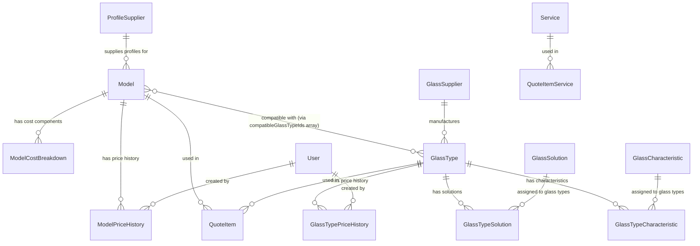
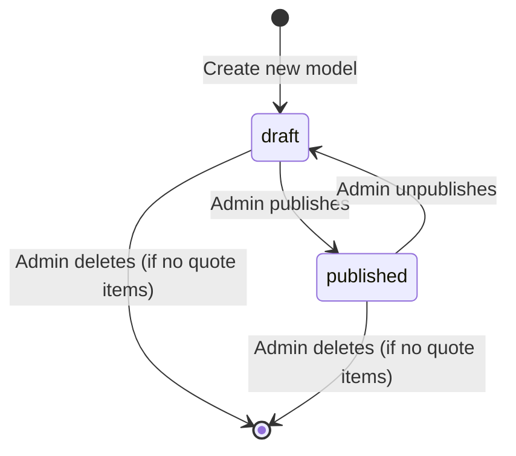
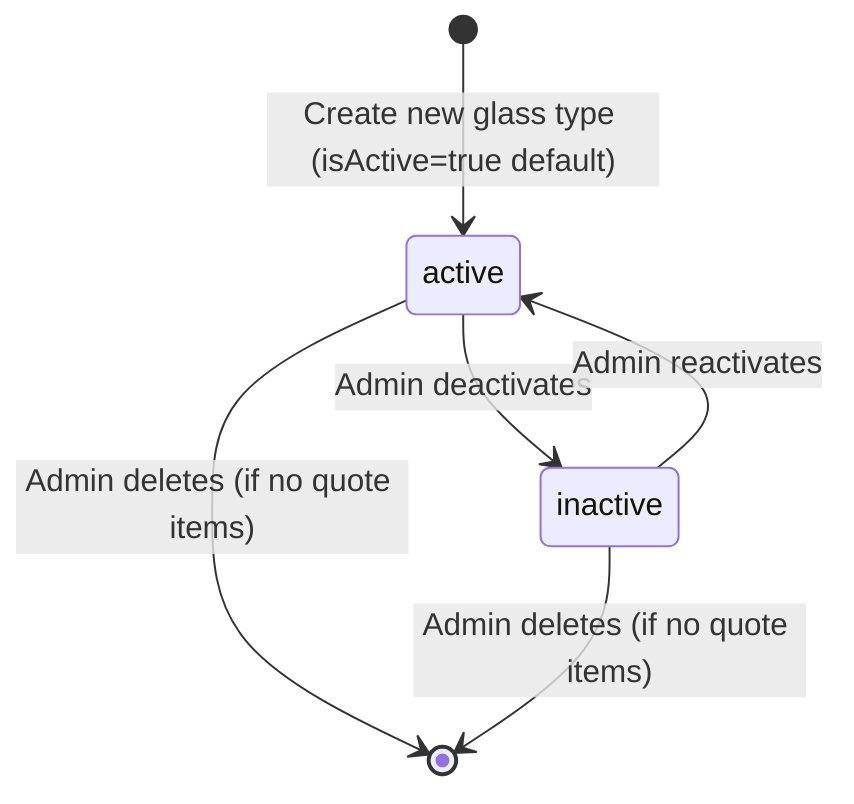

# Phase 1: Data Model & Contracts

**Feature**: Admin Catalog Management  
**Date**: 2025-10-18  
**Status**: Complete ✅

## Entity Definitions

All entities already exist in Prisma schema (`prisma/schema.prisma`). This section documents the entities managed by this feature and any validation rules not captured in the schema.

---

### 1. Model (Window/Door Product)

**Prisma Model**: `Model`

**Fields**:
| Field                  | Type                | Constraints                                     | Description                                       |
| ---------------------- | ------------------- | ----------------------------------------------- | ------------------------------------------------- |
| id                     | String (CUID)       | Primary Key                                     | Auto-generated ID                                 |
| profileSupplierId      | String (nullable)   | Foreign Key → ProfileSupplier                   | Manufacturer of window/door profiles              |
| name                   | String              | Required, max 100 chars                         | Model name (e.g., "Ventana Corrediza PVC")        |
| status                 | ModelStatus enum    | draft \| published                              | Visibility in public catalog                      |
| minWidthMm             | Int                 | Positive, <= maxWidthMm                         | Minimum width in millimeters                      |
| maxWidthMm             | Int                 | Positive, >= minWidthMm                         | Maximum width in millimeters                      |
| minHeightMm            | Int                 | Positive, <= maxHeightMm                        | Minimum height in millimeters                     |
| maxHeightMm            | Int                 | Positive, >= minHeightMm                        | Maximum height in millimeters                     |
| basePrice              | Decimal(12,2)       | Positive                                        | Base price in tenant currency                     |
| costPerMmWidth         | Decimal(12,4)       | Positive or zero                                | Additional cost per millimeter of width           |
| costPerMmHeight        | Decimal(12,4)       | Positive or zero                                | Additional cost per millimeter of height          |
| accessoryPrice         | Decimal(12,2)       | Nullable, positive                              | Optional accessory flat fee                       |
| glassDiscountWidthMm   | Int                 | Default 0, positive or zero                     | Glass discount per side (width)                   |
| glassDiscountHeightMm  | Int                 | Default 0, positive or zero                     | Glass discount per side (height)                  |
| compatibleGlassTypeIds | String[]            | Required, min 1, all IDs must exist & be active | Array of GlassType IDs compatible with this model |
| profitMarginPercentage | Decimal(5,2)        | Nullable, 0-100                                 | Profit margin percentage                          |
| lastCostReviewDate     | DateTime (nullable) | Optional                                        | Last cost review date                             |
| costNotes              | String (nullable)   | Optional, max 500 chars                         | Notes about cost structure                        |
| createdAt              | DateTime            | Auto-generated                                  | Creation timestamp                                |
| updatedAt              | DateTime            | Auto-updated                                    | Last update timestamp                             |

**Relationships**:
- `profileSupplier`: Many-to-One → ProfileSupplier (optional, `onDelete: SetNull`)
- `quoteItems`: One-to-Many ← QuoteItem (cascade delete prevented)
- `costBreakdown`: One-to-Many ← ModelCostBreakdown (cascade delete allowed)
- `priceHistory`: One-to-Many ← ModelPriceHistory (cascade delete allowed)

**Business Rules**:
1. At least one compatible glass type must be selected
2. Min dimensions must be less than or equal to max dimensions
3. Draft models are not visible in public catalog
4. Cannot delete if referenced in quote items (referential integrity)
5. Price changes trigger automatic price history record creation

**Validation Notes**:
- `compatibleGlassTypeIds`: Must validate that all IDs exist in GlassType table and have `isActive=true`
- Dimension ranges: Typical residential windows are 300-3000mm width, 400-2500mm height
- Price fields: Must be positive (Zod refinement: `.positive()`)

---

### 2. GlassType

**Prisma Model**: `GlassType`

**Fields**:
| Field             | Type                | Constraints                      | Description                                   |
| ----------------- | ------------------- | -------------------------------- | --------------------------------------------- |
| id                | String (CUID)       | Primary Key                      | Auto-generated ID                             |
| name              | String              | Required, max 100 chars          | Glass type name (e.g., "Vidrio Templado 6mm") |
| purpose           | GlassPurpose enum   | DEPRECATED (use solutions)       | Legacy field, will be removed in v2.0         |
| thicknessMm       | Int                 | Positive (3-50mm typical)        | Glass thickness in millimeters                |
| pricePerSqm       | Decimal(12,2)       | Positive                         | Price per square meter in tenant currency     |
| uValue            | Decimal(5,2)        | Nullable, positive               | Thermal transmittance (W/m²·K)                |
| isTempered        | Boolean             | DEPRECATED (use characteristics) | Legacy field, will be removed in v2.0         |
| isLaminated       | Boolean             | DEPRECATED (use characteristics) | Legacy field, will be removed in v2.0         |
| isLowE            | Boolean             | DEPRECATED (use characteristics) | Legacy field, will be removed in v2.0         |
| isTripleGlazed    | Boolean             | DEPRECATED (use characteristics) | Legacy field, will be removed in v2.0         |
| glassSupplierId   | String (nullable)   | Foreign Key → GlassSupplier      | Manufacturer of glass                         |
| sku               | String (nullable)   | Unique, max 50 chars             | Supplier SKU/product code                     |
| description       | String (nullable)   | Optional, max 500 chars          | Detailed description                          |
| solarFactor       | Decimal(4,2)        | Nullable, 0.00-1.00              | Solar factor (g-value)                        |
| lightTransmission | Decimal(4,2)        | Nullable, 0.00-1.00              | Light transmission percentage                 |
| isActive          | Boolean             | Default true                     | Whether available for selection               |
| lastReviewDate    | DateTime (nullable) | Optional                         | Last technical review date                    |
| createdAt         | DateTime            | Auto-generated                   | Creation timestamp                            |
| updatedAt         | DateTime            | Auto-updated                     | Last update timestamp                         |

**Relationships**:
- `glassSupplier`: Many-to-One → GlassSupplier (optional, `onDelete: SetNull`)
- `quoteItems`: One-to-Many ← QuoteItem (cascade delete prevented)
- `solutions`: Many-to-Many ↔ GlassSolution (via GlassTypeSolution pivot)
- `characteristics`: Many-to-Many ↔ GlassCharacteristic (via GlassTypeCharacteristic pivot)
- `priceHistory`: One-to-Many ← GlassTypePriceHistory (cascade delete allowed)

**Business Rules**:
1. At least one solution should be assigned (not enforced in DB, but recommended in UI)
2. Cannot delete if referenced in quote items (referential integrity)
3. Price changes trigger automatic price history record creation
4. Inactive glass types hidden from public catalog but still visible in admin
5. Legacy boolean fields (isTempered, etc.) will be migrated to characteristics (future task)

**Validation Notes**:
- `thicknessMm`: Typical range 3-50mm (residential/commercial glass)
- `solarFactor` and `lightTransmission`: Must be between 0.00 and 1.00 (percentages as decimals)
- `sku`: If provided, must be unique across all glass types

---

### 3. Service

**Prisma Model**: `Service`

**Fields**:
| Field     | Type             | Constraints                | Description                                   |
| --------- | ---------------- | -------------------------- | --------------------------------------------- |
| id        | String (CUID)    | Primary Key                | Auto-generated ID                             |
| name      | String           | Required, max 100 chars    | Service name (e.g., "Instalación", "Entrega") |
| type      | ServiceType enum | area \| perimeter \| fixed | Calculation method                            |
| unit      | ServiceUnit enum | unit \| sqm \| ml          | Measurement unit                              |
| rate      | Decimal(12,4)    | Positive                   | Rate per unit (currency per unit/sqm/ml)      |
| createdAt | DateTime         | Auto-generated             | Creation timestamp                            |
| updatedAt | DateTime         | Auto-updated               | Last update timestamp                         |

**Relationships**:
- `quoteServices`: One-to-Many ← QuoteItemService (cascade delete prevented)

**Business Rules**:
1. Service type determines how quantity is calculated:
   - `area`: Quantity = (width * height) in sqm
   - `perimeter`: Quantity = 2 * (width + height) in ml
   - `fixed`: Quantity = 1 (flat fee)
2. Cannot delete if referenced in quote item services (referential integrity)
3. Rate should be positive (services add cost, not discounts)

**Validation Notes**:
- `rate`: Must be positive (services don't have negative rates)
- Service `type` and `unit` should be compatible (e.g., type='area' usually pairs with unit='sqm')

---

### 4. ProfileSupplier

**Prisma Model**: `ProfileSupplier`

**Fields**:
| Field        | Type              | Constraints                      | Description                                   |
| ------------ | ----------------- | -------------------------------- | --------------------------------------------- |
| id           | String (CUID)     | Primary Key                      | Auto-generated ID                             |
| name         | String            | Required, unique                 | Supplier name (e.g., "Rehau", "Deceuninck")   |
| materialType | MaterialType enum | PVC \| ALUMINUM \| WOOD \| MIXED | Type of material the supplier provides        |
| isActive     | Boolean           | Default true                     | Whether this supplier is active for selection |
| notes        | String (nullable) | Optional, max 500 chars          | Additional notes about the supplier           |
| createdAt    | DateTime          | Auto-generated                   | Creation timestamp                            |
| updatedAt    | DateTime          | Auto-updated                     | Last update timestamp                         |

**Relationships**:
- `models`: One-to-Many ← Model (optional foreign key, `onDelete: SetNull`)

**Business Rules**:
1. Supplier name must be unique (enforced by Prisma schema)
2. Inactive suppliers hidden from public catalog but still visible in admin
3. Cannot hard delete if referenced in models (referential integrity check recommended)

**Validation Notes**:
- `name`: Should be trimmed and validated for uniqueness case-insensitively
- `materialType`: Enum ensures only valid material types are used

---

### 5. GlassSupplier

**Prisma Model**: `GlassSupplier`

**Fields**:
| Field        | Type              | Constraints              | Description                                      |
| ------------ | ----------------- | ------------------------ | ------------------------------------------------ |
| id           | String (CUID)     | Primary Key              | Auto-generated ID                                |
| name         | String            | Required, unique         | Supplier name (e.g., "Guardian", "Saint-Gobain") |
| code         | String (nullable) | Optional, unique, max 10 | Short code (e.g., "GRD" for Guardian)            |
| country      | String (nullable) | Optional, max 50         | Country where the supplier is based              |
| website      | String (nullable) | Optional, URL format     | Official website URL                             |
| contactEmail | String (nullable) | Optional, email format   | Contact email for orders/inquiries               |
| contactPhone | String (nullable) | Optional, max 20         | Contact phone number                             |
| isActive     | Boolean           | Default true             | Whether this supplier is active for selection    |
| notes        | String (nullable) | Optional, max 500 chars  | Additional notes about the supplier              |
| createdAt    | DateTime          | Auto-generated           | Creation timestamp                               |
| updatedAt    | DateTime          | Auto-updated             | Last update timestamp                            |

**Relationships**:
- `glassTypes`: One-to-Many ← GlassType (optional foreign key, `onDelete: SetNull`)

**Business Rules**:
1. Supplier name and code (if provided) must be unique
2. Inactive suppliers hidden from public catalog but still visible in admin
3. Cannot hard delete if referenced in glass types (referential integrity check recommended)

**Validation Notes**:
- `name`: Should be trimmed and validated for uniqueness case-insensitively
- `code`: If provided, should be uppercase and alphanumeric only
- `website`: Must be valid URL format (http/https)
- `contactEmail`: Must be valid email format

---

### 6. GlassSolution

**Prisma Model**: `GlassSolution`

**Fields**:
| Field       | Type              | Constraints                 | Description                                               |
| ----------- | ----------------- | --------------------------- | --------------------------------------------------------- |
| id          | String (CUID)     | Primary Key                 | Auto-generated ID                                         |
| key         | String            | Required, unique, lowercase | Unique key (e.g., "security", "thermal_insulation")       |
| name        | String            | Required, max 50 chars      | Technical name in English (e.g., "Security")              |
| nameEs      | String            | Required, max 50 chars      | Commercial name in Spanish (e.g., "Seguridad")            |
| description | String (nullable) | Optional, max 500 chars     | Description of the solution                               |
| icon        | String (nullable) | Optional, Lucide icon name  | Icon name from Lucide React (e.g., "Shield", "Snowflake") |
| sortOrder   | Int               | Default 0                   | Display order (lower = higher priority)                   |
| isActive    | Boolean           | Default true                | Whether solution is active for assignment                 |
| createdAt   | DateTime          | Auto-generated              | Creation timestamp                                        |
| updatedAt   | DateTime          | Auto-updated                | Last update timestamp                                     |

**Relationships**:
- `glassTypes`: Many-to-Many ↔ GlassType (via GlassTypeSolution pivot)

**Business Rules**:
1. Solution `key` must be unique and lowercase with underscores (e.g., "thermal_insulation")
2. Inactive solutions hidden from public catalog but still visible in admin
3. Cannot delete if assigned to any glass types (referential integrity check required)
4. Sort order determines display priority in catalog filters (lower = shown first)

**Validation Notes**:
- `key`: Should be snake_case, alphanumeric with underscores only
- `icon`: Must be a valid Lucide React icon name (validate against icon library)
- `sortOrder`: Typically 0-100 range (lower numbers for more important solutions)

---

### 7. GlassCharacteristic

**Prisma Model**: `GlassCharacteristic`

**Fields**:
| Field       | Type              | Constraints                 | Description                                              |
| ----------- | ----------------- | --------------------------- | -------------------------------------------------------- |
| id          | String (CUID)     | Primary Key                 | Auto-generated ID                                        |
| key         | String            | Required, unique, lowercase | Unique key (e.g., "tempered", "laminated", "low_e")      |
| name        | String            | Required, max 50 chars      | Technical name in English (e.g., "Tempered")             |
| nameEs      | String            | Required, max 50 chars      | Commercial name in Spanish (e.g., "Templado")            |
| description | String (nullable) | Optional, max 500 chars     | Description of the characteristic                        |
| category    | String            | Required, max 50 chars      | Category grouping (e.g., "safety", "thermal", "coating") |
| isActive    | Boolean           | Default true                | Whether characteristic is active for assignment          |
| sortOrder   | Int               | Default 0                   | Display order (lower = higher priority)                  |
| createdAt   | DateTime          | Auto-generated              | Creation timestamp                                       |
| updatedAt   | DateTime          | Auto-updated                | Last update timestamp                                    |

**Relationships**:
- `glassTypes`: Many-to-Many ↔ GlassType (via GlassTypeCharacteristic pivot)

**Business Rules**:
1. Characteristic `key` must be unique and lowercase with underscores (e.g., "low_e")
2. Inactive characteristics hidden from public catalog but still visible in admin
3. Cannot delete if assigned to any glass types (referential integrity check required)
4. Categories group related characteristics (e.g., "safety" includes "tempered", "laminated")

**Validation Notes**:
- `key`: Should be snake_case, alphanumeric with underscores only
- `category`: Common categories - "safety", "thermal", "acoustic", "coating", "aesthetic"
- `sortOrder`: Typically 0-100 range (lower numbers for more important characteristics)

---

### 8. ModelCostBreakdown (Enhancement Entity)

**Prisma Model**: `ModelCostBreakdown`

**Fields**:
| Field     | Type              | Constraints                                       | Description                                          |
| --------- | ----------------- | ------------------------------------------------- | ---------------------------------------------------- |
| id        | String (CUID)     | Primary Key                                       | Auto-generated ID                                    |
| modelId   | String            | Foreign Key → Model                               | Model this cost component belongs to                 |
| component | String            | Required, max 100 chars                           | Component name (e.g., "perfil_vertical", "herrajes") |
| costType  | CostType enum     | fixed \| per_mm_width \| per_mm_height \| per_sqm | Type of cost calculation                             |
| unitCost  | Decimal(12,4)     | Positive                                          | Cost per unit in tenant currency                     |
| notes     | String (nullable) | Optional, max 500 chars                           | Additional notes about this component                |
| createdAt | DateTime          | Auto-generated                                    | Creation timestamp                                   |
| updatedAt | DateTime          | Auto-updated                                      | Last update timestamp                                |

**Relationships**:
- `model`: Many-to-One → Model (cascade delete allowed)

**Business Rules**:
1. Cost breakdown is optional enhancement (not required for model creation)
2. Multiple cost components can exist per model
3. Cost type determines calculation method (similar to Service type)

**Validation Notes**:
- `component`: Common components - "perfil_vertical", "perfil_horizontal", "esquineros", "herrajes", "mano_obra"
- `unitCost`: Must be positive
- Cost breakdown managed from Model detail page (not separate CRUD pages)

---

### 9. GlassTypeSolution (Pivot Table)

**Prisma Model**: `GlassTypeSolution`

**Fields**:
| Field             | Type                   | Constraints                                         | Description                                             |
| ----------------- | ---------------------- | --------------------------------------------------- | ------------------------------------------------------- |
| id                | String (CUID)          | Primary Key                                         | Auto-generated ID                                       |
| glassTypeId       | String                 | Foreign Key → GlassType                             | Glass type this relation belongs to                     |
| solutionId        | String                 | Foreign Key → GlassSolution                         | Solution assigned to glass type                         |
| performanceRating | PerformanceRating enum | basic \| standard \| good \| very_good \| excellent | Performance level for this solution                     |
| isPrimary         | Boolean                | Default false                                       | Whether this is the primary solution for the glass type |
| notes             | String (nullable)      | Optional, max 500 chars                             | Additional notes about this classification              |
| createdAt         | DateTime               | Auto-generated                                      | Creation timestamp                                      |
| updatedAt         | DateTime               | Auto-updated                                        | Last update timestamp                                   |

**Relationships**:
- `glassType`: Many-to-One → GlassType (cascade delete)
- `solution`: Many-to-One → GlassSolution (cascade delete)

**Business Rules**:
1. Unique constraint on (glassTypeId, solutionId) - no duplicate assignments
2. Only one solution per glass type can be marked as primary
3. Cascade delete when glass type or solution is deleted

**Validation Notes**:
- `performanceRating`: Should reflect glass type's effectiveness for the solution
- `isPrimary`: Only one solution should have isPrimary=true per glass type (validated in application logic)

---

### 10. GlassTypeCharacteristic (Pivot Table)

**Prisma Model**: `GlassTypeCharacteristic`

**Fields**:
| Field            | Type              | Constraints                       | Description                                             |
| ---------------- | ----------------- | --------------------------------- | ------------------------------------------------------- |
| id               | String (CUID)     | Primary Key                       | Auto-generated ID                                       |
| glassTypeId      | String            | Foreign Key → GlassType           | Glass type this relation belongs to                     |
| characteristicId | String            | Foreign Key → GlassCharacteristic | Characteristic assigned to glass type                   |
| value            | String (nullable) | Optional, max 100 chars           | Optional value (e.g., "6.38mm" for laminated thickness) |
| certification    | String (nullable) | Optional, max 100 chars           | Optional certification reference (e.g., "EN 12150")     |
| notes            | String (nullable) | Optional, max 500 chars           | Additional notes about this characteristic application  |
| createdAt        | DateTime          | Auto-generated                    | Creation timestamp                                      |

**Relationships**:
- `glassType`: Many-to-One → GlassType (cascade delete)
- `characteristic`: Many-to-One → GlassCharacteristic (cascade delete)

**Business Rules**:
1. Unique constraint on (glassTypeId, characteristicId) - no duplicate assignments
2. Cascade delete when glass type or characteristic is deleted

**Validation Notes**:
- `value`: Optional freeform text for characteristic-specific values (e.g., thickness, coating type)
- `certification`: Optional certification standard (e.g., EN 12150 for tempered glass, EN 14449 for laminated)

---

## Entity Relationships Diagram

---

## Validation Rules Summary

### Cross-Entity Validation

1. **Model → GlassType Compatibility**:
   - All IDs in `compatibleGlassTypeIds` must exist in GlassType table
   - All referenced glass types must have `isActive=true`

2. **Dimension Constraints**:
   - `minWidthMm <= maxWidthMm`
   - `minHeightMm <= maxHeightMm`
   - Typical ranges: 300-3000mm (width), 400-2500mm (height)

3. **Price Positivity**:
   - All price/cost fields must be positive (no negative values)
   - Decimal precision: 12,2 for prices, 12,4 for rates/costs

4. **Referential Integrity**:
   - Cannot delete Model if referenced in QuoteItem
   - Cannot delete GlassType if referenced in QuoteItem
   - Cannot delete Service if referenced in QuoteItemService
   - Cannot delete ProfileSupplier if referenced in Model (or set to null)
   - Cannot delete GlassSupplier if referenced in GlassType (or set to null)
   - Cannot delete GlassSolution if assigned to GlassType (via GlassTypeSolution)
   - Cannot delete GlassCharacteristic if assigned to GlassType (via GlassTypeCharacteristic)

5. **Uniqueness Constraints**:
   - ProfileSupplier.name (case-insensitive validation in app)
   - GlassSupplier.name (case-insensitive validation in app)
   - GlassSupplier.code (if provided)
   - GlassType.sku (if provided)
   - GlassSolution.key
   - GlassCharacteristic.key
   - GlassTypeSolution(glassTypeId, solutionId)
   - GlassTypeCharacteristic(glassTypeId, characteristicId)

6. **Status-Based Visibility**:
   - Model: Only `status=published` visible in public catalog
   - GlassType: Only `isActive=true` visible in public catalog
   - ProfileSupplier: Only `isActive=true` visible in public dropdowns
   - GlassSupplier: Only `isActive=true` visible in public dropdowns
   - GlassSolution: Only `isActive=true` visible in public filters
   - GlassCharacteristic: Only `isActive=true` visible in public filters

---

## State Transitions

### Model Status Lifecycle

**Rules**:
- New models default to `draft` status
- Draft models not visible in public catalog
- Published models visible in public catalog
- Status can be toggled freely (no one-way transitions)
- Deletion only allowed if no associated quote items

---

### GlassType Activation Lifecycle

**Rules**:
- New glass types default to `isActive=true`
- Inactive glass types not visible in public catalog or model forms
- Can be toggled between active/inactive freely
- Deletion only allowed if no associated quote items

---

## Data Model Status

✅ **Complete** - All entities already defined in Prisma schema  
✅ **Validated** - Constitution SRP compliance (single responsibility per entity)  
✅ **Relationships** - All foreign keys and constraints documented  

**Next Step**: Phase 1 - API Contracts (tRPC procedures & Zod schemas)
