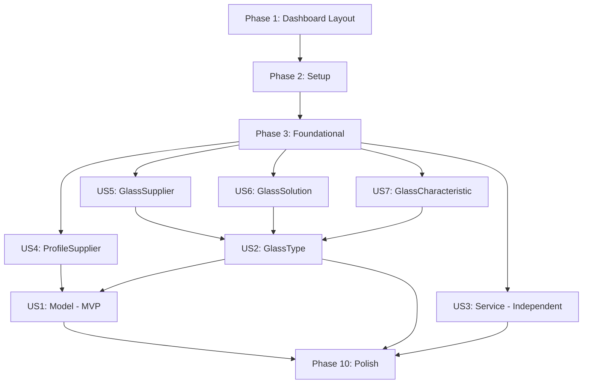

# Tasks: Admin Catalog Management

**Feature Branch**: `011-admin-catalog-management`  
**Date**: 2025-10-18  
**Input**: Design documents from `/specs/011-admin-catalog-management/`  
**Prerequisites**: plan.md ✅, spec.md ✅, research.md ✅, data-model.md ✅, contracts/ ✅, quickstart.md ✅

**Tests**: Not explicitly requested in spec - tests will be written pragmatically (before/during/after implementation as appropriate)

**Organization**: Tasks are grouped by user story to enable independent implementation and testing of each story.

---

## Format: `- [ ] [ID] [P?] [Story] Description`
- **Checkbox**: ALWAYS `- [ ]` (markdown checkbox)
- **[ID]**: Sequential task ID (T001, T002, T003...)
- **[P]**: Can run in parallel (different files, no dependencies)
- **[Story]**: Which user story (US1, US2, US3, US4, US5, US6, US7)
- Include exact file paths in descriptions

---

## Phase 1: Dashboard Layout Infrastructure 🎯 UI Foundation

**Purpose**: Implement standardized dashboard layout using Shadcn/ui sidebar components from dashboard-01 block

**Context**: Recently added Shadcn/ui dashboard-01 block (https://ui.shadcn.com/blocks) via `npx shadcn@latest add dashboard-01`. This phase sets up the admin dashboard layout before implementing any CRUD features.

**Goal**: Create a consistent admin layout with sidebar navigation and standardized content container that will be used by all admin pages.

**Independent Test**: Navigate to `/dashboard/admin`, verify sidebar appears with navigation items, test responsive behavior (sidebar collapses on mobile), verify content area has proper spacing and max-width constraints.

### Implementation Tasks

- [x] T001 Create admin dashboard layout in `src/app/(dashboard)/admin/layout.tsx` (Server Component with AppSidebar integration)
- [x] T002 [P] Configure AppSidebar navigation data in `src/app/(dashboard)/admin/layout.tsx` (nav items for all 7 entity types: Models, Glass Types, Services, Profile Suppliers, Glass Suppliers, Solutions, Characteristics)
- [x] T003 [P] Create standardized content container component in `src/app/(dashboard)/admin/_components/admin-content-container.tsx` (consistent padding, max-width, responsive spacing)
- [x] T004 [P] Create admin dashboard home page in `src/app/(dashboard)/admin/page.tsx` (Server Component with overview stats/cards)
- [x] T005 [P] Update SidebarProvider configuration in admin layout (default open state, collapsible behavior)
- [x] T006 [P] Customize NavMain component styling for admin section in admin layout (if needed for branding/theme)
- [x] T007 [P] Add breadcrumbs component in `src/app/(dashboard)/admin/_components/admin-breadcrumbs.tsx` (shows current location in admin section)
- [x] T008 Verify mobile responsiveness: sidebar drawer functionality on small screens
- [x] T009 Verify keyboard navigation and accessibility (ARIA labels, focus management)

**Available Components** (from `src/components/`):
- `app-sidebar.tsx` - Main sidebar component ✅
- `nav-main.tsx` - Main navigation list ✅
- `nav-secondary.tsx` - Secondary navigation ✅
- `nav-user.tsx` - User profile section ✅
- `ui/sidebar.tsx` - Sidebar primitives ✅

**Checkpoint**: Admin layout infrastructure complete - all admin pages will use this consistent layout

---

## Phase 2: Setup (Shared Infrastructure)

**Purpose**: Project initialization and basic structure (already exists, verify setup)

- [x] T010 Verify Next.js 15 App Router structure in `src/app/(dashboard)/admin/`
- [x] T011 Verify tRPC router structure in `src/server/api/routers/admin/`
- [x] T012 [P] Verify Prisma schema entities (Model, GlassType, Service, ProfileSupplier, GlassSupplier, GlassSolution, GlassCharacteristic) in `prisma/schema.prisma`
- [x] T013 [P] Verify authentication middleware for admin routes in `src/middleware.ts`
- [x] T014 [P] Verify Winston logger configuration in `src/lib/logger.ts`

---

## Phase 3: Foundational (Blocking Prerequisites)

**Purpose**: Core infrastructure that MUST be complete before ANY user story can be implemented

**⚠️ CRITICAL**: No user story work can begin until this phase is complete

- [ ] T006 Create shared Zod validation utilities in `src/lib/validations/shared.schema.ts` (positive integers, decimal validation, dimension min/max refinements)
- [ ] T007 Create referential integrity service in `src/server/services/referential-integrity.service.ts` (check dependencies before delete)
- [ ] T008 [P] Create price history service for models in `src/server/services/model-price-history.service.ts`
- [ ] T009 [P] Create price history service for glass types in `src/server/services/glass-price-history.service.ts`
- [ ] T010 [P] Create reusable delete confirmation dialog component in `src/app/_components/delete-confirmation-dialog.tsx`
- [ ] T011 [P] Update admin navigation component in `src/app/_components/admin-nav.tsx` with links for all 7 entity types
- [ ] T012 Register admin router namespace in `src/server/api/root.ts` (create `admin: createTRPCRouter({})` placeholder)

**Checkpoint**: Foundation ready - user story implementation can now begin in parallel

---

## Phase 3: Foundational (Blocking Prerequisites)

**Purpose**: Core infrastructure that MUST be complete before ANY user story can be implemented

**⚠️ CRITICAL**: No user story work can begin until this phase is complete

- [ ] T015 Create shared Zod validation utilities in `src/lib/validations/shared.schema.ts` (positive integers, decimal validation, dimension min/max refinements)
- [ ] T016 Create referential integrity service in `src/server/services/referential-integrity.service.ts` (check dependencies before delete)
- [ ] T017 [P] Create price history service for models in `src/server/services/model-price-history.service.ts`
- [ ] T018 [P] Create price history service for glass types in `src/server/services/glass-price-history.service.ts`
- [ ] T019 [P] Create reusable delete confirmation dialog component in `src/app/_components/delete-confirmation-dialog.tsx`
- [ ] T020 [P] Update admin navigation component in `src/app/_components/admin-nav.tsx` with links for all 7 entity types
- [ ] T021 Register admin router namespace in `src/server/api/root.ts` (create `admin: createTRPCRouter({})` placeholder)

**Checkpoint**: Foundation ready - user story implementation can now begin in parallel

---

## Phase 4: User Story 4 - Manage Profile Suppliers (Priority: P2) 🎯 Foundation Entity

**Goal**: Enable admins to create, edit, view, and delete profile suppliers (window/door manufacturers)

**Independent Test**: Create a profile supplier (e.g., "Rehau", PVC material), verify it appears in list, edit material type to Aluminum, verify it's available in model form dropdowns, delete it (if no models associated)

**Why First**: ProfileSupplier is a dependency for User Story 1 (Models). Implementing this first unblocks model creation.

### Implementation for User Story 4

- [ ] T022 [P] [US4] Create Zod schemas in `src/lib/validations/admin/profile-supplier.schema.ts` (create, update, list, delete schemas)
- [ ] T023 [US4] Create tRPC router in `src/server/api/routers/admin/profile-supplier.ts` (list, getById, create, update, delete procedures with adminProcedure)
- [ ] T024 [US4] Register profileSupplier router in `src/server/api/root.ts` admin namespace
- [ ] T025 [P] [US4] Create list page in `src/app/(dashboard)/admin/profile-suppliers/page.tsx` (Server Component with initial data fetch)
- [ ] T026 [P] [US4] Create list component in `src/app/(dashboard)/admin/profile-suppliers/_components/profile-supplier-list.tsx` (Client Component with search/filter/pagination)
- [ ] T027 [P] [US4] Create form component in `src/app/(dashboard)/admin/profile-suppliers/_components/profile-supplier-form.tsx` (Client Component with React Hook Form + Zod)
- [ ] T028 [P] [US4] Create new page in `src/app/(dashboard)/admin/profile-suppliers/new/page.tsx` (Server Component wrapper)
- [ ] T029 [P] [US4] Create edit page in `src/app/(dashboard)/admin/profile-suppliers/[id]/page.tsx` (Server Component with data fetch)
- [ ] T030 [US4] Add Winston logging for all CRUD operations in profileSupplier router
- [ ] T031 [US4] Add referential integrity check in delete procedure (check for associated models)

**Checkpoint**: ProfileSupplier CRUD complete and independently testable

---

## Phase 5: User Story 5 - Manage Glass Suppliers (Priority: P3) 🎯 Foundation Entity

**Goal**: Enable admins to create, edit, view, and delete glass suppliers (glass manufacturers)

**Independent Test**: Create a glass supplier (e.g., "Guardian", code "GRD", country "USA"), verify it appears in list, edit contact info, verify it's available in glass type form dropdowns, delete it (if no glass types associated)

**Why Now**: GlassSupplier is a dependency for User Story 2 (Glass Types). Can be implemented in parallel with US4.

### Implementation for User Story 5

- [ ] T023 [P] [US5] Create Zod schemas in `src/lib/validations/admin/glass-supplier.schema.ts` (create, update, list, delete schemas with email/URL validation)
- [ ] T024 [US5] Create tRPC router in `src/server/api/routers/admin/glass-supplier.ts` (list, getById, create, update, delete procedures)
- [ ] T025 [US5] Register glassSupplier router in `src/server/api/root.ts` admin namespace
- [ ] T026 [P] [US5] Create list page in `src/app/(dashboard)/admin/glass-suppliers/page.tsx`
- [ ] T027 [P] [US5] Create list component in `src/app/(dashboard)/admin/glass-suppliers/_components/glass-supplier-list.tsx`
- [ ] T028 [P] [US5] Create form component in `src/app/(dashboard)/admin/glass-suppliers/_components/glass-supplier-form.tsx`
- [ ] T029 [P] [US5] Create new page in `src/app/(dashboard)/admin/glass-suppliers/new/page.tsx`
- [ ] T030 [P] [US5] Create edit page in `src/app/(dashboard)/admin/glass-suppliers/[id]/page.tsx`
- [ ] T031 [US5] Add Winston logging for all CRUD operations
- [ ] T023 [US5] Add referential integrity check in delete procedure (check for associated glass types)

**Checkpoint**: GlassSupplier CRUD complete and independently testable

---

## Phase 5: User Story 6 - Manage Glass Solutions (Priority: P3) 🎯 Foundation Entity

**Goal**: Enable admins to create, edit, view, and delete glass solutions (categorization by intended use)

**Independent Test**: Create a glass solution (e.g., key="thermal_insulation", name="Thermal Insulation", nameEs="Aislamiento Térmico", icon="Snowflake"), verify it appears in list, edit sort order, verify it's available in glass type form for assignment, delete it (if no glass types use it)

**Why Now**: GlassSolution is a dependency for User Story 2 (Glass Types). Can be implemented in parallel with US4/US5.

### Implementation for User Story 6

- [ ] T024 [P] [US6] Create Zod schemas in `src/lib/validations/admin/glass-solution.schema.ts` (create, update, list, delete schemas with key snake_case validation)
- [ ] T025 [US6] Create tRPC router in `src/server/api/routers/admin/glass-solution.ts` (list, getById, create, update, delete procedures)
- [ ] T026 [US6] Register glassSolution router in `src/server/api/root.ts` admin namespace
- [ ] T027 [P] [US6] Create list page in `src/app/(dashboard)/admin/glass-solutions/page.tsx`
- [ ] T028 [P] [US6] Create list component in `src/app/(dashboard)/admin/glass-solutions/_components/glass-solution-list.tsx`
- [ ] T029 [P] [US6] Create form component in `src/app/(dashboard)/admin/glass-solutions/_components/glass-solution-form.tsx` (with Lucide icon selector)
- [ ] T030 [P] [US6] Create new page in `src/app/(dashboard)/admin/glass-solutions/new/page.tsx`
- [ ] T031 [P] [US6] Create edit page in `src/app/(dashboard)/admin/glass-solutions/[id]/page.tsx`
- [ ] T023 [US6] Add Winston logging for all CRUD operations
- [ ] T032 [US6] Add referential integrity check in delete procedure (check for associated GlassTypeSolution records)

**Checkpoint**: GlassSolution CRUD complete and independently testable

---

## Phase 6: User Story 7 - Manage Glass Characteristics (Priority: P3) 🎯 Foundation Entity

**Goal**: Enable admins to create, edit, view, and delete glass characteristics (flexible property tagging)

**Independent Test**: Create a glass characteristic (e.g., key="tempered", name="Tempered", nameEs="Templado", category="safety"), verify it appears in list grouped by category, edit description, verify it's available in glass type form for assignment, delete it (if no glass types use it)

**Why Now**: GlassCharacteristic is a dependency for User Story 2 (Glass Types). Can be implemented in parallel with US4/US5/US6.

### Implementation for User Story 7

- [ ] T024 [P] [US7] Create Zod schemas in `src/lib/validations/admin/glass-characteristic.schema.ts` (create, update, list, delete schemas with key snake_case validation)
- [ ] T025 [US7] Create tRPC router in `src/server/api/routers/admin/glass-characteristic.ts` (list, getById, create, update, delete procedures)
- [ ] T026 [US7] Register glassCharacteristic router in `src/server/api/root.ts` admin namespace
- [ ] T027 [P] [US7] Create list page in `src/app/(dashboard)/admin/glass-characteristics/page.tsx`
- [ ] T028 [P] [US7] Create list component in `src/app/(dashboard)/admin/glass-characteristics/_components/glass-characteristic-list.tsx` (with category grouping)
- [ ] T029 [P] [US7] Create form component in `src/app/(dashboard)/admin/glass-characteristics/_components/glass-characteristic-form.tsx`
- [ ] T030 [P] [US7] Create new page in `src/app/(dashboard)/admin/glass-characteristics/new/page.tsx`
- [ ] T031 [P] [US7] Create edit page in `src/app/(dashboard)/admin/glass-characteristics/[id]/page.tsx`
- [ ] T023 [US7] Add Winston logging for all CRUD operations
- [ ] T032 [US7] Add referential integrity check in delete procedure (check for associated GlassTypeCharacteristic records)

**Checkpoint**: GlassCharacteristic CRUD complete and independently testable

**Foundation Entities Complete**: All dependencies for Glass Types (US2) and Models (US1) are now available

---

## Phase 7: User Story 2 - Manage Glass Types (Priority: P2) 🎯 Core Product

**Goal**: Enable admins to create, edit, view, and delete glass types with solutions, characteristics, and pricing

**Independent Test**: Create a glass type (e.g., "Vidrio Templado 6mm", thickness=6, pricePerSqm=25000, supplier=Guardian), assign to "Security" solution with "very_good" rating, assign "tempered" characteristic with certification="EN 12150", verify it appears in model form glass type selector, edit price (triggers price history), delete it (if no quote items use it)

**Dependencies**: Requires US5 (GlassSupplier), US6 (GlassSolution), US7 (GlassCharacteristic) complete

### Implementation for User Story 2

- [ ] T024 [P] [US2] Create Zod schemas in `src/lib/validations/admin/glass-type.schema.ts` (create, update, list, delete schemas with nested solutions/characteristics arrays)
- [ ] T025 [US2] Create tRPC router in `src/server/api/routers/admin/glass-type.ts` (list with solution/characteristic joins, getById with full relations, create with nested creates, update with solution/characteristic replacement, delete with integrity check)
- [ ] T026 [US2] Register glassType router in `src/server/api/root.ts` admin namespace
- [ ] T027 [US2] Add price history auto-creation in update procedure (call glass-price-history.service.ts when pricePerSqm changes)
- [ ] T028 [P] [US2] Create list page in `src/app/(dashboard)/admin/glass-types/page.tsx`
- [ ] T029 [P] [US2] Create list component in `src/app/(dashboard)/admin/glass-types/_components/glass-type-list.tsx` (show solutions as badges)
- [ ] T030 [P] [US2] Create form component in `src/app/(dashboard)/admin/glass-types/_components/glass-type-form.tsx` (with Accordion sections: Basic Info, Thermal Properties, Solutions, Characteristics)
- [ ] T031 [P] [US2] Create solution selector component in `src/app/(dashboard)/admin/glass-types/_components/solution-selector.tsx` (React Hook Form useFieldArray for dynamic solutions with performance rating, isPrimary, notes)
- [ ] T023 [P] [US2] Create characteristic selector component in `src/app/(dashboard)/admin/glass-types/_components/characteristic-selector.tsx` (React Hook Form useFieldArray for dynamic characteristics with value, certification, notes)
- [ ] T032 [P] [US2] Create new page in `src/app/(dashboard)/admin/glass-types/new/page.tsx`
- [ ] T024 [P] [US2] Create edit page in `src/app/(dashboard)/admin/glass-types/[id]/page.tsx` (fetch with all relations)
- [ ] T025 [US2] Add Winston logging for all CRUD operations (including solution/characteristic assignments)
- [ ] T026 [US2] Add referential integrity check in delete procedure (check for associated quote items)
- [ ] T027 [US2] Add validation in update procedure: only one solution can have isPrimary=true per glass type

**Checkpoint**: GlassType CRUD complete with full solution/characteristic management and price history tracking

---

## Phase 8: User Story 1 - Manage Window/Door Models (Priority: P1) 🎯 MVP Core

**Goal**: Enable admins to create, edit, view, and delete window/door models with pricing, dimensions, and compatible glass types

**Independent Test**: Create a model (e.g., "Ventana Corrediza PVC", supplier=Rehau, status=draft, dimensions=600-2000mm x 800-2200mm, basePrice=150000, costPerMmWidth=50, costPerMmHeight=30, compatibleGlassTypes=[Templado 6mm, Laminado 6.38mm]), publish it (status=published), verify it appears in public catalog, edit pricing (triggers price history), add cost breakdown component (perfil_vertical, fixed, 25000), delete it (only if no quote items)

**Dependencies**: Requires US4 (ProfileSupplier), US2 (GlassType complete for compatible glass types selection)

### Implementation for User Story 1

- [ ] T028 [P] [US1] Create Zod schemas in `src/lib/validations/admin/model.schema.ts` (create, update, list, delete schemas with dimension min/max refinements, compatibleGlassTypeIds array validation, cost breakdown nested schemas)
- [ ] T029 [US1] Create tRPC router in `src/server/api/routers/admin/model.ts` (list, getById with cost breakdown/price history, create, update with price history trigger, delete with integrity check, addCostBreakdown, updateCostBreakdown, deleteCostBreakdown procedures)
- [ ] T030 [US1] Register model router in `src/server/api/root.ts` admin namespace
- [ ] T031 [US1] Add price history auto-creation in update procedure (call model-price-history.service.ts when basePrice/costPerMmWidth/costPerMmHeight changes)
- [ ] T023 [US1] Add validation in create/update: validate all compatibleGlassTypeIds exist and are active
- [ ] T032 [P] [US1] Create list page in `src/app/(dashboard)/admin/models/page.tsx`
- [ ] T024 [P] [US1] Create list component in `src/app/(dashboard)/admin/models/_components/model-list.tsx` (show status badges, price range, glass type count)
- [ ] T025 [P] [US1] Create form component in `src/app/(dashboard)/admin/models/_components/model-form.tsx` (with Accordion sections: Basic Info, Dimensions, Pricing, Compatible Glass Types, Cost Notes)
- [ ] T026 [P] [US1] Create cost breakdown component in `src/app/(dashboard)/admin/models/_components/model-cost-breakdown.tsx` (React Hook Form useFieldArray for dynamic cost components, shown in separate tab/section on edit page)
- [ ] T027 [P] [US1] Create new page in `src/app/(dashboard)/admin/models/new/page.tsx`
- [ ] T028 [P] [US1] Create edit page in `src/app/(dashboard)/admin/models/[id]/page.tsx` (fetch with cost breakdown and price history)
- [ ] T029 [US1] Add Winston logging for all CRUD operations (including cost breakdown changes)
- [ ] T030 [US1] Add referential integrity check in delete procedure (check for associated quote items)

**Checkpoint**: Model CRUD complete with cost breakdown management, price history tracking, and glass type compatibility

**MVP READY**: With User Story 1 complete, the catalog has models (core products) and all their dependencies. This is a shippable MVP.

---

## Phase 9: User Story 3 - Manage Services (Priority: P3) 🎯 Supplementary

**Goal**: Enable admins to create, edit, view, and delete additional services for quotes

**Independent Test**: Create a service (e.g., "Instalación", type=fixed, unit=unit, rate=50000), verify it appears in quote creation forms, edit rate, verify calculation is correct when added to a quote, delete it (if no quote item services use it)

**Dependencies**: None (independent entity)

### Implementation for User Story 3

- [ ] T031 [P] [US3] Create Zod schemas in `src/lib/validations/admin/service.schema.ts` (create, update, list, delete schemas)
- [ ] T023 [US3] Create tRPC router in `src/server/api/routers/admin/service.ts` (list, getById, create, update, delete procedures)
- [ ] T032 [US3] Register service router in `src/server/api/root.ts` admin namespace
- [ ] T024 [P] [US3] Create list page in `src/app/(dashboard)/admin/services/page.tsx`
- [ ] T025 [P] [US3] Create list component in `src/app/(dashboard)/admin/services/_components/service-list.tsx` (show type and unit badges)
- [ ] T026 [P] [US3] Create form component in `src/app/(dashboard)/admin/services/_components/service-form.tsx`
- [ ] T027 [P] [US3] Create new page in `src/app/(dashboard)/admin/services/new/page.tsx`
- [ ] T028 [P] [US3] Create edit page in `src/app/(dashboard)/admin/services/[id]/page.tsx`
- [ ] T029 [US3] Add Winston logging for all CRUD operations
- [ ] T030 [US3] Add referential integrity check in delete procedure (check for associated quote item services)

**Checkpoint**: Service CRUD complete and independently testable

---

## Phase 10: Polish & Cross-Cutting Concerns

**Purpose**: Improvements that affect multiple user stories and final validation

- [ ] T031 [P] Write unit tests for all tRPC routers in `tests/unit/admin/*.test.ts` (profile-supplier, glass-supplier, glass-solution, glass-characteristic, glass-type, model, service)
- [ ] T023 [P] Write unit tests for price history services in `tests/unit/services/*.test.ts` (model-price-history, glass-price-history)
- [ ] T032 [P] Write unit tests for referential integrity service in `tests/unit/services/referential-integrity.test.ts`
- [ ] T024 [P] Write integration tests for model CRUD with cost breakdown in `tests/integration/admin/model-crud.test.ts`
- [ ] T025 [P] Write integration tests for glass type CRUD with solutions/characteristics in `tests/integration/admin/glass-type-crud.test.ts`
- [ ] T026 [P] Write E2E test for profile supplier management in `e2e/admin/profile-supplier-management.spec.ts`
- [ ] T027 [P] Write E2E test for glass supplier management in `e2e/admin/glass-supplier-management.spec.ts`
- [ ] T028 [P] Write E2E test for glass solution management in `e2e/admin/glass-solution-management.spec.ts`
- [ ] T029 [P] Write E2E test for glass characteristic management in `e2e/admin/glass-characteristic-management.spec.ts`
- [ ] T030 [P] Write E2E test for glass type management in `e2e/admin/glass-type-management.spec.ts` (full workflow: create with solutions/characteristics, edit, price change with history, delete prevention)
- [ ] T031 [P] Write E2E test for model management in `e2e/admin/model-management.spec.ts` (full workflow: create with glass types, publish, add cost breakdown, price change with history, delete prevention)
- [ ] T023 [P] Write E2E test for service management in `e2e/admin/service-management.spec.ts`
- [ ] T032 [P] Update README.md with admin catalog management features in `README.md`
- [ ] T024 [P] Update CHANGELOG.md with feature details following conventional changelog format in `CHANGELOG.md`
- [ ] T025 Code review: Verify all Winston logger calls are server-side only (no usage in Client Components)
- [ ] T026 Code review: Verify all admin procedures use `adminProcedure` (not `protectedProcedure`)
- [ ] T027 Code review: Verify all forms use Spanish (es-LA) UI text, all code/comments in English
- [ ] T028 Run `pnpm typecheck` to verify TypeScript compilation
- [ ] T029 Run `pnpm lint:fix` to ensure Ultracite/Biome formatting compliance
- [ ] T030 Run `pnpm test` to execute all unit and integration tests
- [ ] T031 Run `pnpm test:e2e` to execute all E2E tests with Playwright
- [ ] T023 Run quickstart.md validation: Follow setup steps and verify all entity CRUD operations work end-to-end

---

## Dependencies & Execution Order

### Phase Dependencies

- **Dashboard Layout (Phase 1)**: No dependencies - UI foundation for admin section 🎯 **NEW**
- **Setup (Phase 2)**: Depends on Phase 1 - verification of existing structure
- **Foundational (Phase 3)**: Depends on Setup - BLOCKS all user stories
- **Foundation Entities (Phases 4-7)**: All depend on Foundational completion, can run in parallel
  - **US4 ProfileSupplier (Phase 4)**: Can start after Phase 3
  - **US5 GlassSupplier (Phase 5)**: Can start after Phase 3
  - **US6 GlassSolution (Phase 6)**: Can start after Phase 3
  - **US7 GlassCharacteristic (Phase 7)**: Can start after Phase 3
- **Core Products (Phases 8-9)**: Depend on Foundation Entities
  - **US2 GlassType (Phase 8)**: Requires US5, US6, US7 complete
  - **US1 Model (Phase 9)**: Requires US4, US2 complete (MVP milestone)
- **Supplementary (Phase 10)**: 
  - **US3 Service (Phase 10)**: No dependencies, can run anytime after Phase 3
- **Polish (Phase 11)**: Depends on all desired user stories being complete

### User Story Dependencies



### Recommended Execution Strategy

**Option A: Sequential by Priority (Single Developer)**
1. Phase 1-2: Setup + Foundational
2. Phase 3: US4 ProfileSupplier
3. Phase 4: US5 GlassSupplier
4. Phase 5: US6 GlassSolution  
5. Phase 6: US7 GlassCharacteristic
6. Phase 7: US2 GlassType
7. Phase 8: US1 Model ✅ **MVP MILESTONE**
8. Phase 9: US3 Service (optional for MVP)
9. Phase 10: Polish & Testing

**Option B: Parallel by Team (Multiple Developers)**
1. Phase 1-2: Setup + Foundational (All team)
2. **Parallel Block 1** (4 developers):
   - Dev A: US4 ProfileSupplier
   - Dev B: US5 GlassSupplier
   - Dev C: US6 GlassSolution
   - Dev D: US7 GlassCharacteristic
3. **Parallel Block 2** (2 developers):
   - Dev A+B: US2 GlassType
   - Dev C: US3 Service
4. **Sequential**:
   - Dev A+B+C: US1 Model ✅ **MVP MILESTONE**
5. Phase 10: Polish & Testing (All team)

**Option C: MVP First, Iterate Later**
1. Phase 1-2: Setup + Foundational
2. Phase 3-6: Foundation Entities (parallel if possible)
3. Phase 7: US2 GlassType
4. Phase 8: US1 Model ✅ **SHIP MVP**
5. *Later iterations*: US3 Service + additional enhancements

### Parallel Opportunities

**Phase 2 (Foundational) - All [P] tasks can run in parallel:**
- T006 Shared schemas
- T008 Model price history service
- T009 Glass price history service
- T010 Delete confirmation dialog
- T011 Admin navigation

**Phases 3-6 (Foundation Entities) - All phases can run in parallel:**
- ProfileSupplier (T013-T022)
- GlassSupplier (T023-T032)
- GlassSolution (T033-T042)
- GlassCharacteristic (T043-T052)

**Within Each User Story - All [P] tasks can run in parallel:**
- Schema files
- Page files (list, new, edit)
- Component files (list, form)

**Phase 1 (Dashboard Layout) - Most [P] tasks can run in parallel:**
- T002-T007 can be done in parallel once T001 (layout) is complete

**Phase 3 (Foundational) - All [P] tasks can run in parallel:**
- T017 Model price history service
- T018 Glass price history service
- T019 Delete confirmation dialog
- T020 Admin navigation

**Phase 11 (Polish) - All [P] tasks can run in parallel:**
- All test writing tasks (T099-T110)
- Documentation tasks (T111-T112)

---

## Parallel Example: Foundation Entities (Phases 4-7)

Once Phase 3 (Foundational) is complete, all 4 foundation entities can be implemented in parallel by different team members:

```bash
# Developer A: ProfileSupplier (Phase 4)
Tasks: T022-T031 (10 tasks)
Time estimate: ~4-6 hours

# Developer B: GlassSupplier (Phase 5)
Tasks: T032-T041 (10 tasks)
Time estimate: ~4-6 hours

# Developer C: GlassSolution (Phase 6)
Tasks: T042-T051 (10 tasks)
Time estimate: ~4-6 hours

# Developer D: GlassCharacteristic (Phase 7)
Tasks: T052-T061 (10 tasks)
Time estimate: ~4-6 hours

Total parallel time: ~4-6 hours (vs ~16-24 hours sequential)
```

---

## Summary

**Total Tasks**: 120 tasks (updated from 111 - added Phase 1 Dashboard Layout)
- **Dashboard Layout (Phase 1)**: 9 tasks (UI foundation with Shadcn/ui sidebar)
- **Setup (Phase 2)**: 5 tasks (verification)
- **Foundational (Phase 3)**: 7 tasks (blocking prerequisites)
- **US4 ProfileSupplier (Phase 4)**: 10 tasks
- **US5 GlassSupplier (Phase 5)**: 10 tasks
- **US6 GlassSolution (Phase 6)**: 10 tasks
- **US7 GlassCharacteristic (Phase 7)**: 10 tasks
- **US2 GlassType (Phase 8)**: 14 tasks (complex with solutions/characteristics)
- **US1 Model (Phase 9)**: 13 tasks (complex with cost breakdown) ✅ **MVP**
- **US3 Service (Phase 10)**: 10 tasks
- **Polish (Phase 11)**: 22 tasks (testing + documentation)

**Task Distribution by User Story**:
- US1 (Model): 13 tasks - Priority P1 - MVP Core
- US2 (GlassType): 14 tasks - Priority P2 - Required for MVP
- US3 (Service): 10 tasks - Priority P3 - Post-MVP
- US4 (ProfileSupplier): 10 tasks - Priority P2 - Foundation for US1
- US5 (GlassSupplier): 10 tasks - Priority P3 - Foundation for US2
- US6 (GlassSolution): 10 tasks - Priority P3 - Foundation for US2
- US7 (GlassCharacteristic): 10 tasks - Priority P3 - Foundation for US2

**Parallel Opportunities Identified**: 
- Phase 1: 7 parallel tasks (dashboard layout components)
- Phase 3: 5 parallel tasks (foundational services)
- Phases 4-7: All 4 phases can run in parallel (40 tasks total)
- Phase 8-9: Some tasks within each phase can run in parallel
- Phase 11: 18 parallel tasks (all test writing)

**Independent Test Criteria**:
- ✅ Each user story has clear "Independent Test" criteria defined
- ✅ Each user story can be tested without other stories being complete
- ✅ MVP is clearly marked (US1 Model after US4, US2 complete)
- ✅ Dashboard layout can be tested independently (Phase 1)

**Suggested MVP Scope**: 
- Phase 1: Dashboard Layout (UI foundation) 🎯 **NEW**
- Phase 2-3: Setup + Foundational
- Phase 4-7: All Foundation Entities
- Phase 8: US2 GlassType  
- Phase 9: US1 Model
- **Result**: Admin has consistent dashboard layout with sidebar navigation, can manage models, glass types, and all their dependencies (suppliers, solutions, characteristics)

**Format Validation**: ✅ All tasks follow checklist format with:
- Checkbox `- [ ]`
- Task ID (T001-T120)
- [P] marker where applicable
- [Story] label (US1-US7) where applicable
- Clear description with exact file paths

---

**Generated by**: `/speckit.tasks` command  
**Tasks Version**: 1.1.0 (added Phase 1: Dashboard Layout Infrastructure)  
**Last Updated**: 2025-10-18
**Changes**: Added Phase 1 with 9 tasks for implementing Shadcn/ui dashboard-01 layout before CRUD features
