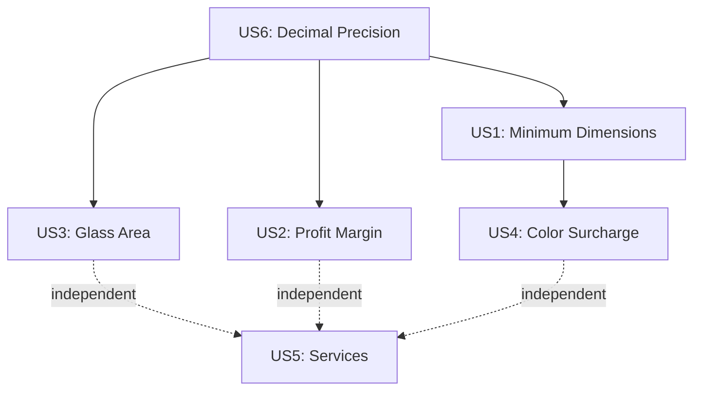

# Tasks: Price Calculation Domain Refactor

**Input**: Design documents from `/specs/016-price-calculation-refactor/`  
**Prerequisites**: plan.md ✅, spec.md ✅

**Constitution Compliance**: Tasks follow principles from `.specify/memory/constitution.md`. Key reminders:
- **Flexible Testing**: TDD approach for domain layer - tests written FIRST, then implementation
- **One Job, One Place**: Each calculator has single responsibility (SOLID)
- **Clarity Over Complexity**: Pure functions with descriptive names
- **Security From the Start**: All calculations server-side with Zod validation

**Tests**: Test tasks are included following TDD approach for domain layer as specified in plan.md (100% coverage requirement).

**Organization**: Tasks grouped by user story to enable independent implementation and testing.

## Format: `[ID] [P?] [Story] Description`

- **[P]**: Can run in parallel (different files, no dependencies)
- **[Story]**: Which user story this task belongs to (e.g., US1, US2, US3)
- Include exact file paths in descriptions

## Path Conventions

Single project structure at repository root:
- Domain: `src/domain/pricing/`
- Tests: `tests/unit/domain/pricing/`
- Adapters: `src/domain/pricing/adapters/`

---

## Phase 1: Setup (Shared Infrastructure)

**Purpose**: Project initialization and domain structure

- [ ] T001 Create domain directory structure: `src/domain/pricing/{core,ports,use-cases,adapters}`
- [ ] T002 [P] Create test directory structure: `tests/unit/domain/pricing/{entities,services}`
- [ ] T003 [P] Install decimal.js dependency: `pnpm add decimal.js`
- [ ] T004 [P] Install fast-check for property-based testing: `pnpm add -D fast-check`
- [ ] T005 [P] Configure TypeScript paths for domain imports in `tsconfig.json`

---

## Phase 2: Foundational (Blocking Prerequisites)

**Purpose**: Core value objects and constants that ALL user stories depend on

**⚠️ CRITICAL**: No user story work can begin until this phase is complete

### Constants & Types

- [ ] T006 [P] Create domain constants in `src/domain/pricing/core/constants.ts`
  - MM_PER_METER = 1000
  - ROUND_SCALE = 2
  - ROUND_MODE = Decimal.ROUND_HALF_UP
  - SERVICE_QUANTITY_SCALE = 2
  - FIXED_SERVICE_QUANTITY_SCALE = 4

- [ ] T007 [P] Create domain types in `src/domain/pricing/core/types.ts`
  - ServiceUnit enum (unit, sqm, ml)
  - ServiceInput, ServiceResult interfaces
  - AdjustmentInput, AdjustmentResult interfaces
  - Export types for use cases

### Value Objects (Foundation for ALL calculations)

- [ ] T008 [P] Create Money value object test in `tests/unit/domain/pricing/entities/money.test.ts`
  - Test creation from Decimal/number/string
  - Test arithmetic operations (add, multiply, divide)
  - Test rounding to 2 decimals with ROUND_HALF_UP
  - Test immutability (operations return new instances)
  - Property-based test: commutativity of addition

- [ ] T009 Create Money value object in `src/domain/pricing/core/entities/money.ts`
  - Private readonly amount: Decimal
  - Constructor accepts Decimal | number | string
  - Methods: add(), multiply(), divide(), toNumber()
  - Static ROUND_SCALE and ROUND_MODE constants

- [ ] T010 [P] Create Dimensions value object test in `tests/unit/domain/pricing/entities/dimensions.test.ts`
  - Test effective width/height (max(value - min, 0))
  - Test conversion to meters
  - Test clamping to zero when below minimum
  - Test edge cases (zero dimensions, negative values)

- [ ] T011 Create Dimensions value object in `src/domain/pricing/core/entities/dimensions.ts`
  - Properties: widthMm, heightMm, minWidthMm, minHeightMm
  - Methods: getEffectiveWidth(), getEffectiveHeight(), toMeters()
  - Validation: clamp negative effective dimensions to zero

- [ ] T012 Create entities public API in `src/domain/pricing/core/entities/index.ts`
  - Export Money and Dimensions classes

**Checkpoint**: Foundation ready - user story calculators can now be implemented in parallel

---

## Phase 3: User Story 6 - Mathematical Precision (Priority: P1) 🎯

**Goal**: Ensure all calculations use decimal arithmetic to prevent floating-point errors

**Independent Test**: Verify that 0.1 + 0.2 = 0.3 exactly using Money class (would fail with native JavaScript numbers)

**Why First**: This is the most foundational requirement - ALL other user stories depend on decimal precision for accurate calculations.

### Implementation for User Story 6

- [ ] T013 [US6] Verify Money class passes decimal precision tests from T008
  - 0.1 + 0.2 = 0.3 exactly (not 0.30000000000000004)
  - Multiple decimal operations produce consistent results
  - Rounding is deterministic and repeatable

- [ ] T014 [US6] Create property-based test for Money arithmetic in `tests/unit/domain/pricing/entities/money.test.ts`
  - Test associativity: (a + b) + c = a + (b + c)
  - Test distributivity: a × (b + c) = (a × b) + (a × c)
  - Use fast-check with 1000+ random test cases

**Checkpoint**: Decimal precision verified - all monetary calculations will be accurate

---

## Phase 4: User Story 1 - Minimum Dimensions Logic (Priority: P1) 🎯 MVP

**Goal**: Calculate profile cost correctly using minimum dimensions logic (base price includes minimums, only charge for extras)

**Independent Test**: Given model with min 800×800mm and dimensions 1000×1200mm, verify profile cost = basePrice + (costPerMm × extraMm)

### Tests for User Story 1

- [ ] T015 [P] [US1] Create ProfileCalculator test in `tests/unit/domain/pricing/services/profile-calculator.test.ts`
  - Test scenario 1: Exact minimum dimensions (800×800mm) → profileCost = basePrice
  - Test scenario 2: Above minimum (1000×1200mm) → basePrice + (0.10 × 200) + (0.10 × 400) = $160
  - Test scenario 3: Below minimum (700×900mm) → treated as 800×800mm, profileCost = basePrice
  - Test zero per-mm costs
  - Test zero extra dimensions

### Implementation for User Story 1

- [ ] T016 [US1] Implement ProfileCalculator in `src/domain/pricing/core/services/profile-calculator.ts`
  - calculateBaseCost(basePrice, colorMultiplier = 1): Money
  - calculateWidthCost(costPerMm, extraMm, colorMultiplier = 1): Money
  - calculateHeightCost(costPerMm, extraMm, colorMultiplier = 1): Money
  - calculateProfileCost(basePrice, costPerMm{Width,Height}, dimensions): Money
  - All functions pure (no side effects)

- [ ] T017 [US1] Create services public API in `src/domain/pricing/core/services/index.ts`
  - Export ProfileCalculator

**Checkpoint**: Profile cost calculation working correctly with minimum dimensions logic

---

## Phase 5: User Story 3 - Glass Area Calculation (Priority: P1) 🎯

**Goal**: Calculate billable glass area by subtracting profile discounts from total dimensions

**Independent Test**: Given 1000×2000mm with 50×50mm discounts, verify area = ((950 × 1950) / 1,000,000) = 1.8525 m²

### Tests for User Story 3

- [ ] T018 [P] [US3] Create GlassCalculator test in `tests/unit/domain/pricing/services/glass-calculator.test.ts`
  - Test scenario 1: 1000×2000mm with 50×50mm discounts → 1.8525 m²
  - Test scenario 2: 800×800mm with 100×100mm discounts → 0.49 m²
  - Test scenario 3: Zero discounts → full area
  - Test edge case: Discounts exceed dimensions → clamped to 0 m²
  - Test glass cost calculation: area × pricePerSqm

### Implementation for User Story 3

- [ ] T019 [US3] Implement GlassCalculator in `src/domain/pricing/core/services/glass-calculator.ts`
  - calculateEffectiveDimensions(dimensions, discounts): { widthMm, heightMm }
  - calculateArea(effectiveDimensions): number (in m²)
  - calculateGlassCost(area, pricePerSqm): Money
  - Clamp negative dimensions to zero after discount

- [ ] T020 [US3] Update services public API in `src/domain/pricing/core/services/index.ts`
  - Export GlassCalculator

**Checkpoint**: Glass area and cost calculation working correctly

---

## Phase 6: User Story 2 - Profit Margin on Model Only (Priority: P1) 🎯

**Goal**: Apply profit margin ONLY to model costs (profile + accessories), NOT to glass/services

**Independent Test**: Given modelCost=$210, margin=20%, verify modelSalesPrice=$262.50 and finalPrice includes glass/services without margin

### Tests for User Story 2

- [ ] T021 [P] [US2] Create MarginCalculator test in `tests/unit/domain/pricing/services/margin-calculator.test.ts`
  - Test scenario 1: modelCost=$210, margin=20% → salesPrice=$262.50, marginAmount=$52.50
  - Test scenario 2: modelCost=$100, margin=25% → salesPrice=$133.33
  - Test scenario 3: margin=0% → salesPrice=modelCost (no margin)
  - Test edge case: margin=100% → should throw error (division by zero)
  - Test edge case: margin>100% → should throw error

### Implementation for User Story 2

- [ ] T022 [US2] Implement MarginCalculator in `src/domain/pricing/core/services/margin-calculator.ts`
  - validateMargin(marginPercentage): void (throws if >= 100%)
  - applyMargin(modelCost, marginPercentage): Money
    - Formula: salesPrice = cost / (1 - margin/100)
  - calculateMarginAmount(salesPrice, cost): Money
  - All functions pure, validation throws on invalid input

- [ ] T023 [US2] Update services public API in `src/domain/pricing/core/services/index.ts`
  - Export MarginCalculator

**Checkpoint**: Profit margin applied correctly to model only, glass/services excluded

---

## Phase 7: User Story 4 - Color Surcharge Application (Priority: P2)

**Goal**: Apply color surcharge to base price AND per-mm costs BEFORE calculating total profile cost

**Independent Test**: Given base=$100, perMm=$0.10, color=10%, dimensions=1000×1200mm (min 800×800mm), verify total=$176 with color applied to components

### Tests for User Story 4

- [ ] T024 [P] [US4] Update ProfileCalculator test in `tests/unit/domain/pricing/services/profile-calculator.test.ts`
  - Test scenario 1: 10% color → base=$110, widthCost=$22, heightCost=$44, total=$176
  - Test scenario 2: 0% color → base=$100, widthCost=$20, heightCost=$40, total=$160
  - Test scenario 3: Verify color NOT applied to glass or services (separate test)
  - Test color applied to accessory cost

### Implementation for User Story 4

- [ ] T025 [US4] Update ProfileCalculator in `src/domain/pricing/core/services/profile-calculator.ts`
  - Ensure colorMultiplier parameter is used in all calculate methods
  - calculateProfileCost now accepts colorSurchargePercentage
  - Formula: colorMultiplier = 1 + (percentage / 100)
  - Apply to base, widthCost, heightCost individually before sum

- [ ] T026 [US4] Create AccessoryCalculator in `src/domain/pricing/core/services/accessory-calculator.ts`
  - calculateAccessoryCost(accessoryPrice, colorMultiplier): Money
  - Returns Money(0) if accessoryPrice is null/undefined

- [ ] T027 [US4] Update services public API in `src/domain/pricing/core/services/index.ts`
  - Export AccessoryCalculator

**Checkpoint**: Color surcharge applied correctly to profile components and accessories

---

## Phase 8: User Story 5 - Service Calculations (Priority: P2)

**Goal**: Calculate service costs based on type (fixed, area, perimeter) with minimum billing units

**Independent Test**: Given area service with rate=$50/m², dimensions=1.0×1.5m (area=1.5m²), minimum=2.0m², verify amount=$100 (billed at minimum)

### Tests for User Story 5

- [ ] T028 [P] [US5] Create ServiceCalculator test in `tests/unit/domain/pricing/services/service-calculator.test.ts`
  - Test fixed service: quantity=1, amount=rate×1
  - Test area service: dimensions 1.0×2.0m → quantity=2.0m², amount=rate×2.0
  - Test perimeter service: dimensions 1.0×2.0m → quantity=6.0ml, amount=rate×6.0
  - Test minimum billing unit: area=1.5m² < minimum=2.0m² → billed at 2.0m²
  - Test quantity rounding: area quantities to 2 decimals, fixed to 4 decimals

### Implementation for User Story 5

- [ ] T029 [US5] Implement ServiceCalculator in `src/domain/pricing/core/services/service-calculator.ts`
  - calculateFixedQuantity(): number (returns 1 or quantityOverride)
  - calculateAreaQuantity(dimensions): number (in m²)
  - calculatePerimeterQuantity(dimensions): number (in ml)
  - applyMinimumBillingUnit(quantity, minimum): number
  - calculateServiceAmount(service, dimensions): ServiceResult
  - Round quantities: 2 decimals for area/perimeter, 4 for fixed

- [ ] T030 [US5] Update services public API in `src/domain/pricing/core/services/index.ts`
  - Export ServiceCalculator

**Checkpoint**: Service calculations working for all types (fixed, area, perimeter) with minimums

---

## Phase 9: Adjustments Calculator (Priority: P2)

**Goal**: Calculate positive/negative adjustments based on quantity and sign

**Independent Test**: Given adjustment with value=$10, quantity=2, sign=negative, verify amount=-$20

### Tests for Adjustments

- [ ] T031 [P] Create AdjustmentCalculator test in `tests/unit/domain/pricing/services/adjustment-calculator.test.ts`
  - Test positive adjustment: value=$10, quantity=2 → amount=$20
  - Test negative adjustment: value=$10, quantity=2, sign=negative → amount=-$20
  - Test quantity calculation based on unit (same as services)
  - Test zero quantity → zero amount

### Implementation for Adjustments

- [ ] T032 Implement AdjustmentCalculator in `src/domain/pricing/core/services/adjustment-calculator.ts`
  - calculateQuantity(adjustment, dimensions): number (reuses service quantity logic)
  - calculateAdjustmentAmount(adjustment, quantity): AdjustmentResult
  - Apply sign (positive/negative) to final amount

- [ ] T033 Update services public API in `src/domain/pricing/core/services/index.ts`
  - Export AdjustmentCalculator

**Checkpoint**: Adjustments calculate correctly with sign and quantity

---

## Phase 10: Price Calculation Aggregate (Integration)

**Goal**: Orchestrate all calculators into single use case that produces complete price breakdown

**Independent Test**: Given full product configuration, verify complete breakdown matches sum of all components with correct formulas applied

### Tests for Price Calculation

- [ ] T034 [P] Create PriceCalculation entity test in `tests/unit/domain/pricing/entities/price-calculation.test.ts`
  - Test complete calculation from spec example:
    - profile=$160, accessory=$50, glass=$148, services=$190, margin=20%
    - Expected: modelCost=$210, modelSales=$262.50, final=$600.50
  - Test with color surcharge applied to profile+accessory
  - Test with zero glass (no glass in configuration)
  - Test with zero services
  - Test with adjustments

### Implementation for Price Calculation

- [ ] T035 Create PriceCalculation aggregate in `src/domain/pricing/core/entities/price-calculation.ts`
  - Properties: profileCost, glassCost, accessoryCost, modelCost, modelSalesPrice, services[], adjustments[], finalSalesPrice
  - Static calculate() method orchestrates all calculators
  - Returns immutable result object
  - All calculations use Money value object

- [ ] T036 Update entities public API in `src/domain/pricing/core/entities/index.ts`
  - Export PriceCalculation aggregate

**Checkpoint**: Complete price calculation works end-to-end with all business rules

---

## Phase 11: Use Case & Ports

**Goal**: Define application layer use case and input/output ports for hexagonal architecture

**Independent Test**: Use case can be called with input, returns result matching PriceCalculation aggregate

### Ports (Interfaces)

- [ ] T037 [P] Create input port interface in `src/domain/pricing/ports/input/price-calculator.port.ts`
  - PriceCalculatorPort interface with calculateItemPrice(input) method
  - PriceCalculationInput type (dimensions, model, glass, services, adjustments)
  - PriceCalculationResult type (matches PriceCalculation properties as plain objects)

- [ ] T038 [P] Create ports public API in `src/domain/pricing/ports/index.ts`
  - Export input port interface and types
  - Note: No output ports needed (no external dependencies)

### Use Case Implementation

- [ ] T039 [P] Create use case test in `tests/unit/domain/pricing/use-cases/calculate-item-price.test.ts`
  - Integration test: Full calculation flow with realistic data
  - Test input validation (margin >= 100% throws error)
  - Test type conversion (string/number → Decimal)
  - Test edge cases from spec

- [ ] T040 Create use case in `src/domain/pricing/use-cases/calculate-item-price.ts`
  - Implements PriceCalculatorPort interface
  - Validates input (margin < 100%, positive values)
  - Converts inputs to domain types (Money, Dimensions)
  - Calls PriceCalculation.calculate()
  - Converts result to plain objects (PriceCalculationResult)

- [ ] T041 Create use-cases public API in `src/domain/pricing/use-cases/index.ts`
  - Export CalculateItemPrice use case

**Checkpoint**: Use case layer complete - domain is fully functional and testable

---

## Phase 12: tRPC Adapter

**Goal**: Integrate domain layer with existing tRPC infrastructure while maintaining backward compatibility

**Independent Test**: tRPC procedure can be called with existing payload format, returns same structure as old implementation

### Adapter Implementation

- [ ] T042 [P] Create tRPC adapter test in `src/domain/pricing/adapters/trpc/price-calculator.adapter.test.ts`
  - Integration test: Call adapter with tRPC input, verify output matches contract
  - Test backward compatibility with existing cart/catalog calls
  - Test error handling (invalid inputs)
  - Test Decimal/number conversions

- [ ] T043 Create tRPC adapter in `src/domain/pricing/adapters/trpc/price-calculator.adapter.ts`
  - Transforms tRPC input → PriceCalculationInput
  - Calls CalculateItemPrice use case
  - Transforms PriceCalculationResult → tRPC output
  - Handles Prisma Decimal types (existing in DB models)
  - Logs errors with Winston (server-side only)

- [ ] T044 Create adapters public API in `src/domain/pricing/adapters/index.ts`
  - Export tRPC adapter

**Checkpoint**: Domain integrated with framework - ready for gradual migration

---

## Phase 13: Migration - Catalog Module

**Goal**: Replace old price calculator in catalog module with new domain layer

**Independent Test**: Catalog model creation uses new calculator, E2E tests pass

### Migration Tasks

- [ ] T045 Update catalog tRPC router in `src/server/api/routers/catalog.ts`
  - Import new price calculator adapter
  - Replace `calculatePriceItem()` calls with adapter.calculateItemPrice()
  - Keep existing Zod validation
  - Maintain exact response structure

- [ ] T046 Add logging to catalog adapter calls in `src/server/api/routers/catalog.ts`
  - Log calculation inputs (modelId, dimensions)
  - Log calculation errors with Spanish user messages
  - Use Winston logger (server-side only)

- [ ] T047 Run catalog E2E tests to verify migration: `pnpm test:e2e -- catalog`
  - Verify model price displays correctly
  - Verify cart additions use correct pricing
  - Verify no regressions

**Checkpoint**: Catalog module migrated successfully

---

## Phase 14: Migration - Cart Module

**Goal**: Replace old price calculator in cart module with new domain layer

**Independent Test**: Cart items calculate prices correctly, E2E tests pass

### Migration Tasks

- [ ] T048 Update cart tRPC router in `src/server/api/routers/cart.ts`
  - Import new price calculator adapter
  - Replace `calculatePriceItem()` calls with adapter.calculateItemPrice()
  - Update cart item creation to use new calculator
  - Update cart item updates to recalculate with new calculator

- [ ] T049 Run cart E2E tests to verify migration: `pnpm test:e2e -- cart`
  - Verify add to cart calculates correctly
  - Verify quantity updates recalculate
  - Verify dimension changes recalculate
  - Verify cart totals are accurate

**Checkpoint**: Cart module migrated successfully

---

## Phase 15: Migration - Quotes Module

**Goal**: Replace old price calculator in quotes module with new domain layer

**Independent Test**: Quote items calculate prices correctly, admin dashboard shows accurate totals

### Migration Tasks

- [ ] T050 Update quotes tRPC router in `src/server/api/routers/quotes.ts`
  - Import new price calculator adapter
  - Replace `calculatePriceItem()` calls with adapter.calculateItemPrice()
  - Update quote item creation
  - Update quote item updates

- [ ] T051 Verify admin quotes dashboard uses correct calculations
  - Test quote creation flow
  - Test quote editing flow
  - Test quote status changes

**Checkpoint**: All modules migrated to new domain calculator

---

## Phase 16: Cleanup & Documentation

**Goal**: Remove old implementation, finalize documentation, run performance benchmarks

### Cleanup Tasks

- [ ] T052 Remove old price calculator in `src/server/price/price-item.ts`
  - Delete calculatePriceItem() function
  - Verify no remaining imports
  - Update any remaining references to use new domain

- [ ] T053 [P] Run full test suite to verify no regressions: `pnpm test`
  - All unit tests pass
  - All integration tests pass
  - All E2E tests pass

### Performance & Benchmarking

- [ ] T054 [P] Create performance benchmark in `tests/benchmarks/pricing.bench.ts`
  - Benchmark 1000 calculations with realistic data
  - Measure average time per calculation
  - Verify <50ms target
  - Compare old vs new implementation (if old still available)

- [ ] T055 [P] Run Vitest benchmarks: `pnpm test:bench`
  - Verify performance targets met
  - Document results in performance.md

### Documentation

- [ ] T056 [P] Create domain README in `src/domain/pricing/README.md`
  - Architecture diagram (hexagonal)
  - How to use the domain layer
  - How to run tests
  - How to add new calculators
  - Migration status

- [ ] T057 Update main project README in `README.md`
  - Add link to domain layer documentation
  - Update architecture section

- [ ] T058 [P] Create CHANGELOG entry in `CHANGELOG.md`
  - Section: "refactor: pure domain pricing with hexagonal architecture"
  - Breaking changes: None (backward compatible)
  - New features: Improved precision, testability, maintainability

**Checkpoint**: Refactor complete - domain is production-ready

---

## Dependencies & Parallel Execution

### User Story Dependencies

**Completion Order**:
1. **US6** (Decimal Precision) - MUST be first
2. **US1, US3, US2** - Can be parallel after US6
3. **US4** - Depends on US1
4. **US5** - Independent, can be parallel with US4

### Parallel Execution Opportunities

**Phase 2 - Foundational** (all parallel):
- T006 (constants) + T007 (types) + T008-T009 (Money tests/impl) + T010-T011 (Dimensions tests/impl)

**Phase 4 - US1 Tests + Implementation**:
- T015 (ProfileCalculator test) + T016 (ProfileCalculator impl) can overlap with test-first approach

**Phase 5 - US3 Glass**:
- T018 (GlassCalculator test) + T019 (GlassCalculator impl) can run while US1 in review

**Phase 6 - US2 Margin**:
- T021 (MarginCalculator test) + T022 (MarginCalculator impl) can run while US1, US3 in review

**Phase 8 - US5 Services**:
- T028 (ServiceCalculator test) independent of all previous work

**Migration Phases** (sequential by module):
- Phase 13 (Catalog) → Phase 14 (Cart) → Phase 15 (Quotes) must be sequential
- Within each phase, tests can run during implementation

---

## Implementation Strategy

### MVP Scope (Week 1)

**Goal**: Get core calculation working with decimal precision and minimum dimensions logic

1. Phase 1: Setup (T001-T005) - 1 hour
2. Phase 2: Foundational (T006-T012) - 4 hours
3. Phase 3: US6 Decimal Precision (T013-T014) - 2 hours
4. Phase 4: US1 Minimum Dimensions (T015-T017) - 4 hours

**Deliverable**: ProfileCalculator working with decimal precision and minimum dimensions logic, fully tested

### Iteration 2 (Week 2)

**Goal**: Add glass, margin, and color calculations

1. Phase 5: US3 Glass (T018-T020) - 3 hours
2. Phase 6: US2 Margin (T021-T023) - 3 hours
3. Phase 7: US4 Color (T024-T027) - 4 hours

**Deliverable**: Complete model pricing (profile + accessories + glass) with color and margin, fully tested

### Iteration 3 (Week 3)

**Goal**: Add services, adjustments, and integration

1. Phase 8: US5 Services (T028-T030) - 4 hours
2. Phase 9: Adjustments (T031-T033) - 2 hours
3. Phase 10: Integration (T034-T036) - 4 hours

**Deliverable**: Complete price calculation with all business rules, fully tested

### Iteration 4 (Week 4)

**Goal**: Integrate with framework and migrate modules

1. Phase 11: Use Case (T037-T041) - 3 hours
2. Phase 12: tRPC Adapter (T042-T044) - 3 hours
3. Phase 13-15: Migration (T045-T051) - 8 hours

**Deliverable**: All modules using new domain calculator

### Iteration 5 (Week 5)

**Goal**: Cleanup, documentation, and performance verification

1. Phase 16: Cleanup & Docs (T052-T058) - 6 hours

**Deliverable**: Production-ready domain layer with complete documentation

---

## Task Summary

**Total Tasks**: 58 tasks across 16 phases

**By User Story**:
- US1 (Minimum Dimensions): 3 tasks
- US2 (Profit Margin): 3 tasks
- US3 (Glass Area): 3 tasks
- US4 (Color Surcharge): 4 tasks
- US5 (Services): 3 tasks
- US6 (Decimal Precision): 2 tasks
- Setup/Infrastructure: 5 tasks
- Foundational: 7 tasks
- Integration: 6 tasks
- Use Case/Ports: 5 tasks
- Adapter: 3 tasks
- Migration: 7 tasks
- Cleanup/Docs: 7 tasks

**Parallel Opportunities**: 20 tasks marked [P] can run in parallel (35% of tasks)

**Independent Test Criteria**:
- Each user story has clear test scenarios that can be verified independently
- No user story depends on another being "deployed" - only on foundational value objects
- Each calculator can be tested in isolation with mock data

**Suggested MVP**: Phase 1-4 (Setup + Foundational + US6 + US1) = 18 tasks, ~11 hours

---

**Format Validation**: ✅ ALL tasks follow checklist format (checkbox + ID + [P]/[Story] labels + file paths)

**Tasks Status**: Ready for execution - each task is specific enough for implementation without additional context
